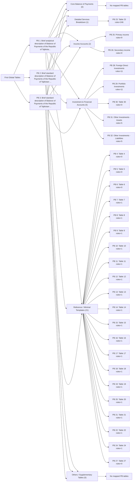

# PB Global-to-Thematic Mapping Diagram

Generated from `report_configs/pb_t*.json`.

## Global tables mapped to thematic groups

## Mapping matrix

| Global PB | Global title | Thematic group | Mapped PBs |
|---:|---|---|---|
| 1 | Brief analytical description of Balance of Payments of the Republic of Tajikistan (in thousand of USD) | Core Balance of Payments | (none) |
| 1 | Brief analytical description of Balance of Payments of the Republic of Tajikistan (in thousand of USD) | Detailed Services Breakdown | PB23 |
| 1 | Brief analytical description of Balance of Payments of the Republic of Tajikistan (in thousand of USD) | Income Accounts | PB25, PB26 |
| 1 | Brief analytical description of Balance of Payments of the Republic of Tajikistan (in thousand of USD) | Investment & Financial Accounts | PB28, PB29, PB30, PB31, PB32 |
| 1 | Brief analytical description of Balance of Payments of the Republic of Tajikistan (in thousand of USD) | Reference / Minimal Templates | PB4, PB5, PB6, PB7, PB8, PB9, PB10, PB11, PB12, PB13, PB14, PB15, PB16, PB17, PB18, PB19, PB20, PB21, PB22, PB24, PB27 |
| 1 | Brief analytical description of Balance of Payments of the Republic of Tajikistan (in thousand of USD) | Others / Supplementary Tables | (none) |
| 2 | Brief standard description of Balance of Payments of the Republic of Tajikistan (in thousand of USD) | Core Balance of Payments | (none) |
| 2 | Brief standard description of Balance of Payments of the Republic of Tajikistan (in thousand of USD) | Detailed Services Breakdown | PB23 |
| 2 | Brief standard description of Balance of Payments of the Republic of Tajikistan (in thousand of USD) | Income Accounts | PB25, PB26 |
| 2 | Brief standard description of Balance of Payments of the Republic of Tajikistan (in thousand of USD) | Investment & Financial Accounts | PB28, PB29, PB30, PB31, PB32 |
| 2 | Brief standard description of Balance of Payments of the Republic of Tajikistan (in thousand of USD) | Reference / Minimal Templates | PB4, PB5, PB6, PB7, PB8, PB9, PB10, PB11, PB12, PB13, PB14, PB15, PB16, PB17, PB18, PB19, PB20, PB21, PB22, PB24, PB27 |
| 2 | Brief standard description of Balance of Payments of the Republic of Tajikistan (in thousand of USD) | Others / Supplementary Tables | (none) |
| 3 | Brief standard description of Balance of Payments of the Republic of Tajikistan (in thousand of USD) | Core Balance of Payments | (none) |
| 3 | Brief standard description of Balance of Payments of the Republic of Tajikistan (in thousand of USD) | Detailed Services Breakdown | PB23 |
| 3 | Brief standard description of Balance of Payments of the Republic of Tajikistan (in thousand of USD) | Income Accounts | PB25, PB26 |
| 3 | Brief standard description of Balance of Payments of the Republic of Tajikistan (in thousand of USD) | Investment & Financial Accounts | PB28, PB29, PB30, PB31, PB32 |
| 3 | Brief standard description of Balance of Payments of the Republic of Tajikistan (in thousand of USD) | Reference / Minimal Templates | PB4, PB5, PB6, PB7, PB8, PB9, PB10, PB11, PB12, PB13, PB14, PB15, PB16, PB17, PB18, PB19, PB20, PB21, PB22, PB24, PB27 |
| 3 | Brief standard description of Balance of Payments of the Republic of Tajikistan (in thousand of USD) | Others / Supplementary Tables | (none) |

## Theme summary

| Theme | PB count | PB list |
|---|---:|---|
| Core Balance of Payments | 0 | (none) |
| Detailed Services Breakdown | 1 | PB23 |
| Income Accounts | 2 | PB25, PB26 |
| Investment & Financial Accounts | 5 | PB28, PB29, PB30, PB31, PB32 |
| Reference / Minimal Templates | 21 | PB4, PB5, PB6, PB7, PB8, PB9, PB10, PB11, PB12, PB13, PB14, PB15, PB16, PB17, PB18, PB19, PB20, PB21, PB22, PB24, PB27 |
| Others / Supplementary Tables | 0 | (none) |
