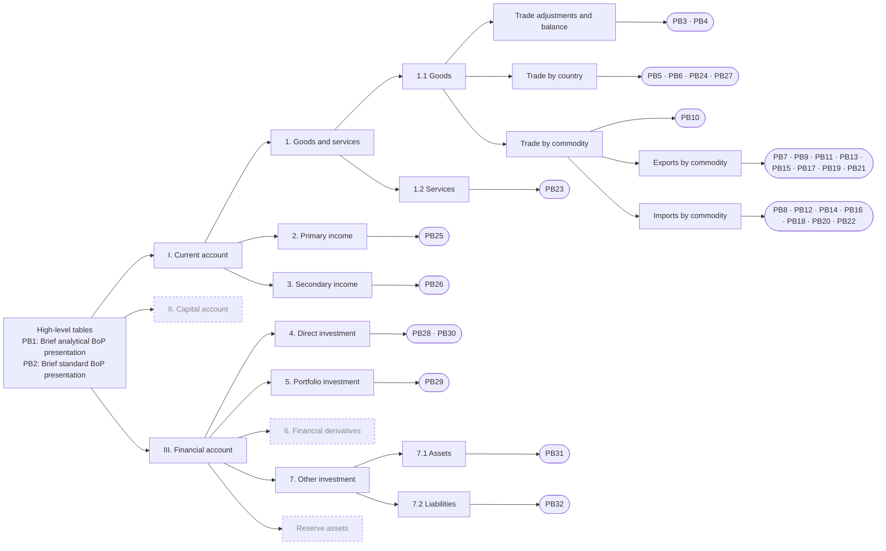

# PB Hierarchy

Detailed PB tables allocated under the rows of the high-level tables (PB1, PB2).

## Allocation

| PB | BoP item | Basis |
|---:|---|---|
| 1 | High-level table | Brief analytical BoP presentation |
| 2 | High-level table | Brief standard BoP presentation |
| 3 | Trade adjustments and balance | Foreign trade turnover with NBT adjustments (coverage, FOB, processing) |
| 4 | Trade adjustments and balance | Trade balance by main commodities with volumes and world prices |
| 5 | Trade by country | Export / import / surplus by country |
| 6 | Trade by country | Export / import / surplus by country |
| 7 | Exports by commodity | Total on export |
| 8 | Imports by commodity | Total on import |
| 9 | Exports by commodity | Exports: nuts, grapes, dried fruits, oilseeds |
| 10 | Trade by commodity | Trade by commodity section (HS sections) |
| 11 | Exports by commodity | Total on export |
| 12 | Imports by commodity | Total on import |
| 13 | Exports by commodity | Total on export |
| 14 | Imports by commodity | Imports: wheat, oil products, chemicals |
| 15 | Exports by commodity | Total on export |
| 16 | Imports by commodity | Imports: wheat, flour, vegetable oil |
| 17 | Exports by commodity | Total on export |
| 18 | Imports by commodity | Total on import |
| 19 | Exports by commodity | Total on export |
| 20 | Imports by commodity | Total on import |
| 21 | Exports by commodity | Total on export |
| 22 | Imports by commodity | Total on import |
| 23 | 1.2 Services | Services by type, credits and debits |
| 24 | Trade by country | Export / import by country |
| 25 | 2. Primary income | Compensation of employees, investment income |
| 26 | 3. Secondary income | General government and private transfers, remittances |
| 27 | Trade by country | Trade by country, weight and cost |
| 28 | 4. Direct investment | Direct investment inflows and outflows |
| 29 | 5. Portfolio investment | Titled Portfolio Investments in main_config; rows list industries |
| 30 | 4. Direct investment | Direct investment by country, sum and share |
| 31 | 7.1 Assets | Other investment assets by sector |
| 32 | 7.2 Liabilities | Other investment liabilities by sector |
