# PB Leaf Indicators

Row-level indicators of every leaf table in the PB hierarchy (`pb_hierarchy.md`),
read from the latest Excel file of each table in `output_files/`.

- Credit / Debit / Proceeds / Outflow rows are shown as measures of the indicator they belong to.
- Charts show every indicator and sub-indicator; only flat lists of more than 12 countries or commodities are collapsed (they are listed in full in the tables).
- PB25 and PB26 only carry Russian labels below the first level; they are shown in English (BPM6 terms).

## Overview by BoP branch

### Goods: trade adjustments and trade by country

```mermaid
flowchart LR
  g_adj["Trade adjustments and balance"]
  pb3(["PB3"])
  g_adj --> pb3
  pb3_1["foreign trade turnover"]
  pb3 --> pb3_1
  pb3_1_2["official data"]
  pb3_1 --> pb3_1_2
  pb3_1_3["the amendment on coverage"]
  pb3_1 --> pb3_1_3
  pb3_1_4["adjustment up to fob price"]
  pb3_1 --> pb3_1_4
  pb3_1_5["the amendment at cost"]
  pb3_1 --> pb3_1_5
  pb3_1_6["others"]
  pb3_1 --> pb3_1_6
  pb3_7["export"]
  pb3 --> pb3_7
  pb3_7_8["official data"]
  pb3_7 --> pb3_7_8
  pb3_7_9["the amendment on coverage"]
  pb3_7 --> pb3_7_9
  pb3_7_10["the goods for processing"]
  pb3_7 --> pb3_7_10
  pb3_7_11["others"]
  pb3_7 --> pb3_7_11
  pb3_12["import"]
  pb3 --> pb3_12
  pb3_12_13["official data"]
  pb3_12 --> pb3_12_13
  pb3_12_14["the amendment on coverage"]
  pb3_12 --> pb3_12_14
  pb3_12_15["adjustment up to fob price"]
  pb3_12 --> pb3_12_15
  pb3_12_16["the goods for processing"]
  pb3_12 --> pb3_12_16
  pb3_12_17["others"]
  pb3_12 --> pb3_12_17
  pb3_18["trade balance"]
  pb3 --> pb3_18
  pb3_18_19["official data"]
  pb3_18 --> pb3_18_19
  pb3_18_20["the amendment on coverage"]
  pb3_18 --> pb3_18_20
  pb3_18_21["adjustment up to fob price"]
  pb3_18 --> pb3_18_21
  pb3_18_22["the amendment at cost"]
  pb3_18 --> pb3_18_22
  pb3_18_23["others"]
  pb3_18 --> pb3_18_23
  pb4(["PB4 · Trade balance<br/>per item: 8 measures"])
  g_adj --> pb4
  pb4_24["CIS"]
  pb4 --> pb4_24
  pb4_25["Far abroad countries"]
  pb4 --> pb4_25
  pb4_26["Export"]
  pb4 --> pb4_26
  pb4_26_27["Aluminum - primary"]
  pb4_26 --> pb4_26_27
  pb4_26_28["Cotton fibre"]
  pb4_26 --> pb4_26_28
  pb4_26_29["Electricity"]
  pb4_26 --> pb4_26_29
  pb4_26_30["Other"]
  pb4_26 --> pb4_26_30
  pb4_31["Import CIF"]
  pb4 --> pb4_31
  pb4_31_32["Alumina"]
  pb4_31 --> pb4_31_32
  pb4_31_33["Oil"]
  pb4_31 --> pb4_31_33
  pb4_31_34["Electricity"]
  pb4_31 --> pb4_31_34
  pb4_31_35["Grain"]
  pb4_31 --> pb4_31_35
  pb4_31_36["Flour"]
  pb4_31 --> pb4_31_36
  pb4_31_37["Others"]
  pb4_31 --> pb4_31_37
  g_cty["Trade by country"]
  pb5(["PB5 · Total (Including :)<br/>export · import · surplus"])
  g_cty --> pb5
  pb5_38["CIS countries"]
  pb5 --> pb5_38
  pb5_38_39["EAEU countries"]
  pb5_38 --> pb5_38_39
  pb5_38_39_40["Belarus"]
  pb5_38_39 --> pb5_38_39_40
  pb5_38_39_41["Kazakhstan"]
  pb5_38_39 --> pb5_38_39_41
  pb5_38_39_42["Kyrgyzstan"]
  pb5_38_39 --> pb5_38_39_42
  pb5_38_39_43["Russia"]
  pb5_38_39 --> pb5_38_39_43
  pb5_38_39_44["Is free-economic zone"]
  pb5_38_39 --> pb5_38_39_44
  pb5_38_45["Non EurAseC countries"]
  pb5_38 --> pb5_38_45
  pb5_38_45_46["Azerbaijan"]
  pb5_38_45 --> pb5_38_45_46
  pb5_38_45_47["Armenia"]
  pb5_38_45 --> pb5_38_45_47
  pb5_38_45_48["Moldova"]
  pb5_38_45 --> pb5_38_45_48
  pb5_38_45_49["Turkmenistan"]
  pb5_38_45 --> pb5_38_45_49
  pb5_38_45_50["Uzbekistan"]
  pb5_38_45 --> pb5_38_45_50
  pb5_38_45_51["Ukraine"]
  pb5_38_45 --> pb5_38_45_51
  pb5_52["Far abroad countries"]
  pb5 --> pb5_52
  pb5_52_53["Europa"]
  pb5_52 --> pb5_52_53
  pb5_52_53_54>"41 items<br/>e.g. Austria, Albania, Andorra, …"]
  pb5_52_53 --> pb5_52_53_54
  pb5_52_55["Asia"]
  pb5_52 --> pb5_52_55
  pb5_52_55_56>"36 items<br/>e.g. Afghanistan, Bangladesh, Brunei, …"]
  pb5_52_55 --> pb5_52_55_56
  pb5_52_57["America"]
  pb5_52 --> pb5_52_57
  pb5_52_57_58>"32 items<br/>e.g. Anguilla, Argentina, Belize, …"]
  pb5_52_57 --> pb5_52_57_58
  pb5_52_59["Africa"]
  pb5_52 --> pb5_52_59
  pb5_52_59_60>"25 items<br/>e.g. Djibouti, Niger, Egypt, …"]
  pb5_52_59 --> pb5_52_59_60
  pb5_52_61["Australia Ocenia"]
  pb5_52 --> pb5_52_61
  pb5_52_61_62["Australia"]
  pb5_52_61 --> pb5_52_61_62
  pb5_52_61_63["New Zealand"]
  pb5_52_61 --> pb5_52_61_63
  pb6(["PB6 · Total (Including :)<br/>export · import · surplus"])
  g_cty --> pb6
  pb6_64["CIS countries"]
  pb6 --> pb6_64
  pb6_64_65["EAEU countries"]
  pb6_64 --> pb6_64_65
  pb6_64_65_66["Belarus"]
  pb6_64_65 --> pb6_64_65_66
  pb6_64_65_67["Kazakhstan"]
  pb6_64_65 --> pb6_64_65_67
  pb6_64_65_68["Kyrgyzstan"]
  pb6_64_65 --> pb6_64_65_68
  pb6_64_65_69["Russia"]
  pb6_64_65 --> pb6_64_65_69
  pb6_64_65_70["Is free-economic zone"]
  pb6_64_65 --> pb6_64_65_70
  pb6_64_71["Non EurAseC countries"]
  pb6_64 --> pb6_64_71
  pb6_64_71_72["Azerbaijan"]
  pb6_64_71 --> pb6_64_71_72
  pb6_64_71_73["Armenia"]
  pb6_64_71 --> pb6_64_71_73
  pb6_64_71_74["Moldova"]
  pb6_64_71 --> pb6_64_71_74
  pb6_64_71_75["Turkmenistan"]
  pb6_64_71 --> pb6_64_71_75
  pb6_64_71_76["Uzbekistan"]
  pb6_64_71 --> pb6_64_71_76
  pb6_64_71_77["Ukraine"]
  pb6_64_71 --> pb6_64_71_77
  pb6_78["Far abroad countries"]
  pb6 --> pb6_78
  pb6_78_79["Europa"]
  pb6_78 --> pb6_78_79
  pb6_78_79_80>"41 items<br/>e.g. Austria, Albania, Andorra, …"]
  pb6_78_79 --> pb6_78_79_80
  pb6_78_81["Asia"]
  pb6_78 --> pb6_78_81
  pb6_78_81_82>"36 items<br/>e.g. Afghanistan, Bangladesh, Brunei, …"]
  pb6_78_81 --> pb6_78_81_82
  pb6_78_83["America"]
  pb6_78 --> pb6_78_83
  pb6_78_83_84>"32 items<br/>e.g. Anguilla, Argentina, Belize, …"]
  pb6_78_83 --> pb6_78_83_84
  pb6_78_85["Africa"]
  pb6_78 --> pb6_78_85
  pb6_78_85_86>"24 items<br/>e.g. Djibouti, Niger, Egypt, …"]
  pb6_78_85 --> pb6_78_85_86
  pb6_78_87["Australia Ocenia"]
  pb6_78 --> pb6_78_87
  pb6_78_87_88["Australia"]
  pb6_78_87 --> pb6_78_87_88
  pb6_78_87_89["New Zealand"]
  pb6_78_87 --> pb6_78_87_89
  pb24(["PB24 · Total (Including:)<br/>export · import"])
  g_cty --> pb24
  pb24_90["CIS countries"]
  pb24 --> pb24_90
  pb24_90_91["EAEU countries"]
  pb24_90 --> pb24_90_91
  pb24_90_91_92["Belarus"]
  pb24_90_91 --> pb24_90_91_92
  pb24_90_91_93["Kazakhstan"]
  pb24_90_91 --> pb24_90_91_93
  pb24_90_91_94["Kyrgyzstan"]
  pb24_90_91 --> pb24_90_91_94
  pb24_90_91_95["Russia"]
  pb24_90_91 --> pb24_90_91_95
  pb24_90_96["Non EurAsEC countries"]
  pb24_90 --> pb24_90_96
  pb24_90_96_97["Azerbaijan"]
  pb24_90_96 --> pb24_90_96_97
  pb24_90_96_98["Armenia"]
  pb24_90_96 --> pb24_90_96_98
  pb24_90_96_99["Georgia"]
  pb24_90_96 --> pb24_90_96_99
  pb24_90_96_100["Moldova"]
  pb24_90_96 --> pb24_90_96_100
  pb24_90_96_101["Turkmenistan"]
  pb24_90_96 --> pb24_90_96_101
  pb24_90_96_102["Uzbekistan"]
  pb24_90_96 --> pb24_90_96_102
  pb24_90_96_103["Ukraine"]
  pb24_90_96 --> pb24_90_96_103
  pb24_104["Far abroad countries"]
  pb24 --> pb24_104
  pb24_104_105["Europa"]
  pb24_104 --> pb24_104_105
  pb24_104_105_106>"32 items<br/>e.g. Austria, Albania, Belgium, …"]
  pb24_104_105 --> pb24_104_105_106
  pb24_104_107["Asia"]
  pb24_104 --> pb24_104_107
  pb24_104_107_108>"32 items<br/>e.g. Afghanistan, Bangladesh, Bahrain, …"]
  pb24_104_107 --> pb24_104_107_108
  pb24_104_109["America"]
  pb24_104 --> pb24_104_109
  pb24_104_109_110["Anguilla"]
  pb24_104_109 --> pb24_104_109_110
  pb24_104_109_111["Argentina"]
  pb24_104_109 --> pb24_104_109_111
  pb24_104_109_112["Brazil"]
  pb24_104_109 --> pb24_104_109_112
  pb24_104_109_113["Venezuela"]
  pb24_104_109 --> pb24_104_109_113
  pb24_104_109_114["Canada"]
  pb24_104_109 --> pb24_104_109_114
  pb24_104_109_115["Colombia"]
  pb24_104_109 --> pb24_104_109_115
  pb24_104_109_116["Mexico"]
  pb24_104_109 --> pb24_104_109_116
  pb24_104_109_117["Panama"]
  pb24_104_109 --> pb24_104_109_117
  pb24_104_109_118["Peru"]
  pb24_104_109 --> pb24_104_109_118
  pb24_104_109_119["USA"]
  pb24_104_109 --> pb24_104_109_119
  pb24_104_109_120["Chile"]
  pb24_104_109 --> pb24_104_109_120
  pb24_104_109_121["Eastern Samoa"]
  pb24_104_109 --> pb24_104_109_121
  pb24_104_122["Africa"]
  pb24_104 --> pb24_104_122
  pb24_104_122_123>"14 items<br/>e.g. Zambia, Morocco, Mauritania, …"]
  pb24_104_122 --> pb24_104_122_123
  pb24_104_124["Australia Ocenia"]
  pb24_104 --> pb24_104_124
  pb24_104_124_125["Australia"]
  pb24_104_124 --> pb24_104_124_125
  pb24_104_124_126["New Zealand"]
  pb24_104_124 --> pb24_104_124_126
  pb24_127["Other countries"]
  pb24 --> pb24_127
  pb27(["PB27 · Total<br/>cost, thous. USD · weight"])
  g_cty --> pb27
  pb27_128["Near abroad countries including"]
  pb27 --> pb27_128
  pb27_128_129["Kazakhstan"]
  pb27_128 --> pb27_128_129
  pb27_128_130["Kyrgyzstan"]
  pb27_128 --> pb27_128_130
  pb27_128_131["Russia"]
  pb27_128 --> pb27_128_131
  pb27_128_132["Uzbekistan"]
  pb27_128 --> pb27_128_132
  pb27_128_133["Ukraine"]
  pb27_128 --> pb27_128_133
  pb27_128_134["Turkmenistan"]
  pb27_128 --> pb27_128_134
  pb27_128_135["Belarus"]
  pb27_128 --> pb27_128_135
  pb27_128_136["Azerbaijan"]
  pb27_128 --> pb27_128_136
  pb27_137["Far abroad countries including"]
  pb27 --> pb27_137
  pb27_137_138>"75 items<br/>e.g. Latvia, Germany, United States of America, …"]
  pb27_137 --> pb27_137_138
```

### Goods: exports by commodity

```mermaid
flowchart LR
  g_exp["Exports by commodity"]
  pb7(["PB7 · Total on export"])
  g_exp --> pb7
  pb7_1>"19 items<br/>e.g. HS 0703 (name missing in so…, Carrot, turnip, beet and ot…, Soce vegetables legemes, …"]
  pb7 --> pb7_1
  pb9(["PB9 · Total on import"])
  g_exp --> pb9
  pb9_2["HS 0703 (name missing in source)"]
  pb9 --> pb9_2
  pb9_3["Carrot, turnip, beet and other vegetables"]
  pb9 --> pb9_3
  pb9_4["Dried bean vegetables"]
  pb9 --> pb9_4
  pb9_5["Other nuts"]
  pb9 --> pb9_5
  pb9_6["Grapes"]
  pb9 --> pb9_6
  pb9_7["Dried fruits"]
  pb9 --> pb9_7
  pb9_8["Peanut"]
  pb9 --> pb9_8
  pb9_9["Sunflower seeds"]
  pb9 --> pb9_9
  pb9_10["Locust beans, freestones"]
  pb9 --> pb9_10
  pb9_11["Other goods"]
  pb9 --> pb9_11
  pb11(["PB11 · Total on export"])
  g_exp --> pb11
  pb11_12>"20 items<br/>e.g. Grapes, Fresh fruits, Dried fruits, …"]
  pb11 --> pb11_12
  pb13(["PB13 · Total on export"])
  g_exp --> pb13
  pb13_13>"15 items<br/>e.g. HS 0805 (name missing in so…, Zink ore and its precipitat…, Mineral coal, brignettes, …"]
  pb13 --> pb13_13
  pb15(["PB15 · Total on export"])
  g_exp --> pb15
  pb15_14>"15 items<br/>e.g. Cabbage, cauliflower and ot…, Carrot, turnip, beet and ot…, Grapes, …"]
  pb15 --> pb15_14
  pb17(["PB17 · Total on export"])
  g_exp --> pb17
  pb17_15["Other fresh or dried nuts"]
  pb17 --> pb17_15
  pb17_16["Locust beans, freestones"]
  pb17 --> pb17_16
  pb17_17["Skin from horned cattle skins"]
  pb17 --> pb17_17
  pb17_18["Cotton fibre"]
  pb17 --> pb17_18
  pb17_19["Cotton yarn containing 85 % of cotton"]
  pb17 --> pb17_19
  pb17_20["Aluminum - primary"]
  pb17 --> pb17_20
  pb17_21["Other goods"]
  pb17 --> pb17_21
  pb19(["PB19 · Total on export"])
  g_exp --> pb19
  pb19_22["HS 5201 (name missing in source)"]
  pb19 --> pb19_22
  pb19_23["Cotton yarn containing 85 % of cotton"]
  pb19 --> pb19_23
  pb19_24["Fluid-flow pump"]
  pb19 --> pb19_24
  pb19_25["Air or airfree pump"]
  pb19 --> pb19_25
  pb19_26["Other goods"]
  pb19 --> pb19_26
  pb21(["PB21 · Total on export"])
  g_exp --> pb21
  pb21_27["HS 2607 (name missing in source)"]
  pb21 --> pb21_27
  pb21_28["HS 2608 (name missing in source)"]
  pb21 --> pb21_28
  pb21_29["Cotton fibre"]
  pb21 --> pb21_29
  pb21_30["Cotton yarn containing 85 % of cotton"]
  pb21 --> pb21_30
  pb21_31["Surma"]
  pb21 --> pb21_31
  pb21_32["Other goods"]
  pb21 --> pb21_32
```

### Goods: commodity sections and imports by commodity

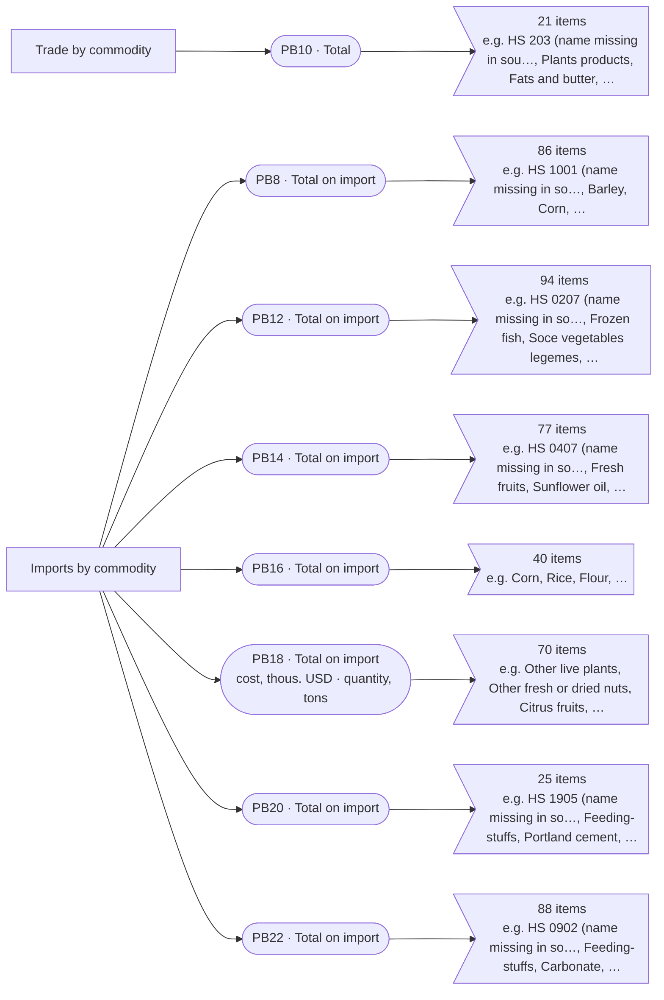

### Services

```mermaid
flowchart LR
  serv["1.2 Services"]
  pb23(["PB23<br/>Credit / Debit"])
  serv --> pb23
  pb23_1["Manufactoring services on physical inputs owned by others"]
  pb23 --> pb23_1
  pb23_1_2["Goods for services"]
  pb23_1 --> pb23_1_2
  pb23_1_3["goods for processing in the Republic of Tajikistan"]
  pb23_1 --> pb23_1_3
  pb23_1_4["goods for processing abroad"]
  pb23_1 --> pb23_1_4
  pb23_5["Maintenance and repair services n.i.e."]
  pb23 --> pb23_5
  pb23_6["Transport"]
  pb23 --> pb23_6
  pb23_6_7["Rail transport"]
  pb23_6 --> pb23_6_7
  pb23_6_7_8["passenger"]
  pb23_6_7 --> pb23_6_7_8
  pb23_6_7_8_9["payable by border, seasonal and other short-term workers"]
  pb23_6_7_8 --> pb23_6_7_8_9
  pb23_6_7_10["freight"]
  pb23_6_7 --> pb23_6_7_10
  pb23_6_7_11["other"]
  pb23_6_7 --> pb23_6_7_11
  pb23_6_12["Motor transport"]
  pb23_6 --> pb23_6_12
  pb23_6_12_13["passenger"]
  pb23_6_12 --> pb23_6_12_13
  pb23_6_12_13_14["payable by border, seasonal and other short-term workers"]
  pb23_6_12_13 --> pb23_6_12_13_14
  pb23_6_12_15["freight"]
  pb23_6_12 --> pb23_6_12_15
  pb23_6_12_16["other"]
  pb23_6_12 --> pb23_6_12_16
  pb23_6_17["Air transport"]
  pb23_6 --> pb23_6_17
  pb23_6_17_18["passenger"]
  pb23_6_17 --> pb23_6_17_18
  pb23_6_17_18_19["payable by border, seasonal and other short-term workers"]
  pb23_6_17_18 --> pb23_6_17_18_19
  pb23_6_17_20["freight"]
  pb23_6_17 --> pb23_6_17_20
  pb23_6_17_21["other"]
  pb23_6_17 --> pb23_6_17_21
  pb23_6_22["Sea transport"]
  pb23_6 --> pb23_6_22
  pb23_6_22_23["passenger"]
  pb23_6_22 --> pb23_6_22_23
  pb23_6_22_23_24["payable by border, seasonal and other short-term workers"]
  pb23_6_22_23 --> pb23_6_22_23_24
  pb23_6_22_25["freight"]
  pb23_6_22 --> pb23_6_22_25
  pb23_6_22_26["other"]
  pb23_6_22 --> pb23_6_22_26
  pb23_6_27["Pipeline transportation"]
  pb23_6 --> pb23_6_27
  pb23_6_27_28["freight"]
  pb23_6_27 --> pb23_6_27_28
  pb23_6_27_29["other"]
  pb23_6_27 --> pb23_6_27_29
  pb23_6_30["other modes of transport"]
  pb23_6 --> pb23_6_30
  pb23_6_30_31["passenger"]
  pb23_6_30 --> pb23_6_30_31
  pb23_6_30_31_32["payable by border, seasonal and other short-term workers"]
  pb23_6_30_31 --> pb23_6_30_31_32
  pb23_6_30_33["freight"]
  pb23_6_30 --> pb23_6_30_33
  pb23_6_30_34["other"]
  pb23_6_30 --> pb23_6_30_34
  pb23_6_35["Postal and courier services"]
  pb23_6 --> pb23_6_35
  pb23_6_36["For all modes of transport"]
  pb23_6 --> pb23_6_36
  pb23_6_36_37["passenger"]
  pb23_6_36 --> pb23_6_36_37
  pb23_6_36_37_38["payable by border, seasonal and other short-term workers"]
  pb23_6_36_37 --> pb23_6_36_37_38
  pb23_6_36_39["freight"]
  pb23_6_36 --> pb23_6_36_39
  pb23_6_36_40["other"]
  pb23_6_36 --> pb23_6_36_40
  pb23_41["Travel"]
  pb23 --> pb23_41
  pb23_41_42["Business"]
  pb23_41 --> pb23_41_42
  pb23_41_42_43["Acquisition of goods and services by border, seasonal, and…"]
  pb23_41_42 --> pb23_41_42_43
  pb23_41_42_44["Other"]
  pb23_41_42 --> pb23_41_42_44
  pb23_41_45["Personal"]
  pb23_41 --> pb23_41_45
  pb23_41_45_46["Health-related"]
  pb23_41_45 --> pb23_41_45_46
  pb23_41_45_47["Education-related"]
  pb23_41_45 --> pb23_41_45_47
  pb23_41_45_48["Other"]
  pb23_41_45 --> pb23_41_45_48
  pb23_41_45_48_49["For both business and personal travel"]
  pb23_41_45_48 --> pb23_41_45_48_49
  pb23_41_45_48_50["Goods"]
  pb23_41_45_48 --> pb23_41_45_48_50
  pb23_41_45_48_51["Local transport services"]
  pb23_41_45_48 --> pb23_41_45_48_51
  pb23_41_45_48_52["Accommodation services"]
  pb23_41_45_48 --> pb23_41_45_48_52
  pb23_41_45_48_53["Food-serving services"]
  pb23_41_45_48 --> pb23_41_45_48_53
  pb23_41_45_48_54["other services"]
  pb23_41_45_48 --> pb23_41_45_48_54
  pb23_41_45_48_55["of which: health services"]
  pb23_41_45_48 --> pb23_41_45_48_55
  pb23_41_45_48_56["of which: education services"]
  pb23_41_45_48 --> pb23_41_45_48_56
  pb23_57["Construction"]
  pb23 --> pb23_57
  pb23_57_58["Construction abroad"]
  pb23_57 --> pb23_57_58
  pb23_57_59["Construction in the Repablic of Tajikistan"]
  pb23_57 --> pb23_57_59
  pb23_60["Insurance and pension services"]
  pb23 --> pb23_60
  pb23_60_61["Direct insurance"]
  pb23_60 --> pb23_60_61
  pb23_60_62["Reinsurance"]
  pb23_60 --> pb23_60_62
  pb23_60_63["Auxiliary insurance services"]
  pb23_60 --> pb23_60_63
  pb23_60_64["Pension and standardized guarantee services"]
  pb23_60 --> pb23_60_64
  pb23_60_65["Other"]
  pb23_60 --> pb23_60_65
  pb23_66["Financial services"]
  pb23 --> pb23_66
  pb23_66_67["Explicitly charged and other financial services"]
  pb23_66 --> pb23_66_67
  pb23_66_68["Financial intermediation services indirectly measured (FISI…"]
  pb23_66 --> pb23_66_68
  pb23_69["Charges for the use of intellectual property n.i.e."]
  pb23 --> pb23_69
  pb23_70["Telecommunications, computer, and information services"]
  pb23 --> pb23_70
  pb23_70_71["Telecommunications services"]
  pb23_70 --> pb23_70_71
  pb23_70_72["Computer services"]
  pb23_70 --> pb23_70_72
  pb23_70_73["Information services"]
  pb23_70 --> pb23_70_73
  pb23_74["Other business services"]
  pb23 --> pb23_74
  pb23_74_75["Research and development services"]
  pb23_74 --> pb23_74_75
  pb23_74_76["Professional and management consulting services"]
  pb23_74 --> pb23_74_76
  pb23_74_76_77["Legal services"]
  pb23_74_76 --> pb23_74_76_77
  pb23_74_76_78["Accounting services"]
  pb23_74_76 --> pb23_74_76_78
  pb23_74_76_79["Services in management sphere"]
  pb23_74_76 --> pb23_74_76_79
  pb23_74_76_80["Advertismentm, marketing"]
  pb23_74_76 --> pb23_74_76_80
  pb23_74_76_81["Other"]
  pb23_74_76 --> pb23_74_76_81
  pb23_74_82["Technical, related with trade and other services"]
  pb23_74 --> pb23_74_82
  pb23_74_82_83["Architectual, engeneering and other technical services"]
  pb23_74_82 --> pb23_74_82_83
  pb23_74_82_84["Waste utilization, environmental conrol"]
  pb23_74_82 --> pb23_74_82_84
  pb23_74_82_85["Servieces in minerals industry sphere"]
  pb23_74_82 --> pb23_74_82_85
  pb23_74_82_86["Operative leasing services"]
  pb23_74_82 --> pb23_74_82_86
  pb23_74_82_87["trade related services (now on-selling)"]
  pb23_74_82 --> pb23_74_82_87
  pb23_74_82_88["Other"]
  pb23_74_82 --> pb23_74_82_88
  pb23_89["Personal, cultural, and recreational services"]
  pb23 --> pb23_89
  pb23_89_90["Audiovisual and related services"]
  pb23_89 --> pb23_89_90
  pb23_89_91["Other personal, cultural, and recreational services"]
  pb23_89 --> pb23_89_91
  pb23_92["Government goods and services n.i.e."]
  pb23 --> pb23_92
  pb23_92_93["Goods and services delivered or received by embasses, milit…"]
  pb23_92 --> pb23_92_93
  pb23_92_94["Other services delivered or received by government"]
  pb23_92 --> pb23_92_94
  pb23_92_95["Tourism-related services in travel and passenger transport"]
  pb23_92 --> pb23_92_95
```

### Primary and secondary income

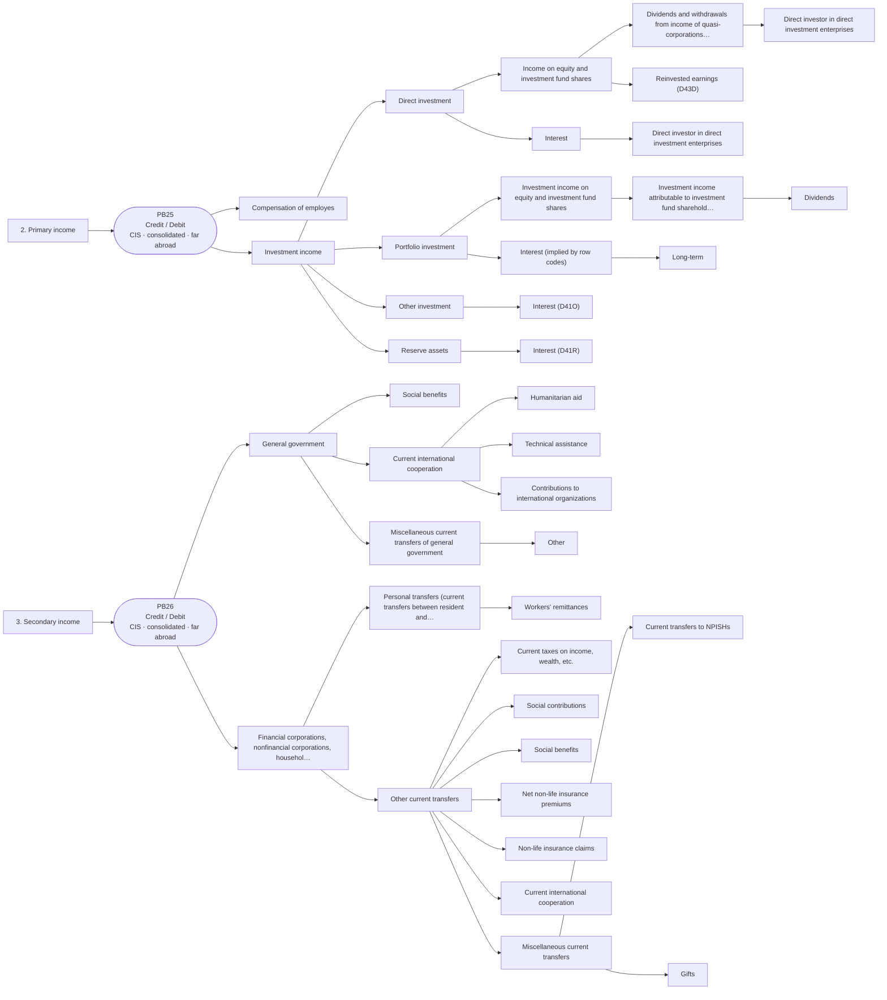

### Financial account

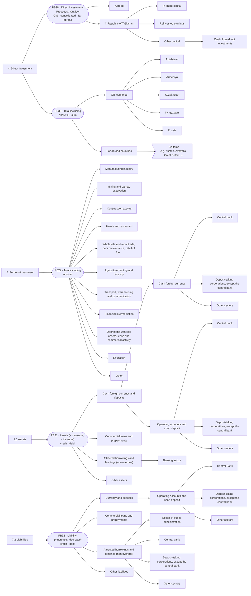

## Leaf tables

### PB3 · I. Current account › 1. Goods and services › 1.1 Goods › Trade adjustments and balance

- Source: `output_files/PB3.v0.1101.2025_1.xlsx`
- Indicators: 23
- Values: previous year; current year

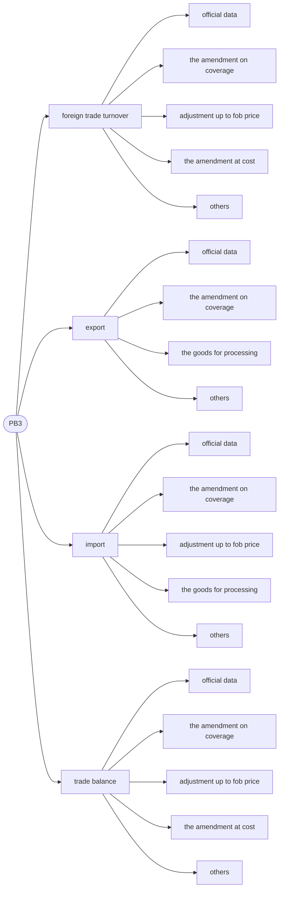

<details>
<summary>All PB3 indicators</summary>

| Code | Indicator | Measures |
|---|---|---|
| 1 | foreign trade turnover |  |
| 1.1 | &nbsp;&nbsp;&nbsp;&nbsp;official data |  |
| 1.2 | &nbsp;&nbsp;&nbsp;&nbsp;the amendment on coverage |  |
| 1.3 | &nbsp;&nbsp;&nbsp;&nbsp;adjustment up to fob price |  |
| 1.4 | &nbsp;&nbsp;&nbsp;&nbsp;the amendment at cost |  |
| 1.5 | &nbsp;&nbsp;&nbsp;&nbsp;others |  |
| 2 | export |  |
| 2.1 | &nbsp;&nbsp;&nbsp;&nbsp;official data |  |
| 2.2 | &nbsp;&nbsp;&nbsp;&nbsp;the amendment on coverage |  |
| 2.3 | &nbsp;&nbsp;&nbsp;&nbsp;the goods for processing |  |
| 2.4 | &nbsp;&nbsp;&nbsp;&nbsp;others |  |
| 3 | import |  |
| 3.1 | &nbsp;&nbsp;&nbsp;&nbsp;official data |  |
| 3.2 | &nbsp;&nbsp;&nbsp;&nbsp;the amendment on coverage |  |
| 3.3 | &nbsp;&nbsp;&nbsp;&nbsp;adjustment up to fob price |  |
| 3.4 | &nbsp;&nbsp;&nbsp;&nbsp;the goods for processing |  |
| 3.5 | &nbsp;&nbsp;&nbsp;&nbsp;others |  |
| 4 | trade balance |  |
| 4.1 | &nbsp;&nbsp;&nbsp;&nbsp;official data |  |
| 4.2 | &nbsp;&nbsp;&nbsp;&nbsp;the amendment on coverage |  |
| 4.3 | &nbsp;&nbsp;&nbsp;&nbsp;adjustment up to fob price |  |
| 4.4 | &nbsp;&nbsp;&nbsp;&nbsp;the amendment at cost |  |
| 4.5 | &nbsp;&nbsp;&nbsp;&nbsp;others |  |

</details>

### PB4 · I. Current account › 1. Goods and services › 1.1 Goods › Trade adjustments and balance

- Source: `output_files/PB4.v0.1101.2025_1.xlsx`
- Indicators: 15
- Row measures: valuation changes, volume (ton), volume change, average price (per 1 ton), price change, world price (per 1 ton), volume (in mln. kilowatt-hour), world price change
- Values: previous year; current year

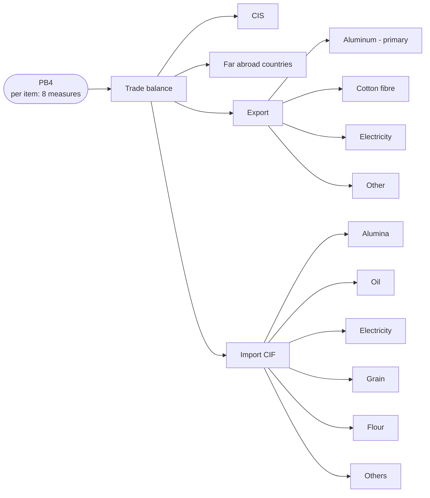

<details>
<summary>All PB4 indicators</summary>

| Code | Indicator | Measures |
|---|---|---|
| 1 | Trade balance |  |
| 1.1 | &nbsp;&nbsp;&nbsp;&nbsp;CIS |  |
| 1.2 | &nbsp;&nbsp;&nbsp;&nbsp;Far abroad countries |  |
| 1.3 | &nbsp;&nbsp;&nbsp;&nbsp;Export |  |
| 1.3.1 | &nbsp;&nbsp;&nbsp;&nbsp;&nbsp;&nbsp;&nbsp;&nbsp;Aluminum - primary | valuation changes, volume (ton), volume change, average price (per 1 ton), price change, world price (per 1 ton) |
| 1.3.2 | &nbsp;&nbsp;&nbsp;&nbsp;&nbsp;&nbsp;&nbsp;&nbsp;Cotton fibre | valuation changes, volume (ton), volume change, average price (per 1 ton), price change, world price (per 1 ton) |
| 1.3.3 | &nbsp;&nbsp;&nbsp;&nbsp;&nbsp;&nbsp;&nbsp;&nbsp;Electricity | volume (in mln. kilowatt-hour) |
| 1.3.4 | &nbsp;&nbsp;&nbsp;&nbsp;&nbsp;&nbsp;&nbsp;&nbsp;Other | valuation changes |
| 1.4 | &nbsp;&nbsp;&nbsp;&nbsp;Import CIF |  |
| 1.4.1 | &nbsp;&nbsp;&nbsp;&nbsp;&nbsp;&nbsp;&nbsp;&nbsp;Alumina | valuation changes, volume (ton), volume change, average price (per 1 ton), price change, world price (per 1 ton), world price change |
| 1.4.2 | &nbsp;&nbsp;&nbsp;&nbsp;&nbsp;&nbsp;&nbsp;&nbsp;Oil | valuation changes, volume (ton), volume change, average price (per 1 ton), price change, world price (per 1 ton), world price change |
| 1.4.3 | &nbsp;&nbsp;&nbsp;&nbsp;&nbsp;&nbsp;&nbsp;&nbsp;Electricity | volume (in mln. kilowatt-hour) |
| 1.4.4 | &nbsp;&nbsp;&nbsp;&nbsp;&nbsp;&nbsp;&nbsp;&nbsp;Grain | valuation changes, volume (ton), volume change, average price (per 1 ton), price change, world price (per 1 ton), world price change |
| 1.4.5 | &nbsp;&nbsp;&nbsp;&nbsp;&nbsp;&nbsp;&nbsp;&nbsp;Flour | valuation changes, volume (ton), volume change, average price (per 1 ton), price change, world price (per 1 ton), world price change |
| 1.4.6 | &nbsp;&nbsp;&nbsp;&nbsp;&nbsp;&nbsp;&nbsp;&nbsp;Others | valuation changes |

</details>

### PB5 · I. Current account › 1. Goods and services › 1.1 Goods › Trade by country

- Source: `output_files/PB5.v0.1101.2025_1.xlsx`
- Indicators: 157
- Breakdown (`data_type`): export, import, surplus
- Values: previous year; current year

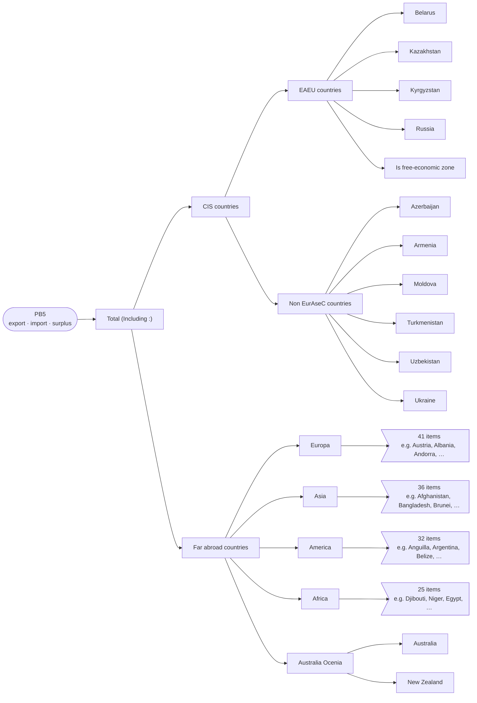

<details>
<summary>All PB5 indicators</summary>

| Code | Indicator | Measures |
|---|---|---|
| 1 | Total (Including :) |  |
| 1.1 | &nbsp;&nbsp;&nbsp;&nbsp;CIS countries |  |
| 1.1.1 | &nbsp;&nbsp;&nbsp;&nbsp;&nbsp;&nbsp;&nbsp;&nbsp;EAEU countries |  |
| 1.1.1.1 | &nbsp;&nbsp;&nbsp;&nbsp;&nbsp;&nbsp;&nbsp;&nbsp;&nbsp;&nbsp;&nbsp;&nbsp;Belarus |  |
| 1.1.1.2 | &nbsp;&nbsp;&nbsp;&nbsp;&nbsp;&nbsp;&nbsp;&nbsp;&nbsp;&nbsp;&nbsp;&nbsp;Kazakhstan |  |
| 1.1.1.3 | &nbsp;&nbsp;&nbsp;&nbsp;&nbsp;&nbsp;&nbsp;&nbsp;&nbsp;&nbsp;&nbsp;&nbsp;Kyrgyzstan |  |
| 1.1.1.4 | &nbsp;&nbsp;&nbsp;&nbsp;&nbsp;&nbsp;&nbsp;&nbsp;&nbsp;&nbsp;&nbsp;&nbsp;Russia |  |
| 1.1.1.5 | &nbsp;&nbsp;&nbsp;&nbsp;&nbsp;&nbsp;&nbsp;&nbsp;&nbsp;&nbsp;&nbsp;&nbsp;Is free-economic zone |  |
| 1.1.2 | &nbsp;&nbsp;&nbsp;&nbsp;&nbsp;&nbsp;&nbsp;&nbsp;Non EurAseC countries |  |
| 1.1.2.1 | &nbsp;&nbsp;&nbsp;&nbsp;&nbsp;&nbsp;&nbsp;&nbsp;&nbsp;&nbsp;&nbsp;&nbsp;Azerbaijan |  |
| 1.1.2.2 | &nbsp;&nbsp;&nbsp;&nbsp;&nbsp;&nbsp;&nbsp;&nbsp;&nbsp;&nbsp;&nbsp;&nbsp;Armenia |  |
| 1.1.2.3 | &nbsp;&nbsp;&nbsp;&nbsp;&nbsp;&nbsp;&nbsp;&nbsp;&nbsp;&nbsp;&nbsp;&nbsp;Moldova |  |
| 1.1.2.4 | &nbsp;&nbsp;&nbsp;&nbsp;&nbsp;&nbsp;&nbsp;&nbsp;&nbsp;&nbsp;&nbsp;&nbsp;Turkmenistan |  |
| 1.1.2.5 | &nbsp;&nbsp;&nbsp;&nbsp;&nbsp;&nbsp;&nbsp;&nbsp;&nbsp;&nbsp;&nbsp;&nbsp;Uzbekistan |  |
| 1.1.2.6 | &nbsp;&nbsp;&nbsp;&nbsp;&nbsp;&nbsp;&nbsp;&nbsp;&nbsp;&nbsp;&nbsp;&nbsp;Ukraine |  |
| 1.2 | &nbsp;&nbsp;&nbsp;&nbsp;Far abroad countries |  |
| 1.2.1 | &nbsp;&nbsp;&nbsp;&nbsp;&nbsp;&nbsp;&nbsp;&nbsp;Europa |  |
| 1.2.1.1 | &nbsp;&nbsp;&nbsp;&nbsp;&nbsp;&nbsp;&nbsp;&nbsp;&nbsp;&nbsp;&nbsp;&nbsp;Austria |  |
| 1.2.1.2 | &nbsp;&nbsp;&nbsp;&nbsp;&nbsp;&nbsp;&nbsp;&nbsp;&nbsp;&nbsp;&nbsp;&nbsp;Albania |  |
| 1.2.1.3 | &nbsp;&nbsp;&nbsp;&nbsp;&nbsp;&nbsp;&nbsp;&nbsp;&nbsp;&nbsp;&nbsp;&nbsp;Andorra |  |
| 1.2.1.4 | &nbsp;&nbsp;&nbsp;&nbsp;&nbsp;&nbsp;&nbsp;&nbsp;&nbsp;&nbsp;&nbsp;&nbsp;Belgium |  |
| 1.2.1.5 | &nbsp;&nbsp;&nbsp;&nbsp;&nbsp;&nbsp;&nbsp;&nbsp;&nbsp;&nbsp;&nbsp;&nbsp;Bulgaria |  |
| 1.2.1.6 | &nbsp;&nbsp;&nbsp;&nbsp;&nbsp;&nbsp;&nbsp;&nbsp;&nbsp;&nbsp;&nbsp;&nbsp;Bosnia and Herzegovina |  |
| 1.2.1.7 | &nbsp;&nbsp;&nbsp;&nbsp;&nbsp;&nbsp;&nbsp;&nbsp;&nbsp;&nbsp;&nbsp;&nbsp;Vatikan |  |
| 1.2.1.8 | &nbsp;&nbsp;&nbsp;&nbsp;&nbsp;&nbsp;&nbsp;&nbsp;&nbsp;&nbsp;&nbsp;&nbsp;Gibraltar |  |
| 1.2.1.9 | &nbsp;&nbsp;&nbsp;&nbsp;&nbsp;&nbsp;&nbsp;&nbsp;&nbsp;&nbsp;&nbsp;&nbsp;Hungary |  |
| 1.2.1.10 | &nbsp;&nbsp;&nbsp;&nbsp;&nbsp;&nbsp;&nbsp;&nbsp;&nbsp;&nbsp;&nbsp;&nbsp;Germany |  |
| 1.2.1.11 | &nbsp;&nbsp;&nbsp;&nbsp;&nbsp;&nbsp;&nbsp;&nbsp;&nbsp;&nbsp;&nbsp;&nbsp;Guernsey |  |
| 1.2.1.12 | &nbsp;&nbsp;&nbsp;&nbsp;&nbsp;&nbsp;&nbsp;&nbsp;&nbsp;&nbsp;&nbsp;&nbsp;Greece |  |
| 1.2.1.13 | &nbsp;&nbsp;&nbsp;&nbsp;&nbsp;&nbsp;&nbsp;&nbsp;&nbsp;&nbsp;&nbsp;&nbsp;Denmark |  |
| 1.2.1.14 | &nbsp;&nbsp;&nbsp;&nbsp;&nbsp;&nbsp;&nbsp;&nbsp;&nbsp;&nbsp;&nbsp;&nbsp;Ireland |  |
| 1.2.1.15 | &nbsp;&nbsp;&nbsp;&nbsp;&nbsp;&nbsp;&nbsp;&nbsp;&nbsp;&nbsp;&nbsp;&nbsp;Iceland |  |
| 1.2.1.16 | &nbsp;&nbsp;&nbsp;&nbsp;&nbsp;&nbsp;&nbsp;&nbsp;&nbsp;&nbsp;&nbsp;&nbsp;Spain |  |
| 1.2.1.17 | &nbsp;&nbsp;&nbsp;&nbsp;&nbsp;&nbsp;&nbsp;&nbsp;&nbsp;&nbsp;&nbsp;&nbsp;Italy |  |
| 1.2.1.18 | &nbsp;&nbsp;&nbsp;&nbsp;&nbsp;&nbsp;&nbsp;&nbsp;&nbsp;&nbsp;&nbsp;&nbsp;Latvia |  |
| 1.2.1.19 | &nbsp;&nbsp;&nbsp;&nbsp;&nbsp;&nbsp;&nbsp;&nbsp;&nbsp;&nbsp;&nbsp;&nbsp;Lithuania |  |
| 1.2.1.20 | &nbsp;&nbsp;&nbsp;&nbsp;&nbsp;&nbsp;&nbsp;&nbsp;&nbsp;&nbsp;&nbsp;&nbsp;Lichtenstein |  |
| 1.2.1.21 | &nbsp;&nbsp;&nbsp;&nbsp;&nbsp;&nbsp;&nbsp;&nbsp;&nbsp;&nbsp;&nbsp;&nbsp;Luxemburg |  |
| 1.2.1.22 | &nbsp;&nbsp;&nbsp;&nbsp;&nbsp;&nbsp;&nbsp;&nbsp;&nbsp;&nbsp;&nbsp;&nbsp;Malta |  |
| 1.2.1.23 | &nbsp;&nbsp;&nbsp;&nbsp;&nbsp;&nbsp;&nbsp;&nbsp;&nbsp;&nbsp;&nbsp;&nbsp;Macedonia |  |
| 1.2.1.24 | &nbsp;&nbsp;&nbsp;&nbsp;&nbsp;&nbsp;&nbsp;&nbsp;&nbsp;&nbsp;&nbsp;&nbsp;Monako |  |
| 1.2.1.25 | &nbsp;&nbsp;&nbsp;&nbsp;&nbsp;&nbsp;&nbsp;&nbsp;&nbsp;&nbsp;&nbsp;&nbsp;Netherlands |  |
| 1.2.1.26 | &nbsp;&nbsp;&nbsp;&nbsp;&nbsp;&nbsp;&nbsp;&nbsp;&nbsp;&nbsp;&nbsp;&nbsp;Norway |  |
| 1.2.1.27 | &nbsp;&nbsp;&nbsp;&nbsp;&nbsp;&nbsp;&nbsp;&nbsp;&nbsp;&nbsp;&nbsp;&nbsp;Poland |  |
| 1.2.1.28 | &nbsp;&nbsp;&nbsp;&nbsp;&nbsp;&nbsp;&nbsp;&nbsp;&nbsp;&nbsp;&nbsp;&nbsp;Romania |  |
| 1.2.1.29 | &nbsp;&nbsp;&nbsp;&nbsp;&nbsp;&nbsp;&nbsp;&nbsp;&nbsp;&nbsp;&nbsp;&nbsp;Portugal |  |
| 1.2.1.30 | &nbsp;&nbsp;&nbsp;&nbsp;&nbsp;&nbsp;&nbsp;&nbsp;&nbsp;&nbsp;&nbsp;&nbsp;San Marino |  |
| 1.2.1.31 | &nbsp;&nbsp;&nbsp;&nbsp;&nbsp;&nbsp;&nbsp;&nbsp;&nbsp;&nbsp;&nbsp;&nbsp;Serbia |  |
| 1.2.1.32 | &nbsp;&nbsp;&nbsp;&nbsp;&nbsp;&nbsp;&nbsp;&nbsp;&nbsp;&nbsp;&nbsp;&nbsp;Slovenia |  |
| 1.2.1.33 | &nbsp;&nbsp;&nbsp;&nbsp;&nbsp;&nbsp;&nbsp;&nbsp;&nbsp;&nbsp;&nbsp;&nbsp;Slovakia |  |
| 1.2.1.34 | &nbsp;&nbsp;&nbsp;&nbsp;&nbsp;&nbsp;&nbsp;&nbsp;&nbsp;&nbsp;&nbsp;&nbsp;United Kingdom |  |
| 1.2.1.35 | &nbsp;&nbsp;&nbsp;&nbsp;&nbsp;&nbsp;&nbsp;&nbsp;&nbsp;&nbsp;&nbsp;&nbsp;Finland |  |
| 1.2.1.36 | &nbsp;&nbsp;&nbsp;&nbsp;&nbsp;&nbsp;&nbsp;&nbsp;&nbsp;&nbsp;&nbsp;&nbsp;France |  |
| 1.2.1.37 | &nbsp;&nbsp;&nbsp;&nbsp;&nbsp;&nbsp;&nbsp;&nbsp;&nbsp;&nbsp;&nbsp;&nbsp;Croatia |  |
| 1.2.1.38 | &nbsp;&nbsp;&nbsp;&nbsp;&nbsp;&nbsp;&nbsp;&nbsp;&nbsp;&nbsp;&nbsp;&nbsp;Czech Republic |  |
| 1.2.1.39 | &nbsp;&nbsp;&nbsp;&nbsp;&nbsp;&nbsp;&nbsp;&nbsp;&nbsp;&nbsp;&nbsp;&nbsp;Switzerland |  |
| 1.2.1.40 | &nbsp;&nbsp;&nbsp;&nbsp;&nbsp;&nbsp;&nbsp;&nbsp;&nbsp;&nbsp;&nbsp;&nbsp;Sweden |  |
| 1.2.1.41 | &nbsp;&nbsp;&nbsp;&nbsp;&nbsp;&nbsp;&nbsp;&nbsp;&nbsp;&nbsp;&nbsp;&nbsp;Estonia |  |
| 1.2.2 | &nbsp;&nbsp;&nbsp;&nbsp;&nbsp;&nbsp;&nbsp;&nbsp;Asia |  |
| 1.2.2.1 | &nbsp;&nbsp;&nbsp;&nbsp;&nbsp;&nbsp;&nbsp;&nbsp;&nbsp;&nbsp;&nbsp;&nbsp;Afghanistan |  |
| 1.2.2.2 | &nbsp;&nbsp;&nbsp;&nbsp;&nbsp;&nbsp;&nbsp;&nbsp;&nbsp;&nbsp;&nbsp;&nbsp;Bangladesh |  |
| 1.2.2.3 | &nbsp;&nbsp;&nbsp;&nbsp;&nbsp;&nbsp;&nbsp;&nbsp;&nbsp;&nbsp;&nbsp;&nbsp;Brunei |  |
| 1.2.2.4 | &nbsp;&nbsp;&nbsp;&nbsp;&nbsp;&nbsp;&nbsp;&nbsp;&nbsp;&nbsp;&nbsp;&nbsp;Vietnam |  |
| 1.2.2.5 | &nbsp;&nbsp;&nbsp;&nbsp;&nbsp;&nbsp;&nbsp;&nbsp;&nbsp;&nbsp;&nbsp;&nbsp;Georgia |  |
| 1.2.2.6 | &nbsp;&nbsp;&nbsp;&nbsp;&nbsp;&nbsp;&nbsp;&nbsp;&nbsp;&nbsp;&nbsp;&nbsp;Israel |  |
| 1.2.2.7 | &nbsp;&nbsp;&nbsp;&nbsp;&nbsp;&nbsp;&nbsp;&nbsp;&nbsp;&nbsp;&nbsp;&nbsp;India |  |
| 1.2.2.8 | &nbsp;&nbsp;&nbsp;&nbsp;&nbsp;&nbsp;&nbsp;&nbsp;&nbsp;&nbsp;&nbsp;&nbsp;Indonesia |  |
| 1.2.2.9 | &nbsp;&nbsp;&nbsp;&nbsp;&nbsp;&nbsp;&nbsp;&nbsp;&nbsp;&nbsp;&nbsp;&nbsp;Jordan |  |
| 1.2.2.10 | &nbsp;&nbsp;&nbsp;&nbsp;&nbsp;&nbsp;&nbsp;&nbsp;&nbsp;&nbsp;&nbsp;&nbsp;Iraq |  |
| 1.2.2.11 | &nbsp;&nbsp;&nbsp;&nbsp;&nbsp;&nbsp;&nbsp;&nbsp;&nbsp;&nbsp;&nbsp;&nbsp;Iran |  |
| 1.2.2.12 | &nbsp;&nbsp;&nbsp;&nbsp;&nbsp;&nbsp;&nbsp;&nbsp;&nbsp;&nbsp;&nbsp;&nbsp;Qatar |  |
| 1.2.2.13 | &nbsp;&nbsp;&nbsp;&nbsp;&nbsp;&nbsp;&nbsp;&nbsp;&nbsp;&nbsp;&nbsp;&nbsp;Cyprus |  |
| 1.2.2.14 | &nbsp;&nbsp;&nbsp;&nbsp;&nbsp;&nbsp;&nbsp;&nbsp;&nbsp;&nbsp;&nbsp;&nbsp;North Korea |  |
| 1.2.2.15 | &nbsp;&nbsp;&nbsp;&nbsp;&nbsp;&nbsp;&nbsp;&nbsp;&nbsp;&nbsp;&nbsp;&nbsp;China |  |
| 1.2.2.16 | &nbsp;&nbsp;&nbsp;&nbsp;&nbsp;&nbsp;&nbsp;&nbsp;&nbsp;&nbsp;&nbsp;&nbsp;Kuwait |  |
| 1.2.2.17 | &nbsp;&nbsp;&nbsp;&nbsp;&nbsp;&nbsp;&nbsp;&nbsp;&nbsp;&nbsp;&nbsp;&nbsp;Lebanon |  |
| 1.2.2.18 | &nbsp;&nbsp;&nbsp;&nbsp;&nbsp;&nbsp;&nbsp;&nbsp;&nbsp;&nbsp;&nbsp;&nbsp;Malaysia |  |
| 1.2.2.19 | &nbsp;&nbsp;&nbsp;&nbsp;&nbsp;&nbsp;&nbsp;&nbsp;&nbsp;&nbsp;&nbsp;&nbsp;Mongolia |  |
| 1.2.2.20 | &nbsp;&nbsp;&nbsp;&nbsp;&nbsp;&nbsp;&nbsp;&nbsp;&nbsp;&nbsp;&nbsp;&nbsp;Myanma |  |
| 1.2.2.21 | &nbsp;&nbsp;&nbsp;&nbsp;&nbsp;&nbsp;&nbsp;&nbsp;&nbsp;&nbsp;&nbsp;&nbsp;Nepal |  |
| 1.2.2.22 | &nbsp;&nbsp;&nbsp;&nbsp;&nbsp;&nbsp;&nbsp;&nbsp;&nbsp;&nbsp;&nbsp;&nbsp;United Arab Emirates |  |
| 1.2.2.23 | &nbsp;&nbsp;&nbsp;&nbsp;&nbsp;&nbsp;&nbsp;&nbsp;&nbsp;&nbsp;&nbsp;&nbsp;Oman |  |
| 1.2.2.24 | &nbsp;&nbsp;&nbsp;&nbsp;&nbsp;&nbsp;&nbsp;&nbsp;&nbsp;&nbsp;&nbsp;&nbsp;Pakistan |  |
| 1.2.2.25 | &nbsp;&nbsp;&nbsp;&nbsp;&nbsp;&nbsp;&nbsp;&nbsp;&nbsp;&nbsp;&nbsp;&nbsp;Republic of Korea |  |
| 1.2.2.26 | &nbsp;&nbsp;&nbsp;&nbsp;&nbsp;&nbsp;&nbsp;&nbsp;&nbsp;&nbsp;&nbsp;&nbsp;Hong Kong |  |
| 1.2.2.27 | &nbsp;&nbsp;&nbsp;&nbsp;&nbsp;&nbsp;&nbsp;&nbsp;&nbsp;&nbsp;&nbsp;&nbsp;Saudi Arabia |  |
| 1.2.2.28 | &nbsp;&nbsp;&nbsp;&nbsp;&nbsp;&nbsp;&nbsp;&nbsp;&nbsp;&nbsp;&nbsp;&nbsp;Singapore |  |
| 1.2.2.29 | &nbsp;&nbsp;&nbsp;&nbsp;&nbsp;&nbsp;&nbsp;&nbsp;&nbsp;&nbsp;&nbsp;&nbsp;Syria |  |
| 1.2.2.30 | &nbsp;&nbsp;&nbsp;&nbsp;&nbsp;&nbsp;&nbsp;&nbsp;&nbsp;&nbsp;&nbsp;&nbsp;Thailand |  |
| 1.2.2.31 | &nbsp;&nbsp;&nbsp;&nbsp;&nbsp;&nbsp;&nbsp;&nbsp;&nbsp;&nbsp;&nbsp;&nbsp;Taiwan |  |
| 1.2.2.32 | &nbsp;&nbsp;&nbsp;&nbsp;&nbsp;&nbsp;&nbsp;&nbsp;&nbsp;&nbsp;&nbsp;&nbsp;Turkey |  |
| 1.2.2.33 | &nbsp;&nbsp;&nbsp;&nbsp;&nbsp;&nbsp;&nbsp;&nbsp;&nbsp;&nbsp;&nbsp;&nbsp;Philippines |  |
| 1.2.2.34 | &nbsp;&nbsp;&nbsp;&nbsp;&nbsp;&nbsp;&nbsp;&nbsp;&nbsp;&nbsp;&nbsp;&nbsp;Sri Lanka |  |
| 1.2.2.35 | &nbsp;&nbsp;&nbsp;&nbsp;&nbsp;&nbsp;&nbsp;&nbsp;&nbsp;&nbsp;&nbsp;&nbsp;Japan |  |
| 1.2.2.37 | &nbsp;&nbsp;&nbsp;&nbsp;&nbsp;&nbsp;&nbsp;&nbsp;&nbsp;&nbsp;&nbsp;&nbsp;Other caentry |  |
| 1.2.3 | &nbsp;&nbsp;&nbsp;&nbsp;&nbsp;&nbsp;&nbsp;&nbsp;America |  |
| 1.2.3.1 | &nbsp;&nbsp;&nbsp;&nbsp;&nbsp;&nbsp;&nbsp;&nbsp;&nbsp;&nbsp;&nbsp;&nbsp;Anguilla |  |
| 1.2.3.2 | &nbsp;&nbsp;&nbsp;&nbsp;&nbsp;&nbsp;&nbsp;&nbsp;&nbsp;&nbsp;&nbsp;&nbsp;Argentina |  |
| 1.2.3.3 | &nbsp;&nbsp;&nbsp;&nbsp;&nbsp;&nbsp;&nbsp;&nbsp;&nbsp;&nbsp;&nbsp;&nbsp;Belize |  |
| 1.2.3.4 | &nbsp;&nbsp;&nbsp;&nbsp;&nbsp;&nbsp;&nbsp;&nbsp;&nbsp;&nbsp;&nbsp;&nbsp;The Bahamas |  |
| 1.2.3.5 | &nbsp;&nbsp;&nbsp;&nbsp;&nbsp;&nbsp;&nbsp;&nbsp;&nbsp;&nbsp;&nbsp;&nbsp;Bolivia |  |
| 1.2.3.6 | &nbsp;&nbsp;&nbsp;&nbsp;&nbsp;&nbsp;&nbsp;&nbsp;&nbsp;&nbsp;&nbsp;&nbsp;Brazil |  |
| 1.2.3.7 | &nbsp;&nbsp;&nbsp;&nbsp;&nbsp;&nbsp;&nbsp;&nbsp;&nbsp;&nbsp;&nbsp;&nbsp;Chile |  |
| 1.2.3.8 | &nbsp;&nbsp;&nbsp;&nbsp;&nbsp;&nbsp;&nbsp;&nbsp;&nbsp;&nbsp;&nbsp;&nbsp;Honduras |  |
| 1.2.3.9 | &nbsp;&nbsp;&nbsp;&nbsp;&nbsp;&nbsp;&nbsp;&nbsp;&nbsp;&nbsp;&nbsp;&nbsp;Cuba |  |
| 1.2.3.10 | &nbsp;&nbsp;&nbsp;&nbsp;&nbsp;&nbsp;&nbsp;&nbsp;&nbsp;&nbsp;&nbsp;&nbsp;Venezuela |  |
| 1.2.3.11 | &nbsp;&nbsp;&nbsp;&nbsp;&nbsp;&nbsp;&nbsp;&nbsp;&nbsp;&nbsp;&nbsp;&nbsp;Virgin Islands |  |
| 1.2.3.12 | &nbsp;&nbsp;&nbsp;&nbsp;&nbsp;&nbsp;&nbsp;&nbsp;&nbsp;&nbsp;&nbsp;&nbsp;Dominica |  |
| 1.2.3.13 | &nbsp;&nbsp;&nbsp;&nbsp;&nbsp;&nbsp;&nbsp;&nbsp;&nbsp;&nbsp;&nbsp;&nbsp;Canada |  |
| 1.2.3.14 | &nbsp;&nbsp;&nbsp;&nbsp;&nbsp;&nbsp;&nbsp;&nbsp;&nbsp;&nbsp;&nbsp;&nbsp;Colombia |  |
| 1.2.3.15 | &nbsp;&nbsp;&nbsp;&nbsp;&nbsp;&nbsp;&nbsp;&nbsp;&nbsp;&nbsp;&nbsp;&nbsp;Mexico |  |
| 1.2.3.16 | &nbsp;&nbsp;&nbsp;&nbsp;&nbsp;&nbsp;&nbsp;&nbsp;&nbsp;&nbsp;&nbsp;&nbsp;Namibia |  |
| 1.2.3.17 | &nbsp;&nbsp;&nbsp;&nbsp;&nbsp;&nbsp;&nbsp;&nbsp;&nbsp;&nbsp;&nbsp;&nbsp;Nauru |  |
| 1.2.3.18 | &nbsp;&nbsp;&nbsp;&nbsp;&nbsp;&nbsp;&nbsp;&nbsp;&nbsp;&nbsp;&nbsp;&nbsp;Peru |  |
| 1.2.3.19 | &nbsp;&nbsp;&nbsp;&nbsp;&nbsp;&nbsp;&nbsp;&nbsp;&nbsp;&nbsp;&nbsp;&nbsp;Puerto Rico |  |
| 1.2.3.20 | &nbsp;&nbsp;&nbsp;&nbsp;&nbsp;&nbsp;&nbsp;&nbsp;&nbsp;&nbsp;&nbsp;&nbsp;Costa Rica |  |
| 1.2.3.21 | &nbsp;&nbsp;&nbsp;&nbsp;&nbsp;&nbsp;&nbsp;&nbsp;&nbsp;&nbsp;&nbsp;&nbsp;Nicaragua |  |
| 1.2.3.22 | &nbsp;&nbsp;&nbsp;&nbsp;&nbsp;&nbsp;&nbsp;&nbsp;&nbsp;&nbsp;&nbsp;&nbsp;Panama |  |
| 1.2.3.23 | &nbsp;&nbsp;&nbsp;&nbsp;&nbsp;&nbsp;&nbsp;&nbsp;&nbsp;&nbsp;&nbsp;&nbsp;Paraguay |  |
| 1.2.3.24 | &nbsp;&nbsp;&nbsp;&nbsp;&nbsp;&nbsp;&nbsp;&nbsp;&nbsp;&nbsp;&nbsp;&nbsp;Uruguay |  |
| 1.2.3.25 | &nbsp;&nbsp;&nbsp;&nbsp;&nbsp;&nbsp;&nbsp;&nbsp;&nbsp;&nbsp;&nbsp;&nbsp;United States of America |  |
| 1.2.3.26 | &nbsp;&nbsp;&nbsp;&nbsp;&nbsp;&nbsp;&nbsp;&nbsp;&nbsp;&nbsp;&nbsp;&nbsp;St. Vincent and the Grenadines |  |
| 1.2.3.27 | &nbsp;&nbsp;&nbsp;&nbsp;&nbsp;&nbsp;&nbsp;&nbsp;&nbsp;&nbsp;&nbsp;&nbsp;Surinam |  |
| 1.2.3.28 | &nbsp;&nbsp;&nbsp;&nbsp;&nbsp;&nbsp;&nbsp;&nbsp;&nbsp;&nbsp;&nbsp;&nbsp;Eastern Samoa (USA) |  |
| 1.2.3.29 | &nbsp;&nbsp;&nbsp;&nbsp;&nbsp;&nbsp;&nbsp;&nbsp;&nbsp;&nbsp;&nbsp;&nbsp;Sierra Leone |  |
| 1.2.3.30 | &nbsp;&nbsp;&nbsp;&nbsp;&nbsp;&nbsp;&nbsp;&nbsp;&nbsp;&nbsp;&nbsp;&nbsp;Ecuador |  |
| 1.2.3.31 | &nbsp;&nbsp;&nbsp;&nbsp;&nbsp;&nbsp;&nbsp;&nbsp;&nbsp;&nbsp;&nbsp;&nbsp;Jamaica |  |
| 1.2.3.32 | &nbsp;&nbsp;&nbsp;&nbsp;&nbsp;&nbsp;&nbsp;&nbsp;&nbsp;&nbsp;&nbsp;&nbsp;Barbados |  |
| 1.2.4 | &nbsp;&nbsp;&nbsp;&nbsp;&nbsp;&nbsp;&nbsp;&nbsp;Africa |  |
| 1.2.4.1 | &nbsp;&nbsp;&nbsp;&nbsp;&nbsp;&nbsp;&nbsp;&nbsp;&nbsp;&nbsp;&nbsp;&nbsp;Djibouti |  |
| 1.2.4.2 | &nbsp;&nbsp;&nbsp;&nbsp;&nbsp;&nbsp;&nbsp;&nbsp;&nbsp;&nbsp;&nbsp;&nbsp;Niger |  |
| 1.2.4.3 | &nbsp;&nbsp;&nbsp;&nbsp;&nbsp;&nbsp;&nbsp;&nbsp;&nbsp;&nbsp;&nbsp;&nbsp;Egypt |  |
| 1.2.4.4 | &nbsp;&nbsp;&nbsp;&nbsp;&nbsp;&nbsp;&nbsp;&nbsp;&nbsp;&nbsp;&nbsp;&nbsp;Ghana |  |
| 1.2.4.5 | &nbsp;&nbsp;&nbsp;&nbsp;&nbsp;&nbsp;&nbsp;&nbsp;&nbsp;&nbsp;&nbsp;&nbsp;Cambodia |  |
| 1.2.4.6 | &nbsp;&nbsp;&nbsp;&nbsp;&nbsp;&nbsp;&nbsp;&nbsp;&nbsp;&nbsp;&nbsp;&nbsp;Algeria |  |
| 1.2.4.7 | &nbsp;&nbsp;&nbsp;&nbsp;&nbsp;&nbsp;&nbsp;&nbsp;&nbsp;&nbsp;&nbsp;&nbsp;Guinea |  |
| 1.2.4.8 | &nbsp;&nbsp;&nbsp;&nbsp;&nbsp;&nbsp;&nbsp;&nbsp;&nbsp;&nbsp;&nbsp;&nbsp;Madagascar |  |
| 1.2.4.9 | &nbsp;&nbsp;&nbsp;&nbsp;&nbsp;&nbsp;&nbsp;&nbsp;&nbsp;&nbsp;&nbsp;&nbsp;Zimbabwe |  |
| 1.2.4.10 | &nbsp;&nbsp;&nbsp;&nbsp;&nbsp;&nbsp;&nbsp;&nbsp;&nbsp;&nbsp;&nbsp;&nbsp;Laos |  |
| 1.2.4.11 | &nbsp;&nbsp;&nbsp;&nbsp;&nbsp;&nbsp;&nbsp;&nbsp;&nbsp;&nbsp;&nbsp;&nbsp;Morocco |  |
| 1.2.4.12 | &nbsp;&nbsp;&nbsp;&nbsp;&nbsp;&nbsp;&nbsp;&nbsp;&nbsp;&nbsp;&nbsp;&nbsp;Ethiopia |  |
| 1.2.4.13 | &nbsp;&nbsp;&nbsp;&nbsp;&nbsp;&nbsp;&nbsp;&nbsp;&nbsp;&nbsp;&nbsp;&nbsp;Kenya |  |
| 1.2.4.14 | &nbsp;&nbsp;&nbsp;&nbsp;&nbsp;&nbsp;&nbsp;&nbsp;&nbsp;&nbsp;&nbsp;&nbsp;Mozambique |  |
| 1.2.4.15 | &nbsp;&nbsp;&nbsp;&nbsp;&nbsp;&nbsp;&nbsp;&nbsp;&nbsp;&nbsp;&nbsp;&nbsp;Seychelles Islands |  |
| 1.2.4.16 | &nbsp;&nbsp;&nbsp;&nbsp;&nbsp;&nbsp;&nbsp;&nbsp;&nbsp;&nbsp;&nbsp;&nbsp;Tunis |  |
| 1.2.4.17 | &nbsp;&nbsp;&nbsp;&nbsp;&nbsp;&nbsp;&nbsp;&nbsp;&nbsp;&nbsp;&nbsp;&nbsp;Mauritius |  |
| 1.2.4.18 | &nbsp;&nbsp;&nbsp;&nbsp;&nbsp;&nbsp;&nbsp;&nbsp;&nbsp;&nbsp;&nbsp;&nbsp;Swaziland |  |
| 1.2.4.19 | &nbsp;&nbsp;&nbsp;&nbsp;&nbsp;&nbsp;&nbsp;&nbsp;&nbsp;&nbsp;&nbsp;&nbsp;Tanzania |  |
| 1.2.4.21 | &nbsp;&nbsp;&nbsp;&nbsp;&nbsp;&nbsp;&nbsp;&nbsp;&nbsp;&nbsp;&nbsp;&nbsp;Senegal |  |
| 1.2.4.22 | &nbsp;&nbsp;&nbsp;&nbsp;&nbsp;&nbsp;&nbsp;&nbsp;&nbsp;&nbsp;&nbsp;&nbsp;Côte d’Ivoire |  |
| 1.2.4.23 | &nbsp;&nbsp;&nbsp;&nbsp;&nbsp;&nbsp;&nbsp;&nbsp;&nbsp;&nbsp;&nbsp;&nbsp;Mauritania |  |
| 1.2.4.24 | &nbsp;&nbsp;&nbsp;&nbsp;&nbsp;&nbsp;&nbsp;&nbsp;&nbsp;&nbsp;&nbsp;&nbsp;Liberia |  |
| 1.2.4.25 | &nbsp;&nbsp;&nbsp;&nbsp;&nbsp;&nbsp;&nbsp;&nbsp;&nbsp;&nbsp;&nbsp;&nbsp;Republic of South Africa |  |
| 1.2.4.26 | &nbsp;&nbsp;&nbsp;&nbsp;&nbsp;&nbsp;&nbsp;&nbsp;&nbsp;&nbsp;&nbsp;&nbsp;Congo |  |
| 1.2.5 | &nbsp;&nbsp;&nbsp;&nbsp;&nbsp;&nbsp;&nbsp;&nbsp;Australia Ocenia |  |
| 1.2.5.1 | &nbsp;&nbsp;&nbsp;&nbsp;&nbsp;&nbsp;&nbsp;&nbsp;&nbsp;&nbsp;&nbsp;&nbsp;Australia |  |
| 1.2.5.2 | &nbsp;&nbsp;&nbsp;&nbsp;&nbsp;&nbsp;&nbsp;&nbsp;&nbsp;&nbsp;&nbsp;&nbsp;New Zealand |  |

</details>

### PB6 · I. Current account › 1. Goods and services › 1.1 Goods › Trade by country

- Source: `output_files/PB6.v0.1101.2025_1.xlsx`
- Indicators: 156
- Breakdown (`data_type`): export, import, surplus
- Values: previous year; current year


<details>
<summary>All PB6 indicators</summary>

| Code | Indicator | Measures |
|---|---|---|
| 1 | Total (Including :) |  |
| 1.1 | &nbsp;&nbsp;&nbsp;&nbsp;CIS countries |  |
| 1.1.1 | &nbsp;&nbsp;&nbsp;&nbsp;&nbsp;&nbsp;&nbsp;&nbsp;EAEU countries |  |
| 1.1.1.1 | &nbsp;&nbsp;&nbsp;&nbsp;&nbsp;&nbsp;&nbsp;&nbsp;&nbsp;&nbsp;&nbsp;&nbsp;Belarus |  |
| 1.1.1.2 | &nbsp;&nbsp;&nbsp;&nbsp;&nbsp;&nbsp;&nbsp;&nbsp;&nbsp;&nbsp;&nbsp;&nbsp;Kazakhstan |  |
| 1.1.1.3 | &nbsp;&nbsp;&nbsp;&nbsp;&nbsp;&nbsp;&nbsp;&nbsp;&nbsp;&nbsp;&nbsp;&nbsp;Kyrgyzstan |  |
| 1.1.1.4 | &nbsp;&nbsp;&nbsp;&nbsp;&nbsp;&nbsp;&nbsp;&nbsp;&nbsp;&nbsp;&nbsp;&nbsp;Russia |  |
| 1.1.1.5 | &nbsp;&nbsp;&nbsp;&nbsp;&nbsp;&nbsp;&nbsp;&nbsp;&nbsp;&nbsp;&nbsp;&nbsp;Is free-economic zone |  |
| 1.1.2 | &nbsp;&nbsp;&nbsp;&nbsp;&nbsp;&nbsp;&nbsp;&nbsp;Non EurAseC countries |  |
| 1.1.2.1 | &nbsp;&nbsp;&nbsp;&nbsp;&nbsp;&nbsp;&nbsp;&nbsp;&nbsp;&nbsp;&nbsp;&nbsp;Azerbaijan |  |
| 1.1.2.2 | &nbsp;&nbsp;&nbsp;&nbsp;&nbsp;&nbsp;&nbsp;&nbsp;&nbsp;&nbsp;&nbsp;&nbsp;Armenia |  |
| 1.1.2.3 | &nbsp;&nbsp;&nbsp;&nbsp;&nbsp;&nbsp;&nbsp;&nbsp;&nbsp;&nbsp;&nbsp;&nbsp;Moldova |  |
| 1.1.2.4 | &nbsp;&nbsp;&nbsp;&nbsp;&nbsp;&nbsp;&nbsp;&nbsp;&nbsp;&nbsp;&nbsp;&nbsp;Turkmenistan |  |
| 1.1.2.5 | &nbsp;&nbsp;&nbsp;&nbsp;&nbsp;&nbsp;&nbsp;&nbsp;&nbsp;&nbsp;&nbsp;&nbsp;Uzbekistan |  |
| 1.1.2.6 | &nbsp;&nbsp;&nbsp;&nbsp;&nbsp;&nbsp;&nbsp;&nbsp;&nbsp;&nbsp;&nbsp;&nbsp;Ukraine |  |
| 1.2 | &nbsp;&nbsp;&nbsp;&nbsp;Far abroad countries |  |
| 1.2.1 | &nbsp;&nbsp;&nbsp;&nbsp;&nbsp;&nbsp;&nbsp;&nbsp;Europa |  |
| 1.2.1.1 | &nbsp;&nbsp;&nbsp;&nbsp;&nbsp;&nbsp;&nbsp;&nbsp;&nbsp;&nbsp;&nbsp;&nbsp;Austria |  |
| 1.2.1.2 | &nbsp;&nbsp;&nbsp;&nbsp;&nbsp;&nbsp;&nbsp;&nbsp;&nbsp;&nbsp;&nbsp;&nbsp;Albania |  |
| 1.2.1.3 | &nbsp;&nbsp;&nbsp;&nbsp;&nbsp;&nbsp;&nbsp;&nbsp;&nbsp;&nbsp;&nbsp;&nbsp;Andorra |  |
| 1.2.1.4 | &nbsp;&nbsp;&nbsp;&nbsp;&nbsp;&nbsp;&nbsp;&nbsp;&nbsp;&nbsp;&nbsp;&nbsp;Belgium |  |
| 1.2.1.5 | &nbsp;&nbsp;&nbsp;&nbsp;&nbsp;&nbsp;&nbsp;&nbsp;&nbsp;&nbsp;&nbsp;&nbsp;Bulgaria |  |
| 1.2.1.6 | &nbsp;&nbsp;&nbsp;&nbsp;&nbsp;&nbsp;&nbsp;&nbsp;&nbsp;&nbsp;&nbsp;&nbsp;Bosnia and Herzegovina |  |
| 1.2.1.7 | &nbsp;&nbsp;&nbsp;&nbsp;&nbsp;&nbsp;&nbsp;&nbsp;&nbsp;&nbsp;&nbsp;&nbsp;Vatikan |  |
| 1.2.1.8 | &nbsp;&nbsp;&nbsp;&nbsp;&nbsp;&nbsp;&nbsp;&nbsp;&nbsp;&nbsp;&nbsp;&nbsp;Gibraltar |  |
| 1.2.1.9 | &nbsp;&nbsp;&nbsp;&nbsp;&nbsp;&nbsp;&nbsp;&nbsp;&nbsp;&nbsp;&nbsp;&nbsp;Hungary |  |
| 1.2.1.10 | &nbsp;&nbsp;&nbsp;&nbsp;&nbsp;&nbsp;&nbsp;&nbsp;&nbsp;&nbsp;&nbsp;&nbsp;Germany |  |
| 1.2.1.11 | &nbsp;&nbsp;&nbsp;&nbsp;&nbsp;&nbsp;&nbsp;&nbsp;&nbsp;&nbsp;&nbsp;&nbsp;Guernsey |  |
| 1.2.1.12 | &nbsp;&nbsp;&nbsp;&nbsp;&nbsp;&nbsp;&nbsp;&nbsp;&nbsp;&nbsp;&nbsp;&nbsp;Greece |  |
| 1.2.1.13 | &nbsp;&nbsp;&nbsp;&nbsp;&nbsp;&nbsp;&nbsp;&nbsp;&nbsp;&nbsp;&nbsp;&nbsp;Denmark |  |
| 1.2.1.14 | &nbsp;&nbsp;&nbsp;&nbsp;&nbsp;&nbsp;&nbsp;&nbsp;&nbsp;&nbsp;&nbsp;&nbsp;Ireland |  |
| 1.2.1.15 | &nbsp;&nbsp;&nbsp;&nbsp;&nbsp;&nbsp;&nbsp;&nbsp;&nbsp;&nbsp;&nbsp;&nbsp;Iceland |  |
| 1.2.1.16 | &nbsp;&nbsp;&nbsp;&nbsp;&nbsp;&nbsp;&nbsp;&nbsp;&nbsp;&nbsp;&nbsp;&nbsp;Spain |  |
| 1.2.1.17 | &nbsp;&nbsp;&nbsp;&nbsp;&nbsp;&nbsp;&nbsp;&nbsp;&nbsp;&nbsp;&nbsp;&nbsp;Italy |  |
| 1.2.1.18 | &nbsp;&nbsp;&nbsp;&nbsp;&nbsp;&nbsp;&nbsp;&nbsp;&nbsp;&nbsp;&nbsp;&nbsp;Latvia |  |
| 1.2.1.19 | &nbsp;&nbsp;&nbsp;&nbsp;&nbsp;&nbsp;&nbsp;&nbsp;&nbsp;&nbsp;&nbsp;&nbsp;Lithuania |  |
| 1.2.1.20 | &nbsp;&nbsp;&nbsp;&nbsp;&nbsp;&nbsp;&nbsp;&nbsp;&nbsp;&nbsp;&nbsp;&nbsp;Lichtenstein |  |
| 1.2.1.21 | &nbsp;&nbsp;&nbsp;&nbsp;&nbsp;&nbsp;&nbsp;&nbsp;&nbsp;&nbsp;&nbsp;&nbsp;Luxemburg |  |
| 1.2.1.22 | &nbsp;&nbsp;&nbsp;&nbsp;&nbsp;&nbsp;&nbsp;&nbsp;&nbsp;&nbsp;&nbsp;&nbsp;Malta |  |
| 1.2.1.23 | &nbsp;&nbsp;&nbsp;&nbsp;&nbsp;&nbsp;&nbsp;&nbsp;&nbsp;&nbsp;&nbsp;&nbsp;Macedonia |  |
| 1.2.1.24 | &nbsp;&nbsp;&nbsp;&nbsp;&nbsp;&nbsp;&nbsp;&nbsp;&nbsp;&nbsp;&nbsp;&nbsp;Monako |  |
| 1.2.1.25 | &nbsp;&nbsp;&nbsp;&nbsp;&nbsp;&nbsp;&nbsp;&nbsp;&nbsp;&nbsp;&nbsp;&nbsp;Netherlands |  |
| 1.2.1.26 | &nbsp;&nbsp;&nbsp;&nbsp;&nbsp;&nbsp;&nbsp;&nbsp;&nbsp;&nbsp;&nbsp;&nbsp;Norway |  |
| 1.2.1.27 | &nbsp;&nbsp;&nbsp;&nbsp;&nbsp;&nbsp;&nbsp;&nbsp;&nbsp;&nbsp;&nbsp;&nbsp;Poland |  |
| 1.2.1.28 | &nbsp;&nbsp;&nbsp;&nbsp;&nbsp;&nbsp;&nbsp;&nbsp;&nbsp;&nbsp;&nbsp;&nbsp;Romania |  |
| 1.2.1.29 | &nbsp;&nbsp;&nbsp;&nbsp;&nbsp;&nbsp;&nbsp;&nbsp;&nbsp;&nbsp;&nbsp;&nbsp;Portugal |  |
| 1.2.1.30 | &nbsp;&nbsp;&nbsp;&nbsp;&nbsp;&nbsp;&nbsp;&nbsp;&nbsp;&nbsp;&nbsp;&nbsp;San Marino |  |
| 1.2.1.31 | &nbsp;&nbsp;&nbsp;&nbsp;&nbsp;&nbsp;&nbsp;&nbsp;&nbsp;&nbsp;&nbsp;&nbsp;Serbia |  |
| 1.2.1.32 | &nbsp;&nbsp;&nbsp;&nbsp;&nbsp;&nbsp;&nbsp;&nbsp;&nbsp;&nbsp;&nbsp;&nbsp;Slovenia |  |
| 1.2.1.33 | &nbsp;&nbsp;&nbsp;&nbsp;&nbsp;&nbsp;&nbsp;&nbsp;&nbsp;&nbsp;&nbsp;&nbsp;Slovakia |  |
| 1.2.1.34 | &nbsp;&nbsp;&nbsp;&nbsp;&nbsp;&nbsp;&nbsp;&nbsp;&nbsp;&nbsp;&nbsp;&nbsp;United Kingdom |  |
| 1.2.1.35 | &nbsp;&nbsp;&nbsp;&nbsp;&nbsp;&nbsp;&nbsp;&nbsp;&nbsp;&nbsp;&nbsp;&nbsp;Finland |  |
| 1.2.1.36 | &nbsp;&nbsp;&nbsp;&nbsp;&nbsp;&nbsp;&nbsp;&nbsp;&nbsp;&nbsp;&nbsp;&nbsp;France |  |
| 1.2.1.37 | &nbsp;&nbsp;&nbsp;&nbsp;&nbsp;&nbsp;&nbsp;&nbsp;&nbsp;&nbsp;&nbsp;&nbsp;Croatia |  |
| 1.2.1.38 | &nbsp;&nbsp;&nbsp;&nbsp;&nbsp;&nbsp;&nbsp;&nbsp;&nbsp;&nbsp;&nbsp;&nbsp;Czech Republic |  |
| 1.2.1.39 | &nbsp;&nbsp;&nbsp;&nbsp;&nbsp;&nbsp;&nbsp;&nbsp;&nbsp;&nbsp;&nbsp;&nbsp;Switzerland |  |
| 1.2.1.40 | &nbsp;&nbsp;&nbsp;&nbsp;&nbsp;&nbsp;&nbsp;&nbsp;&nbsp;&nbsp;&nbsp;&nbsp;Sweden |  |
| 1.2.1.41 | &nbsp;&nbsp;&nbsp;&nbsp;&nbsp;&nbsp;&nbsp;&nbsp;&nbsp;&nbsp;&nbsp;&nbsp;Estonia |  |
| 1.2.2 | &nbsp;&nbsp;&nbsp;&nbsp;&nbsp;&nbsp;&nbsp;&nbsp;Asia |  |
| 1.2.2.1 | &nbsp;&nbsp;&nbsp;&nbsp;&nbsp;&nbsp;&nbsp;&nbsp;&nbsp;&nbsp;&nbsp;&nbsp;Afghanistan |  |
| 1.2.2.2 | &nbsp;&nbsp;&nbsp;&nbsp;&nbsp;&nbsp;&nbsp;&nbsp;&nbsp;&nbsp;&nbsp;&nbsp;Bangladesh |  |
| 1.2.2.3 | &nbsp;&nbsp;&nbsp;&nbsp;&nbsp;&nbsp;&nbsp;&nbsp;&nbsp;&nbsp;&nbsp;&nbsp;Brunei |  |
| 1.2.2.4 | &nbsp;&nbsp;&nbsp;&nbsp;&nbsp;&nbsp;&nbsp;&nbsp;&nbsp;&nbsp;&nbsp;&nbsp;Vietnam |  |
| 1.2.2.5 | &nbsp;&nbsp;&nbsp;&nbsp;&nbsp;&nbsp;&nbsp;&nbsp;&nbsp;&nbsp;&nbsp;&nbsp;Georgia |  |
| 1.2.2.6 | &nbsp;&nbsp;&nbsp;&nbsp;&nbsp;&nbsp;&nbsp;&nbsp;&nbsp;&nbsp;&nbsp;&nbsp;Israel |  |
| 1.2.2.7 | &nbsp;&nbsp;&nbsp;&nbsp;&nbsp;&nbsp;&nbsp;&nbsp;&nbsp;&nbsp;&nbsp;&nbsp;India |  |
| 1.2.2.8 | &nbsp;&nbsp;&nbsp;&nbsp;&nbsp;&nbsp;&nbsp;&nbsp;&nbsp;&nbsp;&nbsp;&nbsp;Indonesia |  |
| 1.2.2.9 | &nbsp;&nbsp;&nbsp;&nbsp;&nbsp;&nbsp;&nbsp;&nbsp;&nbsp;&nbsp;&nbsp;&nbsp;Jordan |  |
| 1.2.2.10 | &nbsp;&nbsp;&nbsp;&nbsp;&nbsp;&nbsp;&nbsp;&nbsp;&nbsp;&nbsp;&nbsp;&nbsp;Iraq |  |
| 1.2.2.11 | &nbsp;&nbsp;&nbsp;&nbsp;&nbsp;&nbsp;&nbsp;&nbsp;&nbsp;&nbsp;&nbsp;&nbsp;Iran |  |
| 1.2.2.12 | &nbsp;&nbsp;&nbsp;&nbsp;&nbsp;&nbsp;&nbsp;&nbsp;&nbsp;&nbsp;&nbsp;&nbsp;Qatar |  |
| 1.2.2.13 | &nbsp;&nbsp;&nbsp;&nbsp;&nbsp;&nbsp;&nbsp;&nbsp;&nbsp;&nbsp;&nbsp;&nbsp;Cyprus |  |
| 1.2.2.14 | &nbsp;&nbsp;&nbsp;&nbsp;&nbsp;&nbsp;&nbsp;&nbsp;&nbsp;&nbsp;&nbsp;&nbsp;North Korea |  |
| 1.2.2.15 | &nbsp;&nbsp;&nbsp;&nbsp;&nbsp;&nbsp;&nbsp;&nbsp;&nbsp;&nbsp;&nbsp;&nbsp;China |  |
| 1.2.2.16 | &nbsp;&nbsp;&nbsp;&nbsp;&nbsp;&nbsp;&nbsp;&nbsp;&nbsp;&nbsp;&nbsp;&nbsp;Kuwait |  |
| 1.2.2.17 | &nbsp;&nbsp;&nbsp;&nbsp;&nbsp;&nbsp;&nbsp;&nbsp;&nbsp;&nbsp;&nbsp;&nbsp;Lebanon |  |
| 1.2.2.18 | &nbsp;&nbsp;&nbsp;&nbsp;&nbsp;&nbsp;&nbsp;&nbsp;&nbsp;&nbsp;&nbsp;&nbsp;Malaysia |  |
| 1.2.2.19 | &nbsp;&nbsp;&nbsp;&nbsp;&nbsp;&nbsp;&nbsp;&nbsp;&nbsp;&nbsp;&nbsp;&nbsp;Mongolia |  |
| 1.2.2.20 | &nbsp;&nbsp;&nbsp;&nbsp;&nbsp;&nbsp;&nbsp;&nbsp;&nbsp;&nbsp;&nbsp;&nbsp;Myanma |  |
| 1.2.2.21 | &nbsp;&nbsp;&nbsp;&nbsp;&nbsp;&nbsp;&nbsp;&nbsp;&nbsp;&nbsp;&nbsp;&nbsp;Nepal |  |
| 1.2.2.22 | &nbsp;&nbsp;&nbsp;&nbsp;&nbsp;&nbsp;&nbsp;&nbsp;&nbsp;&nbsp;&nbsp;&nbsp;United Arab Emirates |  |
| 1.2.2.23 | &nbsp;&nbsp;&nbsp;&nbsp;&nbsp;&nbsp;&nbsp;&nbsp;&nbsp;&nbsp;&nbsp;&nbsp;Oman |  |
| 1.2.2.24 | &nbsp;&nbsp;&nbsp;&nbsp;&nbsp;&nbsp;&nbsp;&nbsp;&nbsp;&nbsp;&nbsp;&nbsp;Pakistan |  |
| 1.2.2.25 | &nbsp;&nbsp;&nbsp;&nbsp;&nbsp;&nbsp;&nbsp;&nbsp;&nbsp;&nbsp;&nbsp;&nbsp;Republic of Korea |  |
| 1.2.2.26 | &nbsp;&nbsp;&nbsp;&nbsp;&nbsp;&nbsp;&nbsp;&nbsp;&nbsp;&nbsp;&nbsp;&nbsp;Hong Kong |  |
| 1.2.2.27 | &nbsp;&nbsp;&nbsp;&nbsp;&nbsp;&nbsp;&nbsp;&nbsp;&nbsp;&nbsp;&nbsp;&nbsp;Saudi Arabia |  |
| 1.2.2.28 | &nbsp;&nbsp;&nbsp;&nbsp;&nbsp;&nbsp;&nbsp;&nbsp;&nbsp;&nbsp;&nbsp;&nbsp;Singapore |  |
| 1.2.2.29 | &nbsp;&nbsp;&nbsp;&nbsp;&nbsp;&nbsp;&nbsp;&nbsp;&nbsp;&nbsp;&nbsp;&nbsp;Syria |  |
| 1.2.2.30 | &nbsp;&nbsp;&nbsp;&nbsp;&nbsp;&nbsp;&nbsp;&nbsp;&nbsp;&nbsp;&nbsp;&nbsp;Thailand |  |
| 1.2.2.31 | &nbsp;&nbsp;&nbsp;&nbsp;&nbsp;&nbsp;&nbsp;&nbsp;&nbsp;&nbsp;&nbsp;&nbsp;Taiwan |  |
| 1.2.2.32 | &nbsp;&nbsp;&nbsp;&nbsp;&nbsp;&nbsp;&nbsp;&nbsp;&nbsp;&nbsp;&nbsp;&nbsp;Turkey |  |
| 1.2.2.33 | &nbsp;&nbsp;&nbsp;&nbsp;&nbsp;&nbsp;&nbsp;&nbsp;&nbsp;&nbsp;&nbsp;&nbsp;Philippines |  |
| 1.2.2.34 | &nbsp;&nbsp;&nbsp;&nbsp;&nbsp;&nbsp;&nbsp;&nbsp;&nbsp;&nbsp;&nbsp;&nbsp;Sri Lanka |  |
| 1.2.2.35 | &nbsp;&nbsp;&nbsp;&nbsp;&nbsp;&nbsp;&nbsp;&nbsp;&nbsp;&nbsp;&nbsp;&nbsp;Japan |  |
| 1.2.2.36 | &nbsp;&nbsp;&nbsp;&nbsp;&nbsp;&nbsp;&nbsp;&nbsp;&nbsp;&nbsp;&nbsp;&nbsp;Other country |  |
| 1.2.3 | &nbsp;&nbsp;&nbsp;&nbsp;&nbsp;&nbsp;&nbsp;&nbsp;America |  |
| 1.2.3.1 | &nbsp;&nbsp;&nbsp;&nbsp;&nbsp;&nbsp;&nbsp;&nbsp;&nbsp;&nbsp;&nbsp;&nbsp;Anguilla |  |
| 1.2.3.2 | &nbsp;&nbsp;&nbsp;&nbsp;&nbsp;&nbsp;&nbsp;&nbsp;&nbsp;&nbsp;&nbsp;&nbsp;Argentina |  |
| 1.2.3.3 | &nbsp;&nbsp;&nbsp;&nbsp;&nbsp;&nbsp;&nbsp;&nbsp;&nbsp;&nbsp;&nbsp;&nbsp;Belize |  |
| 1.2.3.4 | &nbsp;&nbsp;&nbsp;&nbsp;&nbsp;&nbsp;&nbsp;&nbsp;&nbsp;&nbsp;&nbsp;&nbsp;The Bahamas |  |
| 1.2.3.5 | &nbsp;&nbsp;&nbsp;&nbsp;&nbsp;&nbsp;&nbsp;&nbsp;&nbsp;&nbsp;&nbsp;&nbsp;Bolivia |  |
| 1.2.3.6 | &nbsp;&nbsp;&nbsp;&nbsp;&nbsp;&nbsp;&nbsp;&nbsp;&nbsp;&nbsp;&nbsp;&nbsp;Brazil |  |
| 1.2.3.7 | &nbsp;&nbsp;&nbsp;&nbsp;&nbsp;&nbsp;&nbsp;&nbsp;&nbsp;&nbsp;&nbsp;&nbsp;Chile |  |
| 1.2.3.8 | &nbsp;&nbsp;&nbsp;&nbsp;&nbsp;&nbsp;&nbsp;&nbsp;&nbsp;&nbsp;&nbsp;&nbsp;Honduras |  |
| 1.2.3.9 | &nbsp;&nbsp;&nbsp;&nbsp;&nbsp;&nbsp;&nbsp;&nbsp;&nbsp;&nbsp;&nbsp;&nbsp;Cuba |  |
| 1.2.3.10 | &nbsp;&nbsp;&nbsp;&nbsp;&nbsp;&nbsp;&nbsp;&nbsp;&nbsp;&nbsp;&nbsp;&nbsp;Venezuela |  |
| 1.2.3.11 | &nbsp;&nbsp;&nbsp;&nbsp;&nbsp;&nbsp;&nbsp;&nbsp;&nbsp;&nbsp;&nbsp;&nbsp;Virgin Islands |  |
| 1.2.3.12 | &nbsp;&nbsp;&nbsp;&nbsp;&nbsp;&nbsp;&nbsp;&nbsp;&nbsp;&nbsp;&nbsp;&nbsp;Dominica |  |
| 1.2.3.13 | &nbsp;&nbsp;&nbsp;&nbsp;&nbsp;&nbsp;&nbsp;&nbsp;&nbsp;&nbsp;&nbsp;&nbsp;Canada |  |
| 1.2.3.14 | &nbsp;&nbsp;&nbsp;&nbsp;&nbsp;&nbsp;&nbsp;&nbsp;&nbsp;&nbsp;&nbsp;&nbsp;Colombia |  |
| 1.2.3.15 | &nbsp;&nbsp;&nbsp;&nbsp;&nbsp;&nbsp;&nbsp;&nbsp;&nbsp;&nbsp;&nbsp;&nbsp;Mexico |  |
| 1.2.3.16 | &nbsp;&nbsp;&nbsp;&nbsp;&nbsp;&nbsp;&nbsp;&nbsp;&nbsp;&nbsp;&nbsp;&nbsp;Namibia |  |
| 1.2.3.17 | &nbsp;&nbsp;&nbsp;&nbsp;&nbsp;&nbsp;&nbsp;&nbsp;&nbsp;&nbsp;&nbsp;&nbsp;Nauru |  |
| 1.2.3.18 | &nbsp;&nbsp;&nbsp;&nbsp;&nbsp;&nbsp;&nbsp;&nbsp;&nbsp;&nbsp;&nbsp;&nbsp;Peru |  |
| 1.2.3.19 | &nbsp;&nbsp;&nbsp;&nbsp;&nbsp;&nbsp;&nbsp;&nbsp;&nbsp;&nbsp;&nbsp;&nbsp;Puerto Rico |  |
| 1.2.3.20 | &nbsp;&nbsp;&nbsp;&nbsp;&nbsp;&nbsp;&nbsp;&nbsp;&nbsp;&nbsp;&nbsp;&nbsp;Costa Rica |  |
| 1.2.3.21 | &nbsp;&nbsp;&nbsp;&nbsp;&nbsp;&nbsp;&nbsp;&nbsp;&nbsp;&nbsp;&nbsp;&nbsp;Nicaragua |  |
| 1.2.3.22 | &nbsp;&nbsp;&nbsp;&nbsp;&nbsp;&nbsp;&nbsp;&nbsp;&nbsp;&nbsp;&nbsp;&nbsp;Panama |  |
| 1.2.3.23 | &nbsp;&nbsp;&nbsp;&nbsp;&nbsp;&nbsp;&nbsp;&nbsp;&nbsp;&nbsp;&nbsp;&nbsp;Paraguay |  |
| 1.2.3.24 | &nbsp;&nbsp;&nbsp;&nbsp;&nbsp;&nbsp;&nbsp;&nbsp;&nbsp;&nbsp;&nbsp;&nbsp;Uruguay |  |
| 1.2.3.25 | &nbsp;&nbsp;&nbsp;&nbsp;&nbsp;&nbsp;&nbsp;&nbsp;&nbsp;&nbsp;&nbsp;&nbsp;United States of America |  |
| 1.2.3.26 | &nbsp;&nbsp;&nbsp;&nbsp;&nbsp;&nbsp;&nbsp;&nbsp;&nbsp;&nbsp;&nbsp;&nbsp;St. Vincent and the Grenadines |  |
| 1.2.3.27 | &nbsp;&nbsp;&nbsp;&nbsp;&nbsp;&nbsp;&nbsp;&nbsp;&nbsp;&nbsp;&nbsp;&nbsp;Surinam |  |
| 1.2.3.28 | &nbsp;&nbsp;&nbsp;&nbsp;&nbsp;&nbsp;&nbsp;&nbsp;&nbsp;&nbsp;&nbsp;&nbsp;Eastern Samoa (USA) |  |
| 1.2.3.29 | &nbsp;&nbsp;&nbsp;&nbsp;&nbsp;&nbsp;&nbsp;&nbsp;&nbsp;&nbsp;&nbsp;&nbsp;Sierra Leone |  |
| 1.2.3.30 | &nbsp;&nbsp;&nbsp;&nbsp;&nbsp;&nbsp;&nbsp;&nbsp;&nbsp;&nbsp;&nbsp;&nbsp;Ecuador |  |
| 1.2.3.31 | &nbsp;&nbsp;&nbsp;&nbsp;&nbsp;&nbsp;&nbsp;&nbsp;&nbsp;&nbsp;&nbsp;&nbsp;Jamaica |  |
| 1.2.3.32 | &nbsp;&nbsp;&nbsp;&nbsp;&nbsp;&nbsp;&nbsp;&nbsp;&nbsp;&nbsp;&nbsp;&nbsp;Barbados |  |
| 1.2.4 | &nbsp;&nbsp;&nbsp;&nbsp;&nbsp;&nbsp;&nbsp;&nbsp;Africa |  |
| 1.2.4.1 | &nbsp;&nbsp;&nbsp;&nbsp;&nbsp;&nbsp;&nbsp;&nbsp;&nbsp;&nbsp;&nbsp;&nbsp;Djibouti |  |
| 1.2.4.2 | &nbsp;&nbsp;&nbsp;&nbsp;&nbsp;&nbsp;&nbsp;&nbsp;&nbsp;&nbsp;&nbsp;&nbsp;Niger |  |
| 1.2.4.3 | &nbsp;&nbsp;&nbsp;&nbsp;&nbsp;&nbsp;&nbsp;&nbsp;&nbsp;&nbsp;&nbsp;&nbsp;Egypt |  |
| 1.2.4.4 | &nbsp;&nbsp;&nbsp;&nbsp;&nbsp;&nbsp;&nbsp;&nbsp;&nbsp;&nbsp;&nbsp;&nbsp;Ghana |  |
| 1.2.4.5 | &nbsp;&nbsp;&nbsp;&nbsp;&nbsp;&nbsp;&nbsp;&nbsp;&nbsp;&nbsp;&nbsp;&nbsp;Cambodia |  |
| 1.2.4.6 | &nbsp;&nbsp;&nbsp;&nbsp;&nbsp;&nbsp;&nbsp;&nbsp;&nbsp;&nbsp;&nbsp;&nbsp;Algeria |  |
| 1.2.4.7 | &nbsp;&nbsp;&nbsp;&nbsp;&nbsp;&nbsp;&nbsp;&nbsp;&nbsp;&nbsp;&nbsp;&nbsp;Guinea |  |
| 1.2.4.8 | &nbsp;&nbsp;&nbsp;&nbsp;&nbsp;&nbsp;&nbsp;&nbsp;&nbsp;&nbsp;&nbsp;&nbsp;Madagascar |  |
| 1.2.4.9 | &nbsp;&nbsp;&nbsp;&nbsp;&nbsp;&nbsp;&nbsp;&nbsp;&nbsp;&nbsp;&nbsp;&nbsp;Zimbabwe |  |
| 1.2.4.10 | &nbsp;&nbsp;&nbsp;&nbsp;&nbsp;&nbsp;&nbsp;&nbsp;&nbsp;&nbsp;&nbsp;&nbsp;Laos |  |
| 1.2.4.11 | &nbsp;&nbsp;&nbsp;&nbsp;&nbsp;&nbsp;&nbsp;&nbsp;&nbsp;&nbsp;&nbsp;&nbsp;Morocco |  |
| 1.2.4.12 | &nbsp;&nbsp;&nbsp;&nbsp;&nbsp;&nbsp;&nbsp;&nbsp;&nbsp;&nbsp;&nbsp;&nbsp;Ethiopia |  |
| 1.2.4.13 | &nbsp;&nbsp;&nbsp;&nbsp;&nbsp;&nbsp;&nbsp;&nbsp;&nbsp;&nbsp;&nbsp;&nbsp;Kenya |  |
| 1.2.4.14 | &nbsp;&nbsp;&nbsp;&nbsp;&nbsp;&nbsp;&nbsp;&nbsp;&nbsp;&nbsp;&nbsp;&nbsp;Mozambique |  |
| 1.2.4.15 | &nbsp;&nbsp;&nbsp;&nbsp;&nbsp;&nbsp;&nbsp;&nbsp;&nbsp;&nbsp;&nbsp;&nbsp;Seychelles Islands |  |
| 1.2.4.16 | &nbsp;&nbsp;&nbsp;&nbsp;&nbsp;&nbsp;&nbsp;&nbsp;&nbsp;&nbsp;&nbsp;&nbsp;Tunis |  |
| 1.2.4.17 | &nbsp;&nbsp;&nbsp;&nbsp;&nbsp;&nbsp;&nbsp;&nbsp;&nbsp;&nbsp;&nbsp;&nbsp;Mauritius |  |
| 1.2.4.18 | &nbsp;&nbsp;&nbsp;&nbsp;&nbsp;&nbsp;&nbsp;&nbsp;&nbsp;&nbsp;&nbsp;&nbsp;Swaziland |  |
| 1.2.4.19 | &nbsp;&nbsp;&nbsp;&nbsp;&nbsp;&nbsp;&nbsp;&nbsp;&nbsp;&nbsp;&nbsp;&nbsp;Tanzania |  |
| 1.2.4.21 | &nbsp;&nbsp;&nbsp;&nbsp;&nbsp;&nbsp;&nbsp;&nbsp;&nbsp;&nbsp;&nbsp;&nbsp;Senegal |  |
| 1.2.4.22 | &nbsp;&nbsp;&nbsp;&nbsp;&nbsp;&nbsp;&nbsp;&nbsp;&nbsp;&nbsp;&nbsp;&nbsp;Côte d’Ivoire |  |
| 1.2.4.23 | &nbsp;&nbsp;&nbsp;&nbsp;&nbsp;&nbsp;&nbsp;&nbsp;&nbsp;&nbsp;&nbsp;&nbsp;Mauritania |  |
| 1.2.4.24 | &nbsp;&nbsp;&nbsp;&nbsp;&nbsp;&nbsp;&nbsp;&nbsp;&nbsp;&nbsp;&nbsp;&nbsp;Liberia |  |
| 1.2.4.25 | &nbsp;&nbsp;&nbsp;&nbsp;&nbsp;&nbsp;&nbsp;&nbsp;&nbsp;&nbsp;&nbsp;&nbsp;Republic of South Africa |  |
| 1.2.5 | &nbsp;&nbsp;&nbsp;&nbsp;&nbsp;&nbsp;&nbsp;&nbsp;Australia Ocenia |  |
| 1.2.5.1 | &nbsp;&nbsp;&nbsp;&nbsp;&nbsp;&nbsp;&nbsp;&nbsp;&nbsp;&nbsp;&nbsp;&nbsp;Australia |  |
| 1.2.5.2 | &nbsp;&nbsp;&nbsp;&nbsp;&nbsp;&nbsp;&nbsp;&nbsp;&nbsp;&nbsp;&nbsp;&nbsp;New Zealand |  |

</details>

### PB24 · I. Current account › 1. Goods and services › 1.1 Goods › Trade by country

- Source: `output_files/PB24.v0.1101.2026_1.xlsx`
- Indicators: 114
- Breakdown (`data_type`): export, import
- Values: previous year; current year

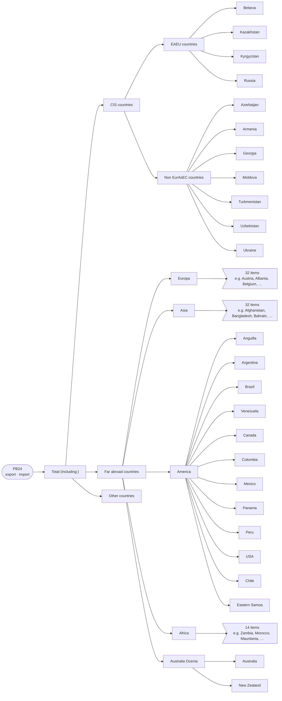

<details>
<summary>All PB24 indicators</summary>

| Code | Indicator | Measures |
|---|---|---|
| 1 | Total (Including:) |  |
| 1.1 | &nbsp;&nbsp;&nbsp;&nbsp;CIS countries |  |
| 1.1.1 | &nbsp;&nbsp;&nbsp;&nbsp;&nbsp;&nbsp;&nbsp;&nbsp;EAEU countries |  |
| 1.1.1.1 | &nbsp;&nbsp;&nbsp;&nbsp;&nbsp;&nbsp;&nbsp;&nbsp;&nbsp;&nbsp;&nbsp;&nbsp;Belarus |  |
| 1.1.1.2 | &nbsp;&nbsp;&nbsp;&nbsp;&nbsp;&nbsp;&nbsp;&nbsp;&nbsp;&nbsp;&nbsp;&nbsp;Kazakhstan |  |
| 1.1.1.3 | &nbsp;&nbsp;&nbsp;&nbsp;&nbsp;&nbsp;&nbsp;&nbsp;&nbsp;&nbsp;&nbsp;&nbsp;Kyrgyzstan |  |
| 1.1.1.4 | &nbsp;&nbsp;&nbsp;&nbsp;&nbsp;&nbsp;&nbsp;&nbsp;&nbsp;&nbsp;&nbsp;&nbsp;Russia |  |
| 1.1.2 | &nbsp;&nbsp;&nbsp;&nbsp;&nbsp;&nbsp;&nbsp;&nbsp;Non EurAsEC countries |  |
| 1.1.2.1 | &nbsp;&nbsp;&nbsp;&nbsp;&nbsp;&nbsp;&nbsp;&nbsp;&nbsp;&nbsp;&nbsp;&nbsp;Azerbaijan |  |
| 1.1.2.2 | &nbsp;&nbsp;&nbsp;&nbsp;&nbsp;&nbsp;&nbsp;&nbsp;&nbsp;&nbsp;&nbsp;&nbsp;Armenia |  |
| 1.1.2.3 | &nbsp;&nbsp;&nbsp;&nbsp;&nbsp;&nbsp;&nbsp;&nbsp;&nbsp;&nbsp;&nbsp;&nbsp;Georgia |  |
| 1.1.2.4 | &nbsp;&nbsp;&nbsp;&nbsp;&nbsp;&nbsp;&nbsp;&nbsp;&nbsp;&nbsp;&nbsp;&nbsp;Moldova |  |
| 1.1.2.5 | &nbsp;&nbsp;&nbsp;&nbsp;&nbsp;&nbsp;&nbsp;&nbsp;&nbsp;&nbsp;&nbsp;&nbsp;Turkmenistan |  |
| 1.1.2.6 | &nbsp;&nbsp;&nbsp;&nbsp;&nbsp;&nbsp;&nbsp;&nbsp;&nbsp;&nbsp;&nbsp;&nbsp;Uzbekistan |  |
| 1.1.2.7 | &nbsp;&nbsp;&nbsp;&nbsp;&nbsp;&nbsp;&nbsp;&nbsp;&nbsp;&nbsp;&nbsp;&nbsp;Ukraine |  |
| 1.2 | &nbsp;&nbsp;&nbsp;&nbsp;Far abroad countries |  |
| 1.2.1 | &nbsp;&nbsp;&nbsp;&nbsp;&nbsp;&nbsp;&nbsp;&nbsp;Europa |  |
| 1.2.1.1 | &nbsp;&nbsp;&nbsp;&nbsp;&nbsp;&nbsp;&nbsp;&nbsp;&nbsp;&nbsp;&nbsp;&nbsp;Austria |  |
| 1.2.1.2 | &nbsp;&nbsp;&nbsp;&nbsp;&nbsp;&nbsp;&nbsp;&nbsp;&nbsp;&nbsp;&nbsp;&nbsp;Albania |  |
| 1.2.1.3 | &nbsp;&nbsp;&nbsp;&nbsp;&nbsp;&nbsp;&nbsp;&nbsp;&nbsp;&nbsp;&nbsp;&nbsp;Belgium |  |
| 1.2.1.4 | &nbsp;&nbsp;&nbsp;&nbsp;&nbsp;&nbsp;&nbsp;&nbsp;&nbsp;&nbsp;&nbsp;&nbsp;Bulgaria |  |
| 1.2.1.5 | &nbsp;&nbsp;&nbsp;&nbsp;&nbsp;&nbsp;&nbsp;&nbsp;&nbsp;&nbsp;&nbsp;&nbsp;Hungary |  |
| 1.2.1.6 | &nbsp;&nbsp;&nbsp;&nbsp;&nbsp;&nbsp;&nbsp;&nbsp;&nbsp;&nbsp;&nbsp;&nbsp;Germany |  |
| 1.2.1.7 | &nbsp;&nbsp;&nbsp;&nbsp;&nbsp;&nbsp;&nbsp;&nbsp;&nbsp;&nbsp;&nbsp;&nbsp;Greece |  |
| 1.2.1.8 | &nbsp;&nbsp;&nbsp;&nbsp;&nbsp;&nbsp;&nbsp;&nbsp;&nbsp;&nbsp;&nbsp;&nbsp;Denmark |  |
| 1.2.1.9 | &nbsp;&nbsp;&nbsp;&nbsp;&nbsp;&nbsp;&nbsp;&nbsp;&nbsp;&nbsp;&nbsp;&nbsp;Ireland |  |
| 1.2.1.10 | &nbsp;&nbsp;&nbsp;&nbsp;&nbsp;&nbsp;&nbsp;&nbsp;&nbsp;&nbsp;&nbsp;&nbsp;Spain |  |
| 1.2.1.11 | &nbsp;&nbsp;&nbsp;&nbsp;&nbsp;&nbsp;&nbsp;&nbsp;&nbsp;&nbsp;&nbsp;&nbsp;Italy |  |
| 1.2.1.12 | &nbsp;&nbsp;&nbsp;&nbsp;&nbsp;&nbsp;&nbsp;&nbsp;&nbsp;&nbsp;&nbsp;&nbsp;Iceland |  |
|  | &nbsp;&nbsp;&nbsp;&nbsp;&nbsp;&nbsp;&nbsp;&nbsp;&nbsp;&nbsp;&nbsp;&nbsp;Latvia |  |
| 1.2.1.14 | &nbsp;&nbsp;&nbsp;&nbsp;&nbsp;&nbsp;&nbsp;&nbsp;&nbsp;&nbsp;&nbsp;&nbsp;Lithuania |  |
| 1.2.1.15 | &nbsp;&nbsp;&nbsp;&nbsp;&nbsp;&nbsp;&nbsp;&nbsp;&nbsp;&nbsp;&nbsp;&nbsp;Luxemburg |  |
| 1.2.1.16 | &nbsp;&nbsp;&nbsp;&nbsp;&nbsp;&nbsp;&nbsp;&nbsp;&nbsp;&nbsp;&nbsp;&nbsp;Norway |  |
| 1.2.1.17 | &nbsp;&nbsp;&nbsp;&nbsp;&nbsp;&nbsp;&nbsp;&nbsp;&nbsp;&nbsp;&nbsp;&nbsp;Poland |  |
| 1.2.1.18 | &nbsp;&nbsp;&nbsp;&nbsp;&nbsp;&nbsp;&nbsp;&nbsp;&nbsp;&nbsp;&nbsp;&nbsp;Macedonia |  |
| 1.2.1.19 | &nbsp;&nbsp;&nbsp;&nbsp;&nbsp;&nbsp;&nbsp;&nbsp;&nbsp;&nbsp;&nbsp;&nbsp;Great Britain |  |
| 1.2.1.20 | &nbsp;&nbsp;&nbsp;&nbsp;&nbsp;&nbsp;&nbsp;&nbsp;&nbsp;&nbsp;&nbsp;&nbsp;Serbia |  |
| 1.2.1.21 | &nbsp;&nbsp;&nbsp;&nbsp;&nbsp;&nbsp;&nbsp;&nbsp;&nbsp;&nbsp;&nbsp;&nbsp;Slovakia |  |
| 1.2.1.22 | &nbsp;&nbsp;&nbsp;&nbsp;&nbsp;&nbsp;&nbsp;&nbsp;&nbsp;&nbsp;&nbsp;&nbsp;Slovenia |  |
| 1.2.1.23 | &nbsp;&nbsp;&nbsp;&nbsp;&nbsp;&nbsp;&nbsp;&nbsp;&nbsp;&nbsp;&nbsp;&nbsp;Romania |  |
| 1.2.1.24 | &nbsp;&nbsp;&nbsp;&nbsp;&nbsp;&nbsp;&nbsp;&nbsp;&nbsp;&nbsp;&nbsp;&nbsp;Finland |  |
| 1.2.1.25 | &nbsp;&nbsp;&nbsp;&nbsp;&nbsp;&nbsp;&nbsp;&nbsp;&nbsp;&nbsp;&nbsp;&nbsp;France |  |
| 1.2.1.26 | &nbsp;&nbsp;&nbsp;&nbsp;&nbsp;&nbsp;&nbsp;&nbsp;&nbsp;&nbsp;&nbsp;&nbsp;Holland |  |
| 1.2.1.27 | &nbsp;&nbsp;&nbsp;&nbsp;&nbsp;&nbsp;&nbsp;&nbsp;&nbsp;&nbsp;&nbsp;&nbsp;Croatia |  |
| 1.2.1.28 | &nbsp;&nbsp;&nbsp;&nbsp;&nbsp;&nbsp;&nbsp;&nbsp;&nbsp;&nbsp;&nbsp;&nbsp;Portugal |  |
| 1.2.1.29 | &nbsp;&nbsp;&nbsp;&nbsp;&nbsp;&nbsp;&nbsp;&nbsp;&nbsp;&nbsp;&nbsp;&nbsp;Czech Republic |  |
| 1.2.1.30 | &nbsp;&nbsp;&nbsp;&nbsp;&nbsp;&nbsp;&nbsp;&nbsp;&nbsp;&nbsp;&nbsp;&nbsp;Switzerland |  |
| 1.2.1.31 | &nbsp;&nbsp;&nbsp;&nbsp;&nbsp;&nbsp;&nbsp;&nbsp;&nbsp;&nbsp;&nbsp;&nbsp;Sweden |  |
| 1.2.1.32 | &nbsp;&nbsp;&nbsp;&nbsp;&nbsp;&nbsp;&nbsp;&nbsp;&nbsp;&nbsp;&nbsp;&nbsp;Estonia |  |
| 1.2.2 | &nbsp;&nbsp;&nbsp;&nbsp;&nbsp;&nbsp;&nbsp;&nbsp;Asia |  |
| 1.2.2.1 | &nbsp;&nbsp;&nbsp;&nbsp;&nbsp;&nbsp;&nbsp;&nbsp;&nbsp;&nbsp;&nbsp;&nbsp;Afghanistan |  |
| 1.2.2.2 | &nbsp;&nbsp;&nbsp;&nbsp;&nbsp;&nbsp;&nbsp;&nbsp;&nbsp;&nbsp;&nbsp;&nbsp;Bangladesh |  |
| 1.2.2.3 | &nbsp;&nbsp;&nbsp;&nbsp;&nbsp;&nbsp;&nbsp;&nbsp;&nbsp;&nbsp;&nbsp;&nbsp;Bahrain |  |
| 1.2.2.4 | &nbsp;&nbsp;&nbsp;&nbsp;&nbsp;&nbsp;&nbsp;&nbsp;&nbsp;&nbsp;&nbsp;&nbsp;Vietnam |  |
| 1.2.2.5 | &nbsp;&nbsp;&nbsp;&nbsp;&nbsp;&nbsp;&nbsp;&nbsp;&nbsp;&nbsp;&nbsp;&nbsp;Jordan |  |
| 1.2.2.6 | &nbsp;&nbsp;&nbsp;&nbsp;&nbsp;&nbsp;&nbsp;&nbsp;&nbsp;&nbsp;&nbsp;&nbsp;Israel |  |
| 1.2.2.7 | &nbsp;&nbsp;&nbsp;&nbsp;&nbsp;&nbsp;&nbsp;&nbsp;&nbsp;&nbsp;&nbsp;&nbsp;India |  |
| 1.2.2.8 | &nbsp;&nbsp;&nbsp;&nbsp;&nbsp;&nbsp;&nbsp;&nbsp;&nbsp;&nbsp;&nbsp;&nbsp;Iran |  |
| 1.2.2.9 | &nbsp;&nbsp;&nbsp;&nbsp;&nbsp;&nbsp;&nbsp;&nbsp;&nbsp;&nbsp;&nbsp;&nbsp;Iraq |  |
| 1.2.2.10 | &nbsp;&nbsp;&nbsp;&nbsp;&nbsp;&nbsp;&nbsp;&nbsp;&nbsp;&nbsp;&nbsp;&nbsp;Cyprus |  |
| 1.2.2.11 | &nbsp;&nbsp;&nbsp;&nbsp;&nbsp;&nbsp;&nbsp;&nbsp;&nbsp;&nbsp;&nbsp;&nbsp;China |  |
| 1.2.2.12 | &nbsp;&nbsp;&nbsp;&nbsp;&nbsp;&nbsp;&nbsp;&nbsp;&nbsp;&nbsp;&nbsp;&nbsp;Taiwan |  |
| 1.2.2.13 | &nbsp;&nbsp;&nbsp;&nbsp;&nbsp;&nbsp;&nbsp;&nbsp;&nbsp;&nbsp;&nbsp;&nbsp;Malaysia |  |
| 1.2.2.14 | &nbsp;&nbsp;&nbsp;&nbsp;&nbsp;&nbsp;&nbsp;&nbsp;&nbsp;&nbsp;&nbsp;&nbsp;Maldives |  |
| 1.2.2.15 | &nbsp;&nbsp;&nbsp;&nbsp;&nbsp;&nbsp;&nbsp;&nbsp;&nbsp;&nbsp;&nbsp;&nbsp;Mongolia |  |
| 1.2.2.16 | &nbsp;&nbsp;&nbsp;&nbsp;&nbsp;&nbsp;&nbsp;&nbsp;&nbsp;&nbsp;&nbsp;&nbsp;Nepal |  |
| 1.2.2.17 | &nbsp;&nbsp;&nbsp;&nbsp;&nbsp;&nbsp;&nbsp;&nbsp;&nbsp;&nbsp;&nbsp;&nbsp;Oman |  |
| 1.2.2.18 | &nbsp;&nbsp;&nbsp;&nbsp;&nbsp;&nbsp;&nbsp;&nbsp;&nbsp;&nbsp;&nbsp;&nbsp;Syria |  |
| 1.2.2.19 | &nbsp;&nbsp;&nbsp;&nbsp;&nbsp;&nbsp;&nbsp;&nbsp;&nbsp;&nbsp;&nbsp;&nbsp;Thailand |  |
| 1.2.2.20 | &nbsp;&nbsp;&nbsp;&nbsp;&nbsp;&nbsp;&nbsp;&nbsp;&nbsp;&nbsp;&nbsp;&nbsp;United Arab Emirates |  |
| 1.2.2.21 | &nbsp;&nbsp;&nbsp;&nbsp;&nbsp;&nbsp;&nbsp;&nbsp;&nbsp;&nbsp;&nbsp;&nbsp;Pakistan |  |
| 1.2.2.22 | &nbsp;&nbsp;&nbsp;&nbsp;&nbsp;&nbsp;&nbsp;&nbsp;&nbsp;&nbsp;&nbsp;&nbsp;North Korea |  |
| 1.2.2.23 | &nbsp;&nbsp;&nbsp;&nbsp;&nbsp;&nbsp;&nbsp;&nbsp;&nbsp;&nbsp;&nbsp;&nbsp;Republic of Korea |  |
| 1.2.2.24 | &nbsp;&nbsp;&nbsp;&nbsp;&nbsp;&nbsp;&nbsp;&nbsp;&nbsp;&nbsp;&nbsp;&nbsp;Hong Kong |  |
| 1.2.2.25 | &nbsp;&nbsp;&nbsp;&nbsp;&nbsp;&nbsp;&nbsp;&nbsp;&nbsp;&nbsp;&nbsp;&nbsp;Saudi Arabia |  |
| 1.2.2.26 | &nbsp;&nbsp;&nbsp;&nbsp;&nbsp;&nbsp;&nbsp;&nbsp;&nbsp;&nbsp;&nbsp;&nbsp;Qatar |  |
| 1.2.2.27 | &nbsp;&nbsp;&nbsp;&nbsp;&nbsp;&nbsp;&nbsp;&nbsp;&nbsp;&nbsp;&nbsp;&nbsp;Kuwait |  |
| 1.2.2.28 | &nbsp;&nbsp;&nbsp;&nbsp;&nbsp;&nbsp;&nbsp;&nbsp;&nbsp;&nbsp;&nbsp;&nbsp;Singapore |  |
| 1.2.2.29 | &nbsp;&nbsp;&nbsp;&nbsp;&nbsp;&nbsp;&nbsp;&nbsp;&nbsp;&nbsp;&nbsp;&nbsp;Turkey |  |
| 1.2.2.30 | &nbsp;&nbsp;&nbsp;&nbsp;&nbsp;&nbsp;&nbsp;&nbsp;&nbsp;&nbsp;&nbsp;&nbsp;Sri Lanka |  |
| 1.2.2.31 | &nbsp;&nbsp;&nbsp;&nbsp;&nbsp;&nbsp;&nbsp;&nbsp;&nbsp;&nbsp;&nbsp;&nbsp;Philippines |  |
| 1.2.2.32 | &nbsp;&nbsp;&nbsp;&nbsp;&nbsp;&nbsp;&nbsp;&nbsp;&nbsp;&nbsp;&nbsp;&nbsp;Japan |  |
| 1.2.3 | &nbsp;&nbsp;&nbsp;&nbsp;&nbsp;&nbsp;&nbsp;&nbsp;America |  |
| 1.2.3.1 | &nbsp;&nbsp;&nbsp;&nbsp;&nbsp;&nbsp;&nbsp;&nbsp;&nbsp;&nbsp;&nbsp;&nbsp;Anguilla |  |
| 1.2.3.2 | &nbsp;&nbsp;&nbsp;&nbsp;&nbsp;&nbsp;&nbsp;&nbsp;&nbsp;&nbsp;&nbsp;&nbsp;Argentina |  |
| 1.2.3.3 | &nbsp;&nbsp;&nbsp;&nbsp;&nbsp;&nbsp;&nbsp;&nbsp;&nbsp;&nbsp;&nbsp;&nbsp;Brazil |  |
| 1.2.3.4 | &nbsp;&nbsp;&nbsp;&nbsp;&nbsp;&nbsp;&nbsp;&nbsp;&nbsp;&nbsp;&nbsp;&nbsp;Venezuela |  |
| 1.2.3.5 | &nbsp;&nbsp;&nbsp;&nbsp;&nbsp;&nbsp;&nbsp;&nbsp;&nbsp;&nbsp;&nbsp;&nbsp;Canada |  |
| 1.2.3.6 | &nbsp;&nbsp;&nbsp;&nbsp;&nbsp;&nbsp;&nbsp;&nbsp;&nbsp;&nbsp;&nbsp;&nbsp;Colombia |  |
| 1.2.3.7 | &nbsp;&nbsp;&nbsp;&nbsp;&nbsp;&nbsp;&nbsp;&nbsp;&nbsp;&nbsp;&nbsp;&nbsp;Mexico |  |
| 1.2.3.8 | &nbsp;&nbsp;&nbsp;&nbsp;&nbsp;&nbsp;&nbsp;&nbsp;&nbsp;&nbsp;&nbsp;&nbsp;Panama |  |
| 1.2.3.9 | &nbsp;&nbsp;&nbsp;&nbsp;&nbsp;&nbsp;&nbsp;&nbsp;&nbsp;&nbsp;&nbsp;&nbsp;Peru |  |
| 1.2.3.10 | &nbsp;&nbsp;&nbsp;&nbsp;&nbsp;&nbsp;&nbsp;&nbsp;&nbsp;&nbsp;&nbsp;&nbsp;USA |  |
| 1.2.3.11 | &nbsp;&nbsp;&nbsp;&nbsp;&nbsp;&nbsp;&nbsp;&nbsp;&nbsp;&nbsp;&nbsp;&nbsp;Chile |  |
| 1.2.3.12 | &nbsp;&nbsp;&nbsp;&nbsp;&nbsp;&nbsp;&nbsp;&nbsp;&nbsp;&nbsp;&nbsp;&nbsp;Eastern Samoa |  |
| 1.2.4 | &nbsp;&nbsp;&nbsp;&nbsp;&nbsp;&nbsp;&nbsp;&nbsp;Africa |  |
| 1.2.4.1 | &nbsp;&nbsp;&nbsp;&nbsp;&nbsp;&nbsp;&nbsp;&nbsp;&nbsp;&nbsp;&nbsp;&nbsp;Zambia |  |
| 1.2.4.2 | &nbsp;&nbsp;&nbsp;&nbsp;&nbsp;&nbsp;&nbsp;&nbsp;&nbsp;&nbsp;&nbsp;&nbsp;Morocco |  |
| 1.2.4.3 | &nbsp;&nbsp;&nbsp;&nbsp;&nbsp;&nbsp;&nbsp;&nbsp;&nbsp;&nbsp;&nbsp;&nbsp;Mauritania |  |
| 1.2.4.4 | &nbsp;&nbsp;&nbsp;&nbsp;&nbsp;&nbsp;&nbsp;&nbsp;&nbsp;&nbsp;&nbsp;&nbsp;Egypt |  |
| 1.2.4.5 | &nbsp;&nbsp;&nbsp;&nbsp;&nbsp;&nbsp;&nbsp;&nbsp;&nbsp;&nbsp;&nbsp;&nbsp;Ruanda |  |
| 1.2.4.6 | &nbsp;&nbsp;&nbsp;&nbsp;&nbsp;&nbsp;&nbsp;&nbsp;&nbsp;&nbsp;&nbsp;&nbsp;Djibouti |  |
| 1.2.4.7 | &nbsp;&nbsp;&nbsp;&nbsp;&nbsp;&nbsp;&nbsp;&nbsp;&nbsp;&nbsp;&nbsp;&nbsp;Nigeria |  |
| 1.2.4.8 | &nbsp;&nbsp;&nbsp;&nbsp;&nbsp;&nbsp;&nbsp;&nbsp;&nbsp;&nbsp;&nbsp;&nbsp;Sudan |  |
| 1.2.4.9 | &nbsp;&nbsp;&nbsp;&nbsp;&nbsp;&nbsp;&nbsp;&nbsp;&nbsp;&nbsp;&nbsp;&nbsp;Tanzania |  |
| 1.2.4.10 | &nbsp;&nbsp;&nbsp;&nbsp;&nbsp;&nbsp;&nbsp;&nbsp;&nbsp;&nbsp;&nbsp;&nbsp;Tunisia |  |
| 1.2.4.11 | &nbsp;&nbsp;&nbsp;&nbsp;&nbsp;&nbsp;&nbsp;&nbsp;&nbsp;&nbsp;&nbsp;&nbsp;Ethiopia |  |
| 1.2.4.12 | &nbsp;&nbsp;&nbsp;&nbsp;&nbsp;&nbsp;&nbsp;&nbsp;&nbsp;&nbsp;&nbsp;&nbsp;Kenya |  |
| 1.2.4.13 | &nbsp;&nbsp;&nbsp;&nbsp;&nbsp;&nbsp;&nbsp;&nbsp;&nbsp;&nbsp;&nbsp;&nbsp;Uganda |  |
| 1.2.4.14 | &nbsp;&nbsp;&nbsp;&nbsp;&nbsp;&nbsp;&nbsp;&nbsp;&nbsp;&nbsp;&nbsp;&nbsp;Republic of South Africa |  |
| 1.2.5 | &nbsp;&nbsp;&nbsp;&nbsp;&nbsp;&nbsp;&nbsp;&nbsp;Australia Ocenia |  |
| 1.2.5.1 | &nbsp;&nbsp;&nbsp;&nbsp;&nbsp;&nbsp;&nbsp;&nbsp;&nbsp;&nbsp;&nbsp;&nbsp;Australia |  |
| 1.2.5.2 | &nbsp;&nbsp;&nbsp;&nbsp;&nbsp;&nbsp;&nbsp;&nbsp;&nbsp;&nbsp;&nbsp;&nbsp;New Zealand |  |
| 1.3 | &nbsp;&nbsp;&nbsp;&nbsp;Other countries |  |

</details>

### PB27 · I. Current account › 1. Goods and services › 1.1 Goods › Trade by country

- Source: `output_files/PB27.v0.1101.2025_1.xlsx`
- Indicators: 86
- Breakdown (`data_type`): cost (in thousand of USD), weight
- Values: previous year; current year

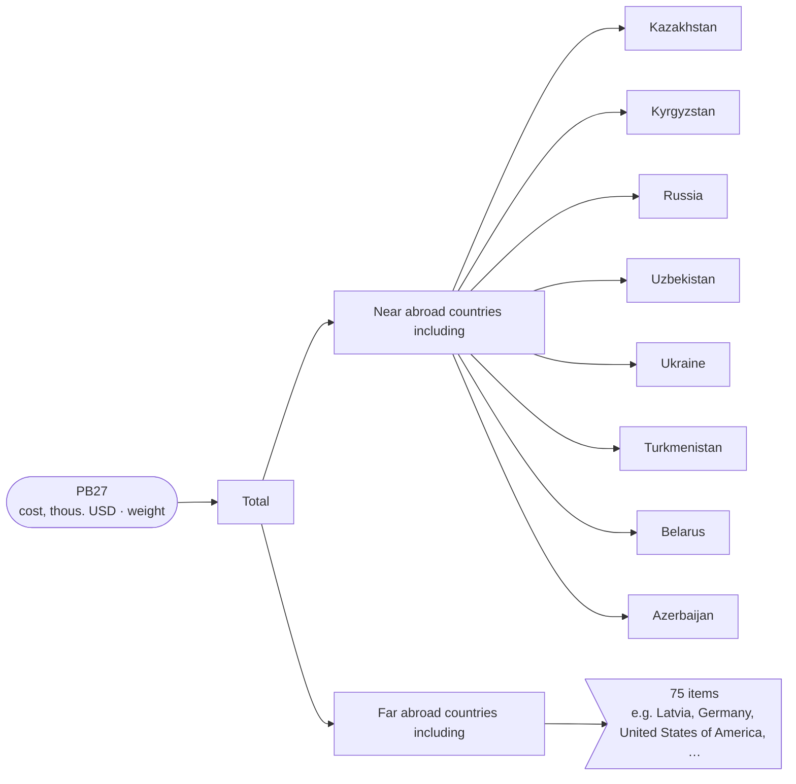

<details>
<summary>All PB27 indicators</summary>

| Code | Indicator | Measures |
|---|---|---|
| 1 | Total |  |
| 1.1 | &nbsp;&nbsp;&nbsp;&nbsp;Near abroad countries including |  |
| 1.1.1 | &nbsp;&nbsp;&nbsp;&nbsp;&nbsp;&nbsp;&nbsp;&nbsp;Kazakhstan |  |
| 1.1.2 | &nbsp;&nbsp;&nbsp;&nbsp;&nbsp;&nbsp;&nbsp;&nbsp;Kyrgyzstan |  |
| 1.1.3 | &nbsp;&nbsp;&nbsp;&nbsp;&nbsp;&nbsp;&nbsp;&nbsp;Russia |  |
| 1.1.4 | &nbsp;&nbsp;&nbsp;&nbsp;&nbsp;&nbsp;&nbsp;&nbsp;Uzbekistan |  |
| 1.1.5 | &nbsp;&nbsp;&nbsp;&nbsp;&nbsp;&nbsp;&nbsp;&nbsp;Ukraine |  |
| 1.1.6 | &nbsp;&nbsp;&nbsp;&nbsp;&nbsp;&nbsp;&nbsp;&nbsp;Turkmenistan |  |
| 1.1.7 | &nbsp;&nbsp;&nbsp;&nbsp;&nbsp;&nbsp;&nbsp;&nbsp;Belarus |  |
| 1.1.8 | &nbsp;&nbsp;&nbsp;&nbsp;&nbsp;&nbsp;&nbsp;&nbsp;Azerbaijan |  |
| 1.2 | &nbsp;&nbsp;&nbsp;&nbsp;Far abroad countries including |  |
| 1.2.1 | &nbsp;&nbsp;&nbsp;&nbsp;&nbsp;&nbsp;&nbsp;&nbsp;Latvia |  |
| 1.2.2 | &nbsp;&nbsp;&nbsp;&nbsp;&nbsp;&nbsp;&nbsp;&nbsp;Germany |  |
| 1.2.3 | &nbsp;&nbsp;&nbsp;&nbsp;&nbsp;&nbsp;&nbsp;&nbsp;United States of America |  |
| 1.2.4 | &nbsp;&nbsp;&nbsp;&nbsp;&nbsp;&nbsp;&nbsp;&nbsp;Estonia |  |
| 1.2.5 | &nbsp;&nbsp;&nbsp;&nbsp;&nbsp;&nbsp;&nbsp;&nbsp;India |  |
| 1.2.6 | &nbsp;&nbsp;&nbsp;&nbsp;&nbsp;&nbsp;&nbsp;&nbsp;Netherlands |  |
| 1.2.7 | &nbsp;&nbsp;&nbsp;&nbsp;&nbsp;&nbsp;&nbsp;&nbsp;Denmark |  |
| 1.2.8 | &nbsp;&nbsp;&nbsp;&nbsp;&nbsp;&nbsp;&nbsp;&nbsp;China |  |
| 1.2.9 | &nbsp;&nbsp;&nbsp;&nbsp;&nbsp;&nbsp;&nbsp;&nbsp;Switzerland |  |
| 1.2.10 | &nbsp;&nbsp;&nbsp;&nbsp;&nbsp;&nbsp;&nbsp;&nbsp;Austria |  |
| 1.2.11 | &nbsp;&nbsp;&nbsp;&nbsp;&nbsp;&nbsp;&nbsp;&nbsp;Greece |  |
| 1.2.12 | &nbsp;&nbsp;&nbsp;&nbsp;&nbsp;&nbsp;&nbsp;&nbsp;Islamic Republic of Iran |  |
| 1.2.13 | &nbsp;&nbsp;&nbsp;&nbsp;&nbsp;&nbsp;&nbsp;&nbsp;Malaysia |  |
| 1.2.14 | &nbsp;&nbsp;&nbsp;&nbsp;&nbsp;&nbsp;&nbsp;&nbsp;Republic of Korea |  |
| 1.2.15 | &nbsp;&nbsp;&nbsp;&nbsp;&nbsp;&nbsp;&nbsp;&nbsp;Sweden |  |
| 1.2.16 | &nbsp;&nbsp;&nbsp;&nbsp;&nbsp;&nbsp;&nbsp;&nbsp;Ireland |  |
| 1.2.17 | &nbsp;&nbsp;&nbsp;&nbsp;&nbsp;&nbsp;&nbsp;&nbsp;Belgium |  |
| 1.2.18 | &nbsp;&nbsp;&nbsp;&nbsp;&nbsp;&nbsp;&nbsp;&nbsp;United Arab Emirates |  |
| 1.2.19 | &nbsp;&nbsp;&nbsp;&nbsp;&nbsp;&nbsp;&nbsp;&nbsp;Great Britain |  |
| 1.2.20 | &nbsp;&nbsp;&nbsp;&nbsp;&nbsp;&nbsp;&nbsp;&nbsp;Spain |  |
| 1.2.21 | &nbsp;&nbsp;&nbsp;&nbsp;&nbsp;&nbsp;&nbsp;&nbsp;France |  |
| 1.2.22 | &nbsp;&nbsp;&nbsp;&nbsp;&nbsp;&nbsp;&nbsp;&nbsp;Mauritius |  |
| 1.2.23 | &nbsp;&nbsp;&nbsp;&nbsp;&nbsp;&nbsp;&nbsp;&nbsp;Republic of South Africa |  |
| 1.2.24 | &nbsp;&nbsp;&nbsp;&nbsp;&nbsp;&nbsp;&nbsp;&nbsp;Indonesia |  |
| 1.2.25 | &nbsp;&nbsp;&nbsp;&nbsp;&nbsp;&nbsp;&nbsp;&nbsp;Pakistan |  |
| 1.2.26 | &nbsp;&nbsp;&nbsp;&nbsp;&nbsp;&nbsp;&nbsp;&nbsp;Turkey |  |
| 1.2.27 | &nbsp;&nbsp;&nbsp;&nbsp;&nbsp;&nbsp;&nbsp;&nbsp;Norway |  |
| 1.2.28 | &nbsp;&nbsp;&nbsp;&nbsp;&nbsp;&nbsp;&nbsp;&nbsp;Italy |  |
| 1.2.29 | &nbsp;&nbsp;&nbsp;&nbsp;&nbsp;&nbsp;&nbsp;&nbsp;Israel |  |
| 1.2.30 | &nbsp;&nbsp;&nbsp;&nbsp;&nbsp;&nbsp;&nbsp;&nbsp;Afghanistan |  |
| 1.2.31 | &nbsp;&nbsp;&nbsp;&nbsp;&nbsp;&nbsp;&nbsp;&nbsp;Finland |  |
| 1.2.32 | &nbsp;&nbsp;&nbsp;&nbsp;&nbsp;&nbsp;&nbsp;&nbsp;Zimbabwe |  |
| 1.2.33 | &nbsp;&nbsp;&nbsp;&nbsp;&nbsp;&nbsp;&nbsp;&nbsp;Jordan |  |
| 1.2.34 | &nbsp;&nbsp;&nbsp;&nbsp;&nbsp;&nbsp;&nbsp;&nbsp;Singapore |  |
| 1.2.35 | &nbsp;&nbsp;&nbsp;&nbsp;&nbsp;&nbsp;&nbsp;&nbsp;Slovakia |  |
| 1.2.36 | &nbsp;&nbsp;&nbsp;&nbsp;&nbsp;&nbsp;&nbsp;&nbsp;Slovenia |  |
| 1.2.37 | &nbsp;&nbsp;&nbsp;&nbsp;&nbsp;&nbsp;&nbsp;&nbsp;Czech Republic |  |
| 1.2.38 | &nbsp;&nbsp;&nbsp;&nbsp;&nbsp;&nbsp;&nbsp;&nbsp;Bulgaria |  |
| 1.2.39 | &nbsp;&nbsp;&nbsp;&nbsp;&nbsp;&nbsp;&nbsp;&nbsp;Japan |  |
| 1.2.40 | &nbsp;&nbsp;&nbsp;&nbsp;&nbsp;&nbsp;&nbsp;&nbsp;Hungary |  |
| 1.2.41 | &nbsp;&nbsp;&nbsp;&nbsp;&nbsp;&nbsp;&nbsp;&nbsp;Egypt |  |
| 1.2.43 | &nbsp;&nbsp;&nbsp;&nbsp;&nbsp;&nbsp;&nbsp;&nbsp;Canada |  |
| 1.2.44 | &nbsp;&nbsp;&nbsp;&nbsp;&nbsp;&nbsp;&nbsp;&nbsp;Australia |  |
| 1.2.45 | &nbsp;&nbsp;&nbsp;&nbsp;&nbsp;&nbsp;&nbsp;&nbsp;Lithuania |  |
| 1.2.46 | &nbsp;&nbsp;&nbsp;&nbsp;&nbsp;&nbsp;&nbsp;&nbsp;Myanmar |  |
| 1.2.47 | &nbsp;&nbsp;&nbsp;&nbsp;&nbsp;&nbsp;&nbsp;&nbsp;Thailand |  |
| 1.2.50 | &nbsp;&nbsp;&nbsp;&nbsp;&nbsp;&nbsp;&nbsp;&nbsp;Hong Kong |  |
| 1.2.51 | &nbsp;&nbsp;&nbsp;&nbsp;&nbsp;&nbsp;&nbsp;&nbsp;Georgia |  |
| 1.2.52 | &nbsp;&nbsp;&nbsp;&nbsp;&nbsp;&nbsp;&nbsp;&nbsp;Taiwan |  |
| 1.2.53 | &nbsp;&nbsp;&nbsp;&nbsp;&nbsp;&nbsp;&nbsp;&nbsp;Croatia |  |
| 1.2.54 | &nbsp;&nbsp;&nbsp;&nbsp;&nbsp;&nbsp;&nbsp;&nbsp;Morocco |  |
| 1.2.55 | &nbsp;&nbsp;&nbsp;&nbsp;&nbsp;&nbsp;&nbsp;&nbsp;Anguilla |  |
| 1.2.56 | &nbsp;&nbsp;&nbsp;&nbsp;&nbsp;&nbsp;&nbsp;&nbsp;Argentina |  |
| 1.2.58 | &nbsp;&nbsp;&nbsp;&nbsp;&nbsp;&nbsp;&nbsp;&nbsp;Saudi Arabia |  |
| 1.2.59 | &nbsp;&nbsp;&nbsp;&nbsp;&nbsp;&nbsp;&nbsp;&nbsp;Qatar |  |
| 1.2.60 | &nbsp;&nbsp;&nbsp;&nbsp;&nbsp;&nbsp;&nbsp;&nbsp;Kuwait |  |
| 1.2.61 | &nbsp;&nbsp;&nbsp;&nbsp;&nbsp;&nbsp;&nbsp;&nbsp;Virgin Islands |  |
| 1.2.62 | &nbsp;&nbsp;&nbsp;&nbsp;&nbsp;&nbsp;&nbsp;&nbsp;Cyprus |  |
| 1.2.63 | &nbsp;&nbsp;&nbsp;&nbsp;&nbsp;&nbsp;&nbsp;&nbsp;Panama |  |
| 1.2.64 | &nbsp;&nbsp;&nbsp;&nbsp;&nbsp;&nbsp;&nbsp;&nbsp;Lebanon |  |
| 1.2.65 | &nbsp;&nbsp;&nbsp;&nbsp;&nbsp;&nbsp;&nbsp;&nbsp;Bosnia |  |
| 1.2.66 | &nbsp;&nbsp;&nbsp;&nbsp;&nbsp;&nbsp;&nbsp;&nbsp;Brazil |  |
| 1.2.67 | &nbsp;&nbsp;&nbsp;&nbsp;&nbsp;&nbsp;&nbsp;&nbsp;Serbia |  |
| 1.2.69 | &nbsp;&nbsp;&nbsp;&nbsp;&nbsp;&nbsp;&nbsp;&nbsp;Vietnam |  |
| 1.2.70 | &nbsp;&nbsp;&nbsp;&nbsp;&nbsp;&nbsp;&nbsp;&nbsp;New Zealand |  |
| 1.2.71 | &nbsp;&nbsp;&nbsp;&nbsp;&nbsp;&nbsp;&nbsp;&nbsp;Poland |  |
| 1.2.72 | &nbsp;&nbsp;&nbsp;&nbsp;&nbsp;&nbsp;&nbsp;&nbsp;Romania |  |
| 1.2.73 | &nbsp;&nbsp;&nbsp;&nbsp;&nbsp;&nbsp;&nbsp;&nbsp;Mexico |  |
| 1.2.74 | &nbsp;&nbsp;&nbsp;&nbsp;&nbsp;&nbsp;&nbsp;&nbsp;Philippines |  |
| 1.2.75 | &nbsp;&nbsp;&nbsp;&nbsp;&nbsp;&nbsp;&nbsp;&nbsp;Colombia |  |
| 1.2.76 | &nbsp;&nbsp;&nbsp;&nbsp;&nbsp;&nbsp;&nbsp;&nbsp;Bangladesh |  |
| 1.2.77 | &nbsp;&nbsp;&nbsp;&nbsp;&nbsp;&nbsp;&nbsp;&nbsp;Portugal |  |
| 1.2.78 | &nbsp;&nbsp;&nbsp;&nbsp;&nbsp;&nbsp;&nbsp;&nbsp;North Korea |  |
| 1.2.79 | &nbsp;&nbsp;&nbsp;&nbsp;&nbsp;&nbsp;&nbsp;&nbsp;Tunis |  |
| 1.2.80 | &nbsp;&nbsp;&nbsp;&nbsp;&nbsp;&nbsp;&nbsp;&nbsp;Other countries |  |

</details>

### PB7 · I. Current account › 1. Goods and services › 1.1 Goods › Trade by commodity › Exports by commodity

- Source: `output_files/PB7.v0.1101.2025_1.xlsx`
- Indicators: 20
- Values: quantity, thous. tons (previous year); value, thous. USD (previous year); quantity, thous. tons (current year); value, thous. USD (current year)

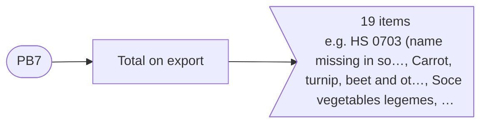

<details>
<summary>All PB7 indicators</summary>

| Code | Indicator | Measures |
|---|---|---|
|  | Total on export |  |
| 0703 | &nbsp;&nbsp;&nbsp;&nbsp;HS 0703 (name missing in source) |  |
| 0706 | &nbsp;&nbsp;&nbsp;&nbsp;Carrot, turnip, beet and others vegetables |  |
| 0713 | &nbsp;&nbsp;&nbsp;&nbsp;Soce vegetables legemes |  |
| 0802 | &nbsp;&nbsp;&nbsp;&nbsp;Other fresh or dried nuts |  |
| 0806 | &nbsp;&nbsp;&nbsp;&nbsp;Grapes |  |
| 0813 | &nbsp;&nbsp;&nbsp;&nbsp;Dried fruits |  |
| 1202 | &nbsp;&nbsp;&nbsp;&nbsp;Groundnut |  |
| 1206 | &nbsp;&nbsp;&nbsp;&nbsp;Sunflower seeds |  |
| 1212 | &nbsp;&nbsp;&nbsp;&nbsp;Bearings if carob tree, stones and kernel of fruits |  |
| 2402 | &nbsp;&nbsp;&nbsp;&nbsp;Cigarette |  |
| 4104 | &nbsp;&nbsp;&nbsp;&nbsp;Skin from horned cattle skins |  |
| 5201 | &nbsp;&nbsp;&nbsp;&nbsp;Cotton fibre |  |
| 5202 | &nbsp;&nbsp;&nbsp;&nbsp;Cotton sweepings |  |
| 5205 | &nbsp;&nbsp;&nbsp;&nbsp;Cotton yarn containing 85 % of cotton |  |
| 5208 | &nbsp;&nbsp;&nbsp;&nbsp;Cotton fabric containing 85 % of cotton not excedding 200 sq.m |  |
| 7601 | &nbsp;&nbsp;&nbsp;&nbsp;Aluminum - primary |  |
| 7604 | &nbsp;&nbsp;&nbsp;&nbsp;Rods and shape from aluminium |  |
| 7605 | &nbsp;&nbsp;&nbsp;&nbsp;Aluminium wire |  |
| 19 | &nbsp;&nbsp;&nbsp;&nbsp;Other goods |  |

</details>

### PB9 · I. Current account › 1. Goods and services › 1.1 Goods › Trade by commodity › Exports by commodity

- Source: `output_files/PB9.v0.1101.2025_1.xlsx`
- Indicators: 11
- Values: quantity, thous. tons (previous year); value, thous. USD (previous year); quantity, thous. tons (current year); value, thous. USD (current year)

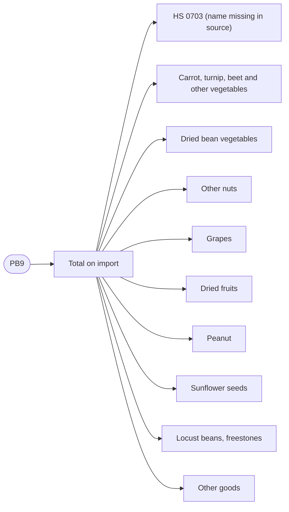

<details>
<summary>All PB9 indicators</summary>

| Code | Indicator | Measures |
|---|---|---|
|  | Total on import |  |
| 0703 | &nbsp;&nbsp;&nbsp;&nbsp;HS 0703 (name missing in source) |  |
| 0706 | &nbsp;&nbsp;&nbsp;&nbsp;Carrot, turnip, beet and other vegetables |  |
| 0713 | &nbsp;&nbsp;&nbsp;&nbsp;Dried bean vegetables |  |
| 0802 | &nbsp;&nbsp;&nbsp;&nbsp;Other nuts |  |
| 0806 | &nbsp;&nbsp;&nbsp;&nbsp;Grapes |  |
| 0813 | &nbsp;&nbsp;&nbsp;&nbsp;Dried fruits |  |
| 1202 | &nbsp;&nbsp;&nbsp;&nbsp;Peanut |  |
| 1206 | &nbsp;&nbsp;&nbsp;&nbsp;Sunflower seeds |  |
| 1212 | &nbsp;&nbsp;&nbsp;&nbsp;Locust beans, freestones |  |
| 10 | &nbsp;&nbsp;&nbsp;&nbsp;Other goods |  |

</details>

### PB11 · I. Current account › 1. Goods and services › 1.1 Goods › Trade by commodity › Exports by commodity

- Source: `output_files/PB11.v0.1101.2025_1.xlsx`
- Indicators: 21
- Values: quantity, thous. tons (previous year); value, thous. USD (previous year); quantity, thous. tons (current year); value, thous. USD (current year)

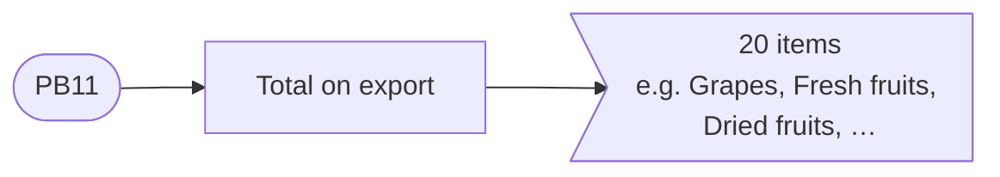

<details>
<summary>All PB11 indicators</summary>

| Code | Indicator | Measures |
|---|---|---|
|  | Total on export |  |
| 2 | &nbsp;&nbsp;&nbsp;&nbsp;Grapes |  |
| 3 | &nbsp;&nbsp;&nbsp;&nbsp;Fresh fruits |  |
| 4 | &nbsp;&nbsp;&nbsp;&nbsp;Dried fruits |  |
| 5 | &nbsp;&nbsp;&nbsp;&nbsp;Groundnut |  |
| 6 | &nbsp;&nbsp;&nbsp;&nbsp;Locust beans, freestones |  |
| 7 | &nbsp;&nbsp;&nbsp;&nbsp;Gelatin |  |
| 8 | &nbsp;&nbsp;&nbsp;&nbsp;Cotton fibre |  |
| 9 | &nbsp;&nbsp;&nbsp;&nbsp;Cotton yarn containing 85 % of cotton |  |
| 10 | &nbsp;&nbsp;&nbsp;&nbsp;Cotton fabric containing 85 % of cotton not excedding 200 sq.m |  |
| 11 | &nbsp;&nbsp;&nbsp;&nbsp;Tights, stockings, sock and other hosiery products |  |
| 12 | &nbsp;&nbsp;&nbsp;&nbsp;Suit, jacket, trousers |  |
| 13 | &nbsp;&nbsp;&nbsp;&nbsp;Suits sports, ski and bathing; clothes subjects other |  |
| 14 | &nbsp;&nbsp;&nbsp;&nbsp;Packing sack and parcel |  |
| 15 | &nbsp;&nbsp;&nbsp;&nbsp;Other products made from ferrous metals |  |
| 16 | &nbsp;&nbsp;&nbsp;&nbsp;Waste and scrap copper |  |
| 17 | &nbsp;&nbsp;&nbsp;&nbsp;Grading equipment,soil and stone breaking |  |
| 18 | &nbsp;&nbsp;&nbsp;&nbsp;Radiotelephone transmission equipment |  |
| 19 | &nbsp;&nbsp;&nbsp;&nbsp;Container |  |
| 20 | &nbsp;&nbsp;&nbsp;&nbsp;Cars |  |
| 20 | &nbsp;&nbsp;&nbsp;&nbsp;Other goods |  |

</details>

### PB13 · I. Current account › 1. Goods and services › 1.1 Goods › Trade by commodity › Exports by commodity

- Source: `output_files/PB13.v0.1101.2025_1.xlsx`
- Indicators: 16
- Values: quantity, thous. tons (previous year); value, thous. USD (previous year); quantity, thous. tons (current year); value, thous. USD (current year)

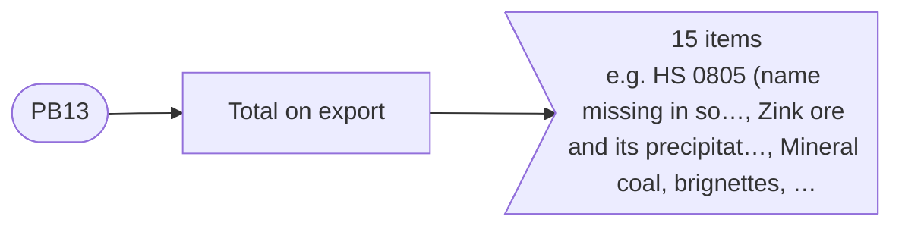

<details>
<summary>All PB13 indicators</summary>

| Code | Indicator | Measures |
|---|---|---|
|  | Total on export |  |
| 0805 | &nbsp;&nbsp;&nbsp;&nbsp;HS 0805 (name missing in source) |  |
| 2608 | &nbsp;&nbsp;&nbsp;&nbsp;Zink ore and its precipitates |  |
| 2701 | &nbsp;&nbsp;&nbsp;&nbsp;Mineral coal, brignettes |  |
| 3503 | &nbsp;&nbsp;&nbsp;&nbsp;Gelatin |  |
| 3915 | &nbsp;&nbsp;&nbsp;&nbsp;Waste |  |
| 4805 | &nbsp;&nbsp;&nbsp;&nbsp;Uncoated paper and cardboard, others |  |
| 5201 | &nbsp;&nbsp;&nbsp;&nbsp;Cotton fibre |  |
| 5205 | &nbsp;&nbsp;&nbsp;&nbsp;Cotton yarn containing 85 % of cotton |  |
| 7204 | &nbsp;&nbsp;&nbsp;&nbsp;Waste and scrap ferrous metals |  |
| 7318 | &nbsp;&nbsp;&nbsp;&nbsp;Screw, bolt, nut and washer from ferrous metal |  |
| 7404 | &nbsp;&nbsp;&nbsp;&nbsp;Waste and scrap copper |  |
| 7601 | &nbsp;&nbsp;&nbsp;&nbsp;Aluminum - primary |  |
| 7604 | &nbsp;&nbsp;&nbsp;&nbsp;Rods and shape from aluminium |  |
| 7605 | &nbsp;&nbsp;&nbsp;&nbsp;Aluminium wire |  |
| 15 | &nbsp;&nbsp;&nbsp;&nbsp;Other goods |  |

</details>

### PB15 · I. Current account › 1. Goods and services › 1.1 Goods › Trade by commodity › Exports by commodity

- Source: `output_files/PB15.v0.1101.2025_1.xlsx`
- Indicators: 16
- Values: quantity, thous. tons (previous year); value, thous. USD (previous year); quantity, thous. tons (current year); value, thous. USD (current year)

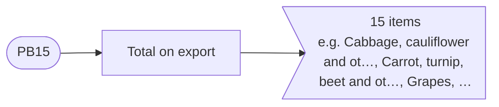

<details>
<summary>All PB15 indicators</summary>

| Code | Indicator | Measures |
|---|---|---|
|  | Total on export |  |
| 2 | &nbsp;&nbsp;&nbsp;&nbsp;Cabbage, cauliflower and others |  |
| 3 | &nbsp;&nbsp;&nbsp;&nbsp;Carrot, turnip, beet and others vegetables |  |
| 4 | &nbsp;&nbsp;&nbsp;&nbsp;Grapes |  |
| 5 | &nbsp;&nbsp;&nbsp;&nbsp;Dried fruits |  |
| 6 | &nbsp;&nbsp;&nbsp;&nbsp;Groundnut |  |
| 7 | &nbsp;&nbsp;&nbsp;&nbsp;Locust beans, freestones |  |
| 8 | &nbsp;&nbsp;&nbsp;&nbsp;Fruit juice and vegetable juice |  |
| 9 | &nbsp;&nbsp;&nbsp;&nbsp;Mineral water |  |
| 10 | &nbsp;&nbsp;&nbsp;&nbsp;Quicklime, slaked lime |  |
| 11 | &nbsp;&nbsp;&nbsp;&nbsp;Oilcakes and other firm wastes |  |
| 12 | &nbsp;&nbsp;&nbsp;&nbsp;Ores and lead concentrates |  |
| 13 | &nbsp;&nbsp;&nbsp;&nbsp;Magazines, ledgers, notebooks, notepads |  |
| 14 | &nbsp;&nbsp;&nbsp;&nbsp;Suits sports, ski and bathing; clothes subjects other |  |
| 15 | &nbsp;&nbsp;&nbsp;&nbsp;Packing sack and parcel |  |
| 15 | &nbsp;&nbsp;&nbsp;&nbsp;Other goods |  |

</details>

### PB17 · I. Current account › 1. Goods and services › 1.1 Goods › Trade by commodity › Exports by commodity

- Source: `output_files/PB17.v0.1101.2025_1.xlsx`
- Indicators: 8
- Values: quantity, thous. tons (previous year); value, thous. USD (previous year); quantity, thous. tons (current year); value, thous. USD (current year)

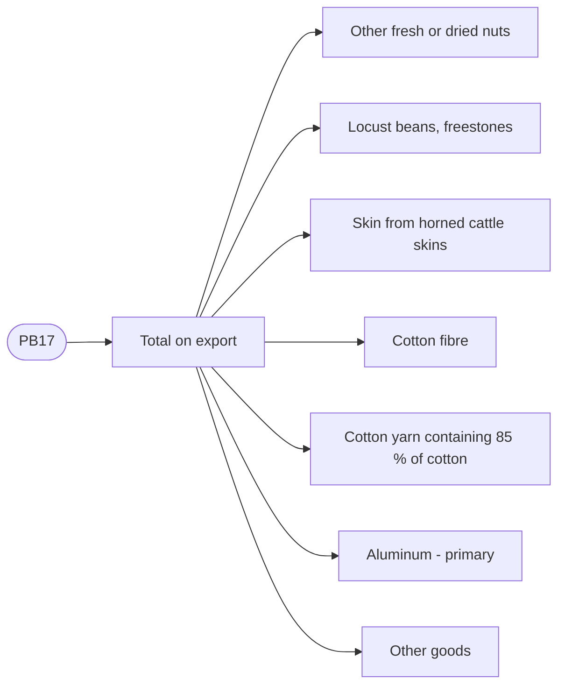

<details>
<summary>All PB17 indicators</summary>

| Code | Indicator | Measures |
|---|---|---|
|  | Total on export |  |
| 2 | &nbsp;&nbsp;&nbsp;&nbsp;Other fresh or dried nuts |  |
| 3 | &nbsp;&nbsp;&nbsp;&nbsp;Locust beans, freestones |  |
| 4 | &nbsp;&nbsp;&nbsp;&nbsp;Skin from horned cattle skins |  |
| 5 | &nbsp;&nbsp;&nbsp;&nbsp;Cotton fibre |  |
| 6 | &nbsp;&nbsp;&nbsp;&nbsp;Cotton yarn containing 85 % of cotton |  |
| 7 | &nbsp;&nbsp;&nbsp;&nbsp;Aluminum - primary |  |
| 7 | &nbsp;&nbsp;&nbsp;&nbsp;Other goods |  |

</details>

### PB19 · I. Current account › 1. Goods and services › 1.1 Goods › Trade by commodity › Exports by commodity

- Source: `output_files/PB19.v0.1101.2025_1.xlsx`
- Indicators: 6
- Values: quantity, thous. tons (previous year); value, thous. USD (previous year); quantity, thous. tons (current year); value, thous. USD (current year)

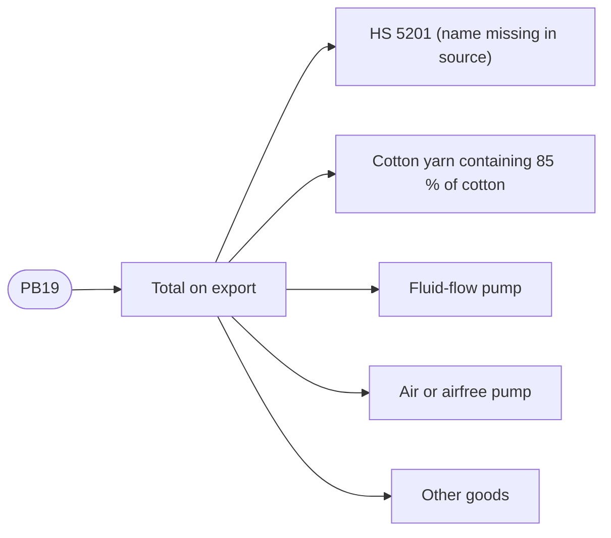

<details>
<summary>All PB19 indicators</summary>

| Code | Indicator | Measures |
|---|---|---|
|  | Total on export |  |
| 5201 | &nbsp;&nbsp;&nbsp;&nbsp;HS 5201 (name missing in source) |  |
| 5205 | &nbsp;&nbsp;&nbsp;&nbsp;Cotton yarn containing 85 % of cotton |  |
| 8413 | &nbsp;&nbsp;&nbsp;&nbsp;Fluid-flow pump |  |
| 8414 | &nbsp;&nbsp;&nbsp;&nbsp;Air or airfree pump |  |
| 5 | &nbsp;&nbsp;&nbsp;&nbsp;Other goods |  |

</details>

### PB21 · I. Current account › 1. Goods and services › 1.1 Goods › Trade by commodity › Exports by commodity

- Source: `output_files/PB21.v0.1101.2025_1.xlsx`
- Indicators: 7
- Values: quantity, thous. tons (previous year); value, thous. USD (previous year); quantity, thous. tons (current year); value, thous. USD (current year)

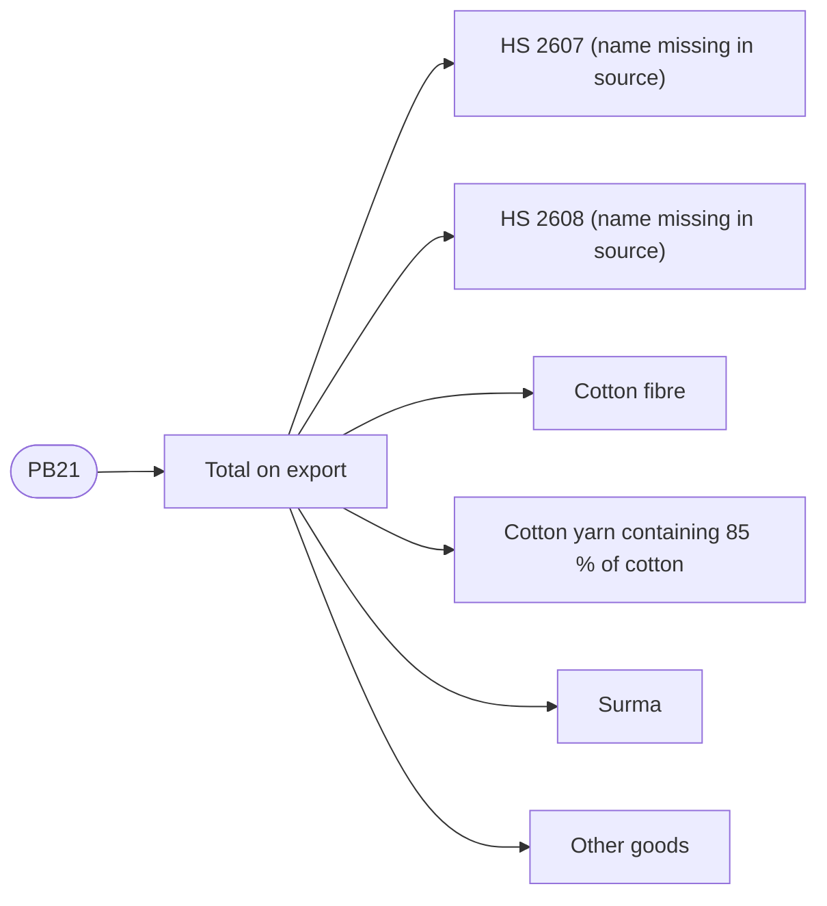

<details>
<summary>All PB21 indicators</summary>

| Code | Indicator | Measures |
|---|---|---|
|  | Total on export |  |
| 2607 | &nbsp;&nbsp;&nbsp;&nbsp;HS 2607 (name missing in source) |  |
| 2608 | &nbsp;&nbsp;&nbsp;&nbsp;HS 2608 (name missing in source) |  |
| 5201 | &nbsp;&nbsp;&nbsp;&nbsp;Cotton fibre |  |
| 5205 | &nbsp;&nbsp;&nbsp;&nbsp;Cotton yarn containing 85 % of cotton |  |
| 8110 | &nbsp;&nbsp;&nbsp;&nbsp;Surma |  |
| 5 | &nbsp;&nbsp;&nbsp;&nbsp;Other goods |  |

</details>

### PB10 · I. Current account › 1. Goods and services › 1.1 Goods › Trade by commodity

- Source: `output_files/PB10.v0.1101.2026_.xlsx`
- Indicators: 22
- Values: quantity, thous. tons (previous year); value, thous. USD (previous year); quantity, thous. tons (current year); value, thous. USD (current year)

```mermaid
flowchart LR
  pb10(["PB10"])
  pb10_1["Total"]
  pb10 --> pb10_1
  pb10_1_2>"21 items<br/>e.g. HS 203 (name missing in sou…, Plants products, Fats and butter, …"]
  pb10_1 --> pb10_1_2
```

<details>
<summary>All PB10 indicators</summary>

| Code | Indicator | Measures |
|---|---|---|
| 1231576 | Total |  |
| 203 | &nbsp;&nbsp;&nbsp;&nbsp;HS 203 (name missing in source) |  |
| 13744 | &nbsp;&nbsp;&nbsp;&nbsp;Plants products |  |
| 0 | &nbsp;&nbsp;&nbsp;&nbsp;Fats and butter |  |
| 3020 | &nbsp;&nbsp;&nbsp;&nbsp;Foodstuffs |  |
| 254918 | &nbsp;&nbsp;&nbsp;&nbsp;Mineral products |  |
| 6053 | &nbsp;&nbsp;&nbsp;&nbsp;Chemical industry production |  |
| 250 | &nbsp;&nbsp;&nbsp;&nbsp;Plastic manufacture |  |
| 2094 | &nbsp;&nbsp;&nbsp;&nbsp;Tanning raw, hide |  |
| 98 | &nbsp;&nbsp;&nbsp;&nbsp;Wood and woodwork |  |
| 416 | &nbsp;&nbsp;&nbsp;&nbsp;Paper and cardboard |  |
| 110927 | &nbsp;&nbsp;&nbsp;&nbsp;Textile materials and textile goods |  |
| 26 | &nbsp;&nbsp;&nbsp;&nbsp;Footwear, headgear |  |
| 154 | &nbsp;&nbsp;&nbsp;&nbsp;Stone ware |  |
| 708925 | &nbsp;&nbsp;&nbsp;&nbsp;Precious and semiprecious stone and metals |  |
| 122264 | &nbsp;&nbsp;&nbsp;&nbsp;Not precious metals |  |
| 3497 | &nbsp;&nbsp;&nbsp;&nbsp;Machinery, equipment and spare parts |  |
| 4406 | &nbsp;&nbsp;&nbsp;&nbsp;Surface, air and water transport facilities |  |
| 0 | &nbsp;&nbsp;&nbsp;&nbsp;Optical instruments and devices, clock |  |
| 581 | &nbsp;&nbsp;&nbsp;&nbsp;Other industrial goods |  |
| 0 | &nbsp;&nbsp;&nbsp;&nbsp;Artwork |  |
| 0 | &nbsp;&nbsp;&nbsp;&nbsp;Others |  |

</details>

### PB8 · I. Current account › 1. Goods and services › 1.1 Goods › Trade by commodity › Imports by commodity

- Source: `output_files/PB8.v0.1101.2025_1.xlsx`
- Indicators: 87
- Values: quantity, thous. tons (previous year); value, thous. USD (previous year); quantity, thous. tons (current year); value, thous. USD (current year)

```mermaid
flowchart LR
  pb8(["PB8"])
  pb8_1["Total on import"]
  pb8 --> pb8_1
  pb8_1_2>"86 items<br/>e.g. HS 1001 (name missing in so…, Barley, Corn, …"]
  pb8_1 --> pb8_1_2
```

<details>
<summary>All PB8 indicators</summary>

| Code | Indicator | Measures |
|---|---|---|
|  | Total on import |  |
| 1001 | &nbsp;&nbsp;&nbsp;&nbsp;HS 1001 (name missing in source) |  |
| 1003 | &nbsp;&nbsp;&nbsp;&nbsp;Barley |  |
| 1005 | &nbsp;&nbsp;&nbsp;&nbsp;Corn |  |
| 1006 | &nbsp;&nbsp;&nbsp;&nbsp;Rice |  |
| 1101 | &nbsp;&nbsp;&nbsp;&nbsp;Flour |  |
| 1103 | &nbsp;&nbsp;&nbsp;&nbsp;Semolina, household flour |  |
| 1104 | &nbsp;&nbsp;&nbsp;&nbsp;Scoured and cracked grain |  |
| 1107 | &nbsp;&nbsp;&nbsp;&nbsp;The malt which roasted or has been not roasted |  |
| 1108 | &nbsp;&nbsp;&nbsp;&nbsp;Starch, inuline |  |
| 1512 | &nbsp;&nbsp;&nbsp;&nbsp;Sunflower oil |  |
| 1513 | &nbsp;&nbsp;&nbsp;&nbsp;Coconut oil and its ofher fyres |  |
| 1515 | &nbsp;&nbsp;&nbsp;&nbsp;Salad and fats |  |
| 1516 | &nbsp;&nbsp;&nbsp;&nbsp;Salad and animal oils and fats |  |
| 1517 | &nbsp;&nbsp;&nbsp;&nbsp;Margarine |  |
| 1701 | &nbsp;&nbsp;&nbsp;&nbsp;Sugar |  |
| 1702 | &nbsp;&nbsp;&nbsp;&nbsp;Other kind of sugar |  |
| 1704 | &nbsp;&nbsp;&nbsp;&nbsp;Pastry |  |
| 1901 | &nbsp;&nbsp;&nbsp;&nbsp;Malt extract |  |
| 1902 | &nbsp;&nbsp;&nbsp;&nbsp;Pasta |  |
| 1904 | &nbsp;&nbsp;&nbsp;&nbsp;Ready foodstuff |  |
| 1905 | &nbsp;&nbsp;&nbsp;&nbsp;Bread, pastry, cookie |  |
| 2601 | &nbsp;&nbsp;&nbsp;&nbsp;Micaceous iron ore |  |
| 2701 | &nbsp;&nbsp;&nbsp;&nbsp;Mineral coal, brignettes |  |
| 2708 | &nbsp;&nbsp;&nbsp;&nbsp;Pitchy bake and coke |  |
| 2710 | &nbsp;&nbsp;&nbsp;&nbsp;Oil products |  |
| 2711 | &nbsp;&nbsp;&nbsp;&nbsp;Natural gas (million cubic meters) |  |
| 2712 | &nbsp;&nbsp;&nbsp;&nbsp;Refinery oil |  |
| 2713 | &nbsp;&nbsp;&nbsp;&nbsp;Refinery coke |  |
| 3102 | &nbsp;&nbsp;&nbsp;&nbsp;Mineral nitrogen fertilizer |  |
| 3103 | &nbsp;&nbsp;&nbsp;&nbsp;Mineral phosphorous fertilizer |  |
| 3105 | &nbsp;&nbsp;&nbsp;&nbsp;Other mineral fertilizer |  |
| 8402 | &nbsp;&nbsp;&nbsp;&nbsp;Steam boiler |  |
| 8403 | &nbsp;&nbsp;&nbsp;&nbsp;Central heating boiler |  |
| 8407 | &nbsp;&nbsp;&nbsp;&nbsp;Spark-ignited engines with spark ignition |  |
| 8408 | &nbsp;&nbsp;&nbsp;&nbsp;Combustion engines |  |
| 8409 | &nbsp;&nbsp;&nbsp;&nbsp;Spare parts for engines |  |
| 8412 | &nbsp;&nbsp;&nbsp;&nbsp;Engines and power plants |  |
| 8413 | &nbsp;&nbsp;&nbsp;&nbsp;Fluid-flow pump |  |
| 8414 | &nbsp;&nbsp;&nbsp;&nbsp;Air or airfree pump |  |
| 8415 | &nbsp;&nbsp;&nbsp;&nbsp;Air-conditioning devices |  |
| 8417 | &nbsp;&nbsp;&nbsp;&nbsp;Ovens and chambers, industrial and laboratory |  |
| 8418 | &nbsp;&nbsp;&nbsp;&nbsp;Refrigerator and deep freeze |  |
| 8419 | &nbsp;&nbsp;&nbsp;&nbsp;Equipments and industrial vehicle |  |
| 8421 | &nbsp;&nbsp;&nbsp;&nbsp;Centrifuges, aggregates |  |
| 8422 | &nbsp;&nbsp;&nbsp;&nbsp;Dishwasher |  |
| 8423 | &nbsp;&nbsp;&nbsp;&nbsp;Weighing equipment |  |
| 8424 | &nbsp;&nbsp;&nbsp;&nbsp;Mechanical device |  |
| 8425 | &nbsp;&nbsp;&nbsp;&nbsp;Lifting tackle, elevator and adjustable jack |  |
| 8426 | &nbsp;&nbsp;&nbsp;&nbsp;Cranes, loaders |  |
| 8427 | &nbsp;&nbsp;&nbsp;&nbsp;Truck loader |  |
| 8428 | &nbsp;&nbsp;&nbsp;&nbsp;Machines and hoisting device |  |
| 8429 | &nbsp;&nbsp;&nbsp;&nbsp;Bulldozers |  |
| 8430 | &nbsp;&nbsp;&nbsp;&nbsp;Drilling and plug-ramming machine |  |
| 8431 | &nbsp;&nbsp;&nbsp;&nbsp;Parts for lifting and transporting equipment, 8425-8430 |  |
| 8432 | &nbsp;&nbsp;&nbsp;&nbsp;Agricultural machinery for soin frcafment |  |
| 8433 | &nbsp;&nbsp;&nbsp;&nbsp;Machines for thresh crop |  |
| 8436 | &nbsp;&nbsp;&nbsp;&nbsp;Agricultural equipment |  |
| 8437 | &nbsp;&nbsp;&nbsp;&nbsp;Machines for cleaning and assortment of seeds |  |
| 8438 | &nbsp;&nbsp;&nbsp;&nbsp;Cooking equipment |  |
| 8441 | &nbsp;&nbsp;&nbsp;&nbsp;Equipment for paper manufacture |  |
| 8443 | &nbsp;&nbsp;&nbsp;&nbsp;Printing equipment |  |
| 8445 | &nbsp;&nbsp;&nbsp;&nbsp;Equipment for textile fiber |  |
| 8446 | &nbsp;&nbsp;&nbsp;&nbsp;Dielectric |  |
| 8448 | &nbsp;&nbsp;&nbsp;&nbsp;Parts and supporting machine |  |
| 8450 | &nbsp;&nbsp;&nbsp;&nbsp;Washing machine |  |
| 8451 | &nbsp;&nbsp;&nbsp;&nbsp;Techniques for washing, cleaning,drying,ironing,pressing and etc. |  |
| 8452 | &nbsp;&nbsp;&nbsp;&nbsp;Sewing machine |  |
| 8458 | &nbsp;&nbsp;&nbsp;&nbsp;Turning metal-cutting equipment |  |
| 8462 | &nbsp;&nbsp;&nbsp;&nbsp;Fabrication machinery |  |
| 8463 | &nbsp;&nbsp;&nbsp;&nbsp;Machine for metalworking |  |
| 8464 | &nbsp;&nbsp;&nbsp;&nbsp;Machine for stone working |  |
| 8465 | &nbsp;&nbsp;&nbsp;&nbsp;Machine for processing |  |
| 8466 | &nbsp;&nbsp;&nbsp;&nbsp;Metal-cutting turing details |  |
| 8467 | &nbsp;&nbsp;&nbsp;&nbsp;Hand tools |  |
| 8470 | &nbsp;&nbsp;&nbsp;&nbsp;Calculator and other goods |  |
| 8471 | &nbsp;&nbsp;&nbsp;&nbsp;Mathematical equipment |  |
| 8472 | &nbsp;&nbsp;&nbsp;&nbsp;Office equipment |  |
| 8473 | &nbsp;&nbsp;&nbsp;&nbsp;Parts for computing technics |  |
| 8474 | &nbsp;&nbsp;&nbsp;&nbsp;Grading equipment,soil and stone breaking |  |
| 8477 | &nbsp;&nbsp;&nbsp;&nbsp;Machines for plastic and rubber |  |
| 8479 | &nbsp;&nbsp;&nbsp;&nbsp;Macines special-purpose equipment |  |
| 8480 | &nbsp;&nbsp;&nbsp;&nbsp;Flask and iron mould |  |
| 8481 | &nbsp;&nbsp;&nbsp;&nbsp;Cranes for pipelines |  |
| 8482 | &nbsp;&nbsp;&nbsp;&nbsp;Ball bushing, roller bearing |  |
| 8483 | &nbsp;&nbsp;&nbsp;&nbsp;Power transmission shaft |  |
| 86 | &nbsp;&nbsp;&nbsp;&nbsp;Other goods |  |

</details>

### PB12 · I. Current account › 1. Goods and services › 1.1 Goods › Trade by commodity › Imports by commodity

- Source: `output_files/PB12.v0.1101.2025_1.xlsx`
- Indicators: 95
- Values: quantity, thous. tons (previous year); value, thous. USD (previous year); quantity, thous. tons (current year); value, thous. USD (current year)

```mermaid
flowchart LR
  pb12(["PB12"])
  pb12_1["Total on import"]
  pb12 --> pb12_1
  pb12_1_2>"94 items<br/>e.g. HS 0207 (name missing in so…, Frozen fish, Soce vegetables legemes, …"]
  pb12_1 --> pb12_1_2
```

<details>
<summary>All PB12 indicators</summary>

| Code | Indicator | Measures |
|---|---|---|
|  | Total on import |  |
| 0207 | &nbsp;&nbsp;&nbsp;&nbsp;HS 0207 (name missing in source) |  |
| 0303 | &nbsp;&nbsp;&nbsp;&nbsp;Frozen fish |  |
| 0713 | &nbsp;&nbsp;&nbsp;&nbsp;Soce vegetables legemes |  |
| 0902 | &nbsp;&nbsp;&nbsp;&nbsp;Tea |  |
| 1101 | &nbsp;&nbsp;&nbsp;&nbsp;Flour |  |
| 1104 | &nbsp;&nbsp;&nbsp;&nbsp;Scoured and cracked grain |  |
| 1107 | &nbsp;&nbsp;&nbsp;&nbsp;The malt which roasted or has been not roasted |  |
| 1108 | &nbsp;&nbsp;&nbsp;&nbsp;Starch, inuline |  |
| 1507 | &nbsp;&nbsp;&nbsp;&nbsp;Soybean oil and its fraction |  |
| 1512 | &nbsp;&nbsp;&nbsp;&nbsp;Sunflower oil |  |
| 1516 | &nbsp;&nbsp;&nbsp;&nbsp;Salad and animal oils and fats |  |
| 1517 | &nbsp;&nbsp;&nbsp;&nbsp;Margarine |  |
| 1602 | &nbsp;&nbsp;&nbsp;&nbsp;Ready or canned meat products |  |
| 1701 | &nbsp;&nbsp;&nbsp;&nbsp;Sugar |  |
| 1704 | &nbsp;&nbsp;&nbsp;&nbsp;Pastry |  |
| 1806 | &nbsp;&nbsp;&nbsp;&nbsp;Chocolate |  |
| 1901 | &nbsp;&nbsp;&nbsp;&nbsp;Malt extract |  |
| 1905 | &nbsp;&nbsp;&nbsp;&nbsp;Bread, pastry, cookie |  |
| 2005 | &nbsp;&nbsp;&nbsp;&nbsp;Vegetables, prepared or conserved without vinegar |  |
| 2008 | &nbsp;&nbsp;&nbsp;&nbsp;Fruit |  |
| 2101 | &nbsp;&nbsp;&nbsp;&nbsp;Extraction and coffee concentrates |  |
| 2102 | &nbsp;&nbsp;&nbsp;&nbsp;Yeast |  |
| 2103 | &nbsp;&nbsp;&nbsp;&nbsp;Products for sauce producing |  |
| 2106 | &nbsp;&nbsp;&nbsp;&nbsp;Other foodstuffs |  |
| 2201 | &nbsp;&nbsp;&nbsp;&nbsp;Mineral water free sugar additives |  |
| 2202 | &nbsp;&nbsp;&nbsp;&nbsp;Mineral water |  |
| 2203 | &nbsp;&nbsp;&nbsp;&nbsp;Beer |  |
| 2208 | &nbsp;&nbsp;&nbsp;&nbsp;Alcohol |  |
| 2304 | &nbsp;&nbsp;&nbsp;&nbsp;Oil cakes and other firm waste received from soy oil |  |
| 2309 | &nbsp;&nbsp;&nbsp;&nbsp;Feeding-stuffs |  |
| 2601 | &nbsp;&nbsp;&nbsp;&nbsp;Micaceous iron ore |  |
| 2704 | &nbsp;&nbsp;&nbsp;&nbsp;Charred coal |  |
| 2711 | &nbsp;&nbsp;&nbsp;&nbsp;Natural gas (million cubic meters) |  |
| 2713 | &nbsp;&nbsp;&nbsp;&nbsp;Refinery coke |  |
| 2833 | &nbsp;&nbsp;&nbsp;&nbsp;Sulphate |  |
| 2835 | &nbsp;&nbsp;&nbsp;&nbsp;Phosphate |  |
| 2836 | &nbsp;&nbsp;&nbsp;&nbsp;Carbonate |  |
| 2837 | &nbsp;&nbsp;&nbsp;&nbsp;Cyanides |  |
| 3002 | &nbsp;&nbsp;&nbsp;&nbsp;Drugs are not available |  |
| 3004 | &nbsp;&nbsp;&nbsp;&nbsp;Drugs packed |  |
| 3102 | &nbsp;&nbsp;&nbsp;&nbsp;Mineral nitrogen fertilizer |  |
| 3105 | &nbsp;&nbsp;&nbsp;&nbsp;Other mineral fertilizer |  |
| 3208 | &nbsp;&nbsp;&nbsp;&nbsp;Synthetic paint and synthetic varnish, non-aqueous medium |  |
| 3209 | &nbsp;&nbsp;&nbsp;&nbsp;Synthetic paint and synthetic varnish, aquatic medium |  |
| 3214 | &nbsp;&nbsp;&nbsp;&nbsp;Putty glass and garden, coating for painting works |  |
| 3304 | &nbsp;&nbsp;&nbsp;&nbsp;Cosmetics |  |
| 3305 | &nbsp;&nbsp;&nbsp;&nbsp;Hare care range |  |
| 3307 | &nbsp;&nbsp;&nbsp;&nbsp;Shaving means, deodorants |  |
| 3401 | &nbsp;&nbsp;&nbsp;&nbsp;Soap |  |
| 3402 | &nbsp;&nbsp;&nbsp;&nbsp;Cleaning fluids and detergents |  |
| 3902 | &nbsp;&nbsp;&nbsp;&nbsp;Polymers of propylene or other olefine in initial form |  |
| 3904 | &nbsp;&nbsp;&nbsp;&nbsp;Polymer vinyl chloride or other olefine in initial form |  |
| 3925 | &nbsp;&nbsp;&nbsp;&nbsp;Construction parts from plastic |  |
| 4011 | &nbsp;&nbsp;&nbsp;&nbsp;Pneumatic buses I new |  |
| 4407 | &nbsp;&nbsp;&nbsp;&nbsp;Chipboard |  |
| 4411 | &nbsp;&nbsp;&nbsp;&nbsp;Cane fiber board |  |
| 4418 | &nbsp;&nbsp;&nbsp;&nbsp;Wooden construction products |  |
| 4707 | &nbsp;&nbsp;&nbsp;&nbsp;Waste paper |  |
| 4801 | &nbsp;&nbsp;&nbsp;&nbsp;Newsprint paper |  |
| 4802 | &nbsp;&nbsp;&nbsp;&nbsp;Uncoated paper and cardboard |  |
| 5703 | &nbsp;&nbsp;&nbsp;&nbsp;Carpets and other textile floor coverings |  |
| 5904 | &nbsp;&nbsp;&nbsp;&nbsp;Linoleum |  |
| 6203 | &nbsp;&nbsp;&nbsp;&nbsp;Suit, jacket, trousers |  |
| 6807 | &nbsp;&nbsp;&nbsp;&nbsp;Asphalt products |  |
| 6811 | &nbsp;&nbsp;&nbsp;&nbsp;Asbestos cement and cement products |  |
| 6902 | &nbsp;&nbsp;&nbsp;&nbsp;Fire bricks, blocks, ceramic tiles and other ceramic siliceous stones |  |
| 6907 | &nbsp;&nbsp;&nbsp;&nbsp;Flagstone, faced tiles for floors, stoves, unglazed ceramic chimneys |  |
| 6908 | &nbsp;&nbsp;&nbsp;&nbsp;Flagstone, faced tiles for floors, stoves, glazed ceramic chimneys |  |
| 7005 | &nbsp;&nbsp;&nbsp;&nbsp;Thermic polished glass with mat surface |  |
| 7010 | &nbsp;&nbsp;&nbsp;&nbsp;Large bottles, bottles, flacons, jugs, pots, jars, ampoules and other glass containers |  |
| 7208 | &nbsp;&nbsp;&nbsp;&nbsp;Flat roll stock made from carbon steel |  |
| 7209 | &nbsp;&nbsp;&nbsp;&nbsp;Flat-rolled products from iron or plain steel of 600 mm width |  |
| 7210 | &nbsp;&nbsp;&nbsp;&nbsp;Flat rolled metal made from carbon steel of 600 mm width |  |
| 7213 | &nbsp;&nbsp;&nbsp;&nbsp;Hot-rolled rod from iron or plain steel |  |
| 7214 | &nbsp;&nbsp;&nbsp;&nbsp;Rods made from carbon steel, width 600 mm |  |
| 7216 | &nbsp;&nbsp;&nbsp;&nbsp;Angle bars, metal shapes made from carbon steel |  |
| 8450 | &nbsp;&nbsp;&nbsp;&nbsp;Washing machine |  |
| 8474 | &nbsp;&nbsp;&nbsp;&nbsp;Grading equipment,soil and stone breaking |  |
| 8477 | &nbsp;&nbsp;&nbsp;&nbsp;Machines for plastic and rubber |  |
| 8481 | &nbsp;&nbsp;&nbsp;&nbsp;Cranes for pipelines |  |
| 8504 | &nbsp;&nbsp;&nbsp;&nbsp;Electric transformers, static and electric transformers (rectifier unit, air-core inductances) |  |
| 8507 | &nbsp;&nbsp;&nbsp;&nbsp;Battery electric |  |
| 8516 | &nbsp;&nbsp;&nbsp;&nbsp;Electric water heaters |  |
| 8517 | &nbsp;&nbsp;&nbsp;&nbsp;Telephone sets or telegraph devices |  |
| 8528 | &nbsp;&nbsp;&nbsp;&nbsp;Receiving equipment for television communication |  |
| 8537 | &nbsp;&nbsp;&nbsp;&nbsp;Benchboards, pads, consoles |  |
| 8544 | &nbsp;&nbsp;&nbsp;&nbsp;Isolated wires, cables |  |
| 8546 | &nbsp;&nbsp;&nbsp;&nbsp;Electrical insulators |  |
| 8703 | &nbsp;&nbsp;&nbsp;&nbsp;Cars |  |
| 8704 | &nbsp;&nbsp;&nbsp;&nbsp;Trucks |  |
| 8705 | &nbsp;&nbsp;&nbsp;&nbsp;Cars specially allocation |  |
| 8708 | &nbsp;&nbsp;&nbsp;&nbsp;Spare parts for cars |  |
| 8716 | &nbsp;&nbsp;&nbsp;&nbsp;Trailers and semi-trailers |  |
| 94 | &nbsp;&nbsp;&nbsp;&nbsp;Other goods |  |

</details>

### PB14 · I. Current account › 1. Goods and services › 1.1 Goods › Trade by commodity › Imports by commodity

- Source: `output_files/PB14.v0.1101.2025_1.xlsx`
- Indicators: 78
- Values: quantity, thous. tons (previous year); value, thous. USD (previous year); quantity, thous. tons (current year); value, thous. USD (current year)

```mermaid
flowchart LR
  pb14(["PB14"])
  pb14_1["Total on import"]
  pb14 --> pb14_1
  pb14_1_2>"77 items<br/>e.g. HS 0407 (name missing in so…, Fresh fruits, Sunflower oil, …"]
  pb14_1 --> pb14_1_2
```

<details>
<summary>All PB14 indicators</summary>

| Code | Indicator | Measures |
|---|---|---|
|  | Total on import |  |
| 0407 | &nbsp;&nbsp;&nbsp;&nbsp;HS 0407 (name missing in source) |  |
| 0810 | &nbsp;&nbsp;&nbsp;&nbsp;Fresh fruits |  |
| 1512 | &nbsp;&nbsp;&nbsp;&nbsp;Sunflower oil |  |
| 1517 | &nbsp;&nbsp;&nbsp;&nbsp;Margarine |  |
| 1601 | &nbsp;&nbsp;&nbsp;&nbsp;Sausages and meat products |  |
| 1704 | &nbsp;&nbsp;&nbsp;&nbsp;Pastry |  |
| 1806 | &nbsp;&nbsp;&nbsp;&nbsp;Chocolate |  |
| 1902 | &nbsp;&nbsp;&nbsp;&nbsp;Pasta |  |
| 1905 | &nbsp;&nbsp;&nbsp;&nbsp;Bread, pastry, cookie |  |
| 2005 | &nbsp;&nbsp;&nbsp;&nbsp;Vegetables, prepared or conserved without vinegar |  |
| 2009 | &nbsp;&nbsp;&nbsp;&nbsp;Fruit juice and vegetable juice |  |
| 2106 | &nbsp;&nbsp;&nbsp;&nbsp;Other foodstuffs |  |
| 2202 | &nbsp;&nbsp;&nbsp;&nbsp;Mineral water |  |
| 2304 | &nbsp;&nbsp;&nbsp;&nbsp;Oil cakes and other firm waste received from soy oil |  |
| 2309 | &nbsp;&nbsp;&nbsp;&nbsp;Feeding-stuffs |  |
| 2503 | &nbsp;&nbsp;&nbsp;&nbsp;Cosmetic means |  |
| 2520 | &nbsp;&nbsp;&nbsp;&nbsp;Gypsum, anhydrite, bonding plaster |  |
| 2523 | &nbsp;&nbsp;&nbsp;&nbsp;Portland cement |  |
| 2701 | &nbsp;&nbsp;&nbsp;&nbsp;Mineral coal, brignettes |  |
| 2710 | &nbsp;&nbsp;&nbsp;&nbsp;Oil products |  |
| 2713 | &nbsp;&nbsp;&nbsp;&nbsp;Refinery coke |  |
| 2716 | &nbsp;&nbsp;&nbsp;&nbsp;Electricity |  |
| 2836 | &nbsp;&nbsp;&nbsp;&nbsp;Carbonate |  |
| 2839 | &nbsp;&nbsp;&nbsp;&nbsp;Silicates |  |
| 3004 | &nbsp;&nbsp;&nbsp;&nbsp;Drugs packed |  |
| 3105 | &nbsp;&nbsp;&nbsp;&nbsp;Other mineral fertilizer |  |
| 3305 | &nbsp;&nbsp;&nbsp;&nbsp;Hare care range |  |
| 3401 | &nbsp;&nbsp;&nbsp;&nbsp;Soap |  |
| 3402 | &nbsp;&nbsp;&nbsp;&nbsp;Cleaning fluids and detergents |  |
| 3605 | &nbsp;&nbsp;&nbsp;&nbsp;Match |  |
| 3814 | &nbsp;&nbsp;&nbsp;&nbsp;Solvent |  |
| 3820 | &nbsp;&nbsp;&nbsp;&nbsp;Antifreeze |  |
| 3901 | &nbsp;&nbsp;&nbsp;&nbsp;Polymers chloride vinyl |  |
| 3902 | &nbsp;&nbsp;&nbsp;&nbsp;Polymers of propylene or other olefine in initial form |  |
| 3904 | &nbsp;&nbsp;&nbsp;&nbsp;Polymer vinyl chloride or other olefine in initial form |  |
| 3906 | &nbsp;&nbsp;&nbsp;&nbsp;Polymer acrylic in initial form |  |
| 3916 | &nbsp;&nbsp;&nbsp;&nbsp;Monofilament yarn from polimeric material of longth more 1 mm |  |
| 3917 | &nbsp;&nbsp;&nbsp;&nbsp;Plastic tubes and pipes |  |
| 3921 | &nbsp;&nbsp;&nbsp;&nbsp;Slabs made from polymeric materials |  |
| 3923 | &nbsp;&nbsp;&nbsp;&nbsp;Products for packing of goods from plastic |  |
| 3925 | &nbsp;&nbsp;&nbsp;&nbsp;Construction parts from plastic |  |
| 4016 | &nbsp;&nbsp;&nbsp;&nbsp;Other products made from rubber |  |
| 4407 | &nbsp;&nbsp;&nbsp;&nbsp;Chipboard |  |
| 4410 | &nbsp;&nbsp;&nbsp;&nbsp;Construction parts from plastic |  |
| 4411 | &nbsp;&nbsp;&nbsp;&nbsp;Cane fiber board |  |
| 4802 | &nbsp;&nbsp;&nbsp;&nbsp;Uncoated paper and cardboard |  |
| 4805 | &nbsp;&nbsp;&nbsp;&nbsp;Uncoated paper and cardboard, others |  |
| 4814 | &nbsp;&nbsp;&nbsp;&nbsp;Wallpapers and similar wall coverings |  |
| 4818 | &nbsp;&nbsp;&nbsp;&nbsp;Soft tissue paper |  |
| 4819 | &nbsp;&nbsp;&nbsp;&nbsp;Bandbox, boxes, packages, paper bags, packets and other tare made from paper |  |
| 4820 | &nbsp;&nbsp;&nbsp;&nbsp;Magazines, ledgers, notebooks, notepads |  |
| 5202 | &nbsp;&nbsp;&nbsp;&nbsp;Cotton sweepings |  |
| 5208 | &nbsp;&nbsp;&nbsp;&nbsp;Cotton fabric containing 85 % of cotton not excedding 200 sq.m |  |
| 5402 | &nbsp;&nbsp;&nbsp;&nbsp;Yarn synthetic |  |
| 5503 | &nbsp;&nbsp;&nbsp;&nbsp;Fiber synthetic |  |
| 5601 | &nbsp;&nbsp;&nbsp;&nbsp;Wadding of textile materials and articles there of |  |
| 5603 | &nbsp;&nbsp;&nbsp;&nbsp;Nonwovens |  |
| 6109 | &nbsp;&nbsp;&nbsp;&nbsp;T-shirt and knitted goods |  |
| 6111 | &nbsp;&nbsp;&nbsp;&nbsp;Children's apparel and accessory to children wear knitted machine or crochetting |  |
| 6115 | &nbsp;&nbsp;&nbsp;&nbsp;Tights, stockings, sock and other hosiery products |  |
| 7216 | &nbsp;&nbsp;&nbsp;&nbsp;Angle bars, metal shapes made from carbon steel |  |
| 7306 | &nbsp;&nbsp;&nbsp;&nbsp;Pipes, lances, shapes made from ferrous metals |  |
| 7308 | &nbsp;&nbsp;&nbsp;&nbsp;Metal structure from ferrous materials |  |
| 7318 | &nbsp;&nbsp;&nbsp;&nbsp;Screw, bolt, nut and washer from ferrous metal |  |
| 7326 | &nbsp;&nbsp;&nbsp;&nbsp;Other products made from ferrous metals |  |
| 8403 | &nbsp;&nbsp;&nbsp;&nbsp;Central heating boiler |  |
| 8414 | &nbsp;&nbsp;&nbsp;&nbsp;Air or airfree pump |  |
| 8415 | &nbsp;&nbsp;&nbsp;&nbsp;Air-conditioning devices |  |
| 8418 | &nbsp;&nbsp;&nbsp;&nbsp;Refrigerator and deep freeze |  |
| 8436 | &nbsp;&nbsp;&nbsp;&nbsp;Agricultural equipment |  |
| 8450 | &nbsp;&nbsp;&nbsp;&nbsp;Washing machine |  |
| 8516 | &nbsp;&nbsp;&nbsp;&nbsp;Electric water heaters |  |
| 8528 | &nbsp;&nbsp;&nbsp;&nbsp;Receiving equipment for television communication |  |
| 8544 | &nbsp;&nbsp;&nbsp;&nbsp;Isolated wires, cables |  |
| 9406 | &nbsp;&nbsp;&nbsp;&nbsp;Structural Building Products |  |
| 9503 | &nbsp;&nbsp;&nbsp;&nbsp;Tricycles, strollers, pedal cars and other toys |  |
| 77 | &nbsp;&nbsp;&nbsp;&nbsp;Other goods |  |

</details>

### PB16 · I. Current account › 1. Goods and services › 1.1 Goods › Trade by commodity › Imports by commodity

- Source: `output_files/PB16.v0.1101.2025_1.xlsx`
- Indicators: 41
- Values: quantity, thous. tons (previous year); value, thous. USD (previous year); quantity, thous. tons (current year); value, thous. USD (current year)

```mermaid
flowchart LR
  pb16(["PB16"])
  pb16_1["Total on import"]
  pb16 --> pb16_1
  pb16_1_2>"40 items<br/>e.g. Corn, Rice, Flour, …"]
  pb16_1 --> pb16_1_2
```

<details>
<summary>All PB16 indicators</summary>

| Code | Indicator | Measures |
|---|---|---|
|  | Total on import |  |
| 2 | &nbsp;&nbsp;&nbsp;&nbsp;Corn |  |
| 3 | &nbsp;&nbsp;&nbsp;&nbsp;Rice |  |
| 4 | &nbsp;&nbsp;&nbsp;&nbsp;Flour |  |
| 5 | &nbsp;&nbsp;&nbsp;&nbsp;The malt which roasted or has been not roasted |  |
| 6 | &nbsp;&nbsp;&nbsp;&nbsp;Flax seeds |  |
| 7 | &nbsp;&nbsp;&nbsp;&nbsp;Sunflower seeds |  |
| 8 | &nbsp;&nbsp;&nbsp;&nbsp;Soybean oil and its fraction |  |
| 9 | &nbsp;&nbsp;&nbsp;&nbsp;Sunflower oil |  |
| 10 | &nbsp;&nbsp;&nbsp;&nbsp;Rape and mustard oil |  |
| 11 | &nbsp;&nbsp;&nbsp;&nbsp;Margarine |  |
| 12 | &nbsp;&nbsp;&nbsp;&nbsp;Pasta |  |
| 13 | &nbsp;&nbsp;&nbsp;&nbsp;Bread, pastry, cookie |  |
| 14 | &nbsp;&nbsp;&nbsp;&nbsp;Soup and broth |  |
| 15 | &nbsp;&nbsp;&nbsp;&nbsp;Mineral water |  |
| 16 | &nbsp;&nbsp;&nbsp;&nbsp;Oil cakes and other firm waste received from soy oil |  |
| 17 | &nbsp;&nbsp;&nbsp;&nbsp;Oilcakes and other firm wastes |  |
| 18 | &nbsp;&nbsp;&nbsp;&nbsp;Feeding-stuffs |  |
| 19 | &nbsp;&nbsp;&nbsp;&nbsp;Cigarette |  |
| 20 | &nbsp;&nbsp;&nbsp;&nbsp;Gypsum, anhydrite, bonding plaster |  |
| 21 | &nbsp;&nbsp;&nbsp;&nbsp;Asbestos |  |
| 22 | &nbsp;&nbsp;&nbsp;&nbsp;Pitchy bake and coke |  |
| 23 | &nbsp;&nbsp;&nbsp;&nbsp;Oil products |  |
| 24 | &nbsp;&nbsp;&nbsp;&nbsp;Natural gas (million cubic meters) |  |
| 25 | &nbsp;&nbsp;&nbsp;&nbsp;Refinery coke |  |
| 26 | &nbsp;&nbsp;&nbsp;&nbsp;Alumina |  |
| 27 | &nbsp;&nbsp;&nbsp;&nbsp;Cyanides |  |
| 28 | &nbsp;&nbsp;&nbsp;&nbsp;Other mineral fertilizer |  |
| 29 | &nbsp;&nbsp;&nbsp;&nbsp;Putty glass and garden, coating for painting works |  |
| 30 | &nbsp;&nbsp;&nbsp;&nbsp;Soap |  |
| 31 | &nbsp;&nbsp;&nbsp;&nbsp;Products for packing of goods from plastic |  |
| 32 | &nbsp;&nbsp;&nbsp;&nbsp;Lapsed clothes and goods |  |
| 33 | &nbsp;&nbsp;&nbsp;&nbsp;Gypsum products |  |
| 34 | &nbsp;&nbsp;&nbsp;&nbsp;Flat roll stock made from carbon steel |  |
| 35 | &nbsp;&nbsp;&nbsp;&nbsp;Flat-rolled products from iron or plain steel of 600 mm width |  |
| 36 | &nbsp;&nbsp;&nbsp;&nbsp;Rods made from carbon steel, width 600 mm |  |
| 37 | &nbsp;&nbsp;&nbsp;&nbsp;Electric transformers, static and electric transformers (rectifier unit, air-core inductances) |  |
| 38 | &nbsp;&nbsp;&nbsp;&nbsp;Battery electric |  |
| 39 | &nbsp;&nbsp;&nbsp;&nbsp;Tractor |  |
| 40 | &nbsp;&nbsp;&nbsp;&nbsp;Cars |  |
| 40 | &nbsp;&nbsp;&nbsp;&nbsp;Other goods |  |

</details>

### PB18 · I. Current account › 1. Goods and services › 1.1 Goods › Trade by commodity › Imports by commodity

- Source: `output_files/PB18.v0.1101.2025_1.xlsx`
- Indicators: 71
- Breakdown (`data_type`): cost (in thousand of USD), quantity (tones)
- Values: previous year; current year

```mermaid
flowchart LR
  pb18(["PB18<br/>cost, thous. USD · quantity, tons"])
  pb18_1["Total on import"]
  pb18 --> pb18_1
  pb18_1_2>"70 items<br/>e.g. Other live plants, Other fresh or dried nuts, Citrus fruits, …"]
  pb18_1 --> pb18_1_2
```

<details>
<summary>All PB18 indicators</summary>

| Code | Indicator | Measures |
|---|---|---|
|  | Total on import |  |
| 1 | &nbsp;&nbsp;&nbsp;&nbsp;Other live plants |  |
| 2 | &nbsp;&nbsp;&nbsp;&nbsp;Other fresh or dried nuts |  |
| 3 | &nbsp;&nbsp;&nbsp;&nbsp;Citrus fruits |  |
| 4 | &nbsp;&nbsp;&nbsp;&nbsp;Seeds of flax |  |
| 5 | &nbsp;&nbsp;&nbsp;&nbsp;Margarine |  |
| 6 | &nbsp;&nbsp;&nbsp;&nbsp;Ready or canned meat products |  |
| 7 | &nbsp;&nbsp;&nbsp;&nbsp;Other kind of sugar |  |
| 8 | &nbsp;&nbsp;&nbsp;&nbsp;Chocolate |  |
| 9 | &nbsp;&nbsp;&nbsp;&nbsp;Malt extract |  |
| 10 | &nbsp;&nbsp;&nbsp;&nbsp;Bread, pastry, cookie |  |
| 11 | &nbsp;&nbsp;&nbsp;&nbsp;Ice-cream and other food service ice |  |
| 12 | &nbsp;&nbsp;&nbsp;&nbsp;Other foodstuffs |  |
| 13 | &nbsp;&nbsp;&nbsp;&nbsp;Mineral water free sugar additives |  |
| 14 | &nbsp;&nbsp;&nbsp;&nbsp;Carbonate |  |
| 15 | &nbsp;&nbsp;&nbsp;&nbsp;Drugs packed |  |
| 16 | &nbsp;&nbsp;&nbsp;&nbsp;Synthetic paint and synthetic varnish, aquatic medium |  |
| 17 | &nbsp;&nbsp;&nbsp;&nbsp;Putty glass and garden, coating for painting works |  |
| 18 | &nbsp;&nbsp;&nbsp;&nbsp;Hare care range |  |
| 19 | &nbsp;&nbsp;&nbsp;&nbsp;Shaving means, deodorants |  |
| 20 | &nbsp;&nbsp;&nbsp;&nbsp;Soap |  |
| 21 | &nbsp;&nbsp;&nbsp;&nbsp;Cleaning fluids and detergents |  |
| 22 | &nbsp;&nbsp;&nbsp;&nbsp;Rubber accelerator |  |
| 23 | &nbsp;&nbsp;&nbsp;&nbsp;Chemicals and chemicfl agents |  |
| 24 | &nbsp;&nbsp;&nbsp;&nbsp;Polymer acrylic in initial form |  |
| 25 | &nbsp;&nbsp;&nbsp;&nbsp;Monofilament yarn from polimeric material of longth more 1 mm |  |
| 26 | &nbsp;&nbsp;&nbsp;&nbsp;Plastic tubes and pipes |  |
| 27 | &nbsp;&nbsp;&nbsp;&nbsp;Slabs made from polymeric materials |  |
| 28 | &nbsp;&nbsp;&nbsp;&nbsp;Products for packing of goods from plastic |  |
| 29 | &nbsp;&nbsp;&nbsp;&nbsp;Plastic kitchen utensils |  |
| 30 | &nbsp;&nbsp;&nbsp;&nbsp;Construction parts from plastic |  |
| 31 | &nbsp;&nbsp;&nbsp;&nbsp;Construction parts from plastic |  |
| 32 | &nbsp;&nbsp;&nbsp;&nbsp;Cane fiber board |  |
| 33 | &nbsp;&nbsp;&nbsp;&nbsp;Wallpapers and similar wall coverings |  |
| 34 | &nbsp;&nbsp;&nbsp;&nbsp;Bandbox, boxes, packages, paper bags, packets and other tare made from paper |  |
| 35 | &nbsp;&nbsp;&nbsp;&nbsp;Yarn synthetic |  |
| 36 | &nbsp;&nbsp;&nbsp;&nbsp;Nonwovens |  |
| 37 | &nbsp;&nbsp;&nbsp;&nbsp;Carpets and other textile floor coverings |  |
| 38 | &nbsp;&nbsp;&nbsp;&nbsp;T-shirt and knitted goods |  |
| 39 | &nbsp;&nbsp;&nbsp;&nbsp;Children's apparel and accessory to children wear knitted machine or crochetting |  |
| 40 | &nbsp;&nbsp;&nbsp;&nbsp;Tights, stockings, sock and other hosiery products |  |
| 41 | &nbsp;&nbsp;&nbsp;&nbsp;Suit, jacket, trousers |  |
| 42 | &nbsp;&nbsp;&nbsp;&nbsp;Other kinds of footwear made from rubber |  |
| 43 | &nbsp;&nbsp;&nbsp;&nbsp;Asphalt products |  |
| 44 | &nbsp;&nbsp;&nbsp;&nbsp;Gypsum products |  |
| 45 | &nbsp;&nbsp;&nbsp;&nbsp;Angle bars, metal shapes made from carbon steel |  |
| 46 | &nbsp;&nbsp;&nbsp;&nbsp;Metal structure from ferrous materials |  |
| 47 | &nbsp;&nbsp;&nbsp;&nbsp;Screw, bolt, nut and washer from ferrous metal |  |
| 48 | &nbsp;&nbsp;&nbsp;&nbsp;Dishware made from ferrous metals |  |
| 49 | &nbsp;&nbsp;&nbsp;&nbsp;Other products made from ferrous metals |  |
| 50 | &nbsp;&nbsp;&nbsp;&nbsp;Rods and shape from aluminium |  |
| 51 | &nbsp;&nbsp;&nbsp;&nbsp;Engines and power plants |  |
| 52 | &nbsp;&nbsp;&nbsp;&nbsp;Air or airfree pump |  |
| 53 | &nbsp;&nbsp;&nbsp;&nbsp;Refrigerator and deep freeze |  |
| 54 | &nbsp;&nbsp;&nbsp;&nbsp;Agricultural machinery for soin frcafment |  |
| 55 | &nbsp;&nbsp;&nbsp;&nbsp;Machines for thresh crop |  |
| 56 | &nbsp;&nbsp;&nbsp;&nbsp;Machines for cleaning and assortment of seeds |  |
| 57 | &nbsp;&nbsp;&nbsp;&nbsp;Cooking equipment |  |
| 58 | &nbsp;&nbsp;&nbsp;&nbsp;Printing equipment |  |
| 59 | &nbsp;&nbsp;&nbsp;&nbsp;Equipment for textile fiber |  |
| 60 | &nbsp;&nbsp;&nbsp;&nbsp;Dielectric |  |
| 61 | &nbsp;&nbsp;&nbsp;&nbsp;Techniques for washing, cleaning,drying,ironing,pressing and etc. |  |
| 62 | &nbsp;&nbsp;&nbsp;&nbsp;Sewing machine |  |
| 63 | &nbsp;&nbsp;&nbsp;&nbsp;Electric transformers, static and electric transformers (rectifier unit, air-core inductances) |  |
| 64 | &nbsp;&nbsp;&nbsp;&nbsp;Battery electric |  |
| 65 | &nbsp;&nbsp;&nbsp;&nbsp;Electric water heaters |  |
| 66 | &nbsp;&nbsp;&nbsp;&nbsp;Cars |  |
| 67 | &nbsp;&nbsp;&nbsp;&nbsp;Spare parts for cars |  |
| 68 | &nbsp;&nbsp;&nbsp;&nbsp;Seat furniture and its parts |  |
| 69 | &nbsp;&nbsp;&nbsp;&nbsp;Furniture and its parts |  |
| 70 | &nbsp;&nbsp;&nbsp;&nbsp;Other goods |  |

</details>

### PB20 · I. Current account › 1. Goods and services › 1.1 Goods › Trade by commodity › Imports by commodity

- Source: `output_files/PB20.v0.1101.2025_1.xlsx`
- Indicators: 26
- Values: quantity, thous. tons (previous year); value, thous. USD (previous year); quantity, thous. tons (current year); value, thous. USD (current year)

```mermaid
flowchart LR
  pb20(["PB20"])
  pb20_1["Total on import"]
  pb20 --> pb20_1
  pb20_1_2>"25 items<br/>e.g. HS 1905 (name missing in so…, Feeding-stuffs, Portland cement, …"]
  pb20_1 --> pb20_1_2
```

<details>
<summary>All PB20 indicators</summary>

| Code | Indicator | Measures |
|---|---|---|
|  | Total on import |  |
| 1905 | &nbsp;&nbsp;&nbsp;&nbsp;HS 1905 (name missing in source) |  |
| 2309 | &nbsp;&nbsp;&nbsp;&nbsp;Feeding-stuffs |  |
| 2523 | &nbsp;&nbsp;&nbsp;&nbsp;Portland cement |  |
| 2836 | &nbsp;&nbsp;&nbsp;&nbsp;Carbonate |  |
| 3004 | &nbsp;&nbsp;&nbsp;&nbsp;Drugs packed |  |
| 3209 | &nbsp;&nbsp;&nbsp;&nbsp;Synthetic paint and synthetic varnish, aquatic medium |  |
| 3402 | &nbsp;&nbsp;&nbsp;&nbsp;Cleaning fluids and detergents |  |
| 3901 | &nbsp;&nbsp;&nbsp;&nbsp;Polymers chloride vinyl |  |
| 3902 | &nbsp;&nbsp;&nbsp;&nbsp;Polymers of propylene or other olefine in initial form |  |
| 3904 | &nbsp;&nbsp;&nbsp;&nbsp;Polymer vinyl chloride or other olefine in initial form |  |
| 4410 | &nbsp;&nbsp;&nbsp;&nbsp;Construction parts from plastic |  |
| 6305 | &nbsp;&nbsp;&nbsp;&nbsp;Packing sack and parcel |  |
| 6908 | &nbsp;&nbsp;&nbsp;&nbsp;Flagstone, faced tiles for floors, stoves, glazed ceramic chimneys |  |
| 7005 | &nbsp;&nbsp;&nbsp;&nbsp;Thermic polished glass with mat surface |  |
| 7208 | &nbsp;&nbsp;&nbsp;&nbsp;Flat roll stock made from carbon steel |  |
| 7213 | &nbsp;&nbsp;&nbsp;&nbsp;Hot-rolled rod from iron or plain steel |  |
| 7216 | &nbsp;&nbsp;&nbsp;&nbsp;Angle bars, metal shapes made from carbon steel |  |
| 8415 | &nbsp;&nbsp;&nbsp;&nbsp;Air-conditioning devices |  |
| 8433 | &nbsp;&nbsp;&nbsp;&nbsp;Machines for thresh crop |  |
| 8450 | &nbsp;&nbsp;&nbsp;&nbsp;Washing machine |  |
| 8465 | &nbsp;&nbsp;&nbsp;&nbsp;Machine for processing |  |
| 8474 | &nbsp;&nbsp;&nbsp;&nbsp;Grading equipment,soil and stone breaking |  |
| 8544 | &nbsp;&nbsp;&nbsp;&nbsp;Isolated wires, cables |  |
| 8701 | &nbsp;&nbsp;&nbsp;&nbsp;Tractor |  |
| 25 | &nbsp;&nbsp;&nbsp;&nbsp;Other goods |  |

</details>

### PB22 · I. Current account › 1. Goods and services › 1.1 Goods › Trade by commodity › Imports by commodity

- Source: `output_files/PB22.v0.1101.2025_1.xlsx`
- Indicators: 89
- Values: quantity, thous. tons (previous year); value, thous. USD (previous year); quantity, thous. tons (current year); value, thous. USD (current year)

```mermaid
flowchart LR
  pb22(["PB22"])
  pb22_1["Total on import"]
  pb22 --> pb22_1
  pb22_1_2>"88 items<br/>e.g. HS 0902 (name missing in so…, Feeding-stuffs, Carbonate, …"]
  pb22_1 --> pb22_1_2
```

<details>
<summary>All PB22 indicators</summary>

| Code | Indicator | Measures |
|---|---|---|
|  | Total on import |  |
| 0902 | &nbsp;&nbsp;&nbsp;&nbsp;HS 0902 (name missing in source) |  |
| 2309 | &nbsp;&nbsp;&nbsp;&nbsp;Feeding-stuffs |  |
| 2836 | &nbsp;&nbsp;&nbsp;&nbsp;Carbonate |  |
| 2837 | &nbsp;&nbsp;&nbsp;&nbsp;Cyanides |  |
| 3002 | &nbsp;&nbsp;&nbsp;&nbsp;Drugs are not available |  |
| 3004 | &nbsp;&nbsp;&nbsp;&nbsp;Drugs packed |  |
| 3208 | &nbsp;&nbsp;&nbsp;&nbsp;Synthetic paint and synthetic varnish, non-aqueous medium |  |
| 3209 | &nbsp;&nbsp;&nbsp;&nbsp;Synthetic paint and synthetic varnish, aquatic medium |  |
| 3402 | &nbsp;&nbsp;&nbsp;&nbsp;Cleaning fluids and detergents |  |
| 3824 | &nbsp;&nbsp;&nbsp;&nbsp;Chemicals and chemicfl agents |  |
| 3901 | &nbsp;&nbsp;&nbsp;&nbsp;Polymers chloride vinyl |  |
| 3904 | &nbsp;&nbsp;&nbsp;&nbsp;Polymer vinyl chloride or other olefine in initial form |  |
| 3917 | &nbsp;&nbsp;&nbsp;&nbsp;Plastic tubes and pipes |  |
| 3923 | &nbsp;&nbsp;&nbsp;&nbsp;Products for packing of goods from plastic |  |
| 4011 | &nbsp;&nbsp;&nbsp;&nbsp;Pneumatic buses I new |  |
| 4410 | &nbsp;&nbsp;&nbsp;&nbsp;Construction parts from plastic |  |
| 4411 | &nbsp;&nbsp;&nbsp;&nbsp;Cane fiber board |  |
| 4802 | &nbsp;&nbsp;&nbsp;&nbsp;Uncoated paper and cardboard |  |
| 5402 | &nbsp;&nbsp;&nbsp;&nbsp;Yarn synthetic |  |
| 5603 | &nbsp;&nbsp;&nbsp;&nbsp;Nonwovens |  |
| 5904 | &nbsp;&nbsp;&nbsp;&nbsp;Linoleum |  |
| 6305 | &nbsp;&nbsp;&nbsp;&nbsp;Packing sack and parcel |  |
| 6402 | &nbsp;&nbsp;&nbsp;&nbsp;Other kinds of footwear made from rubber |  |
| 6806 | &nbsp;&nbsp;&nbsp;&nbsp;Slag wool, silicate cotton and other |  |
| 6807 | &nbsp;&nbsp;&nbsp;&nbsp;Asphalt products |  |
| 6815 | &nbsp;&nbsp;&nbsp;&nbsp;Stone and mineral stones |  |
| 6902 | &nbsp;&nbsp;&nbsp;&nbsp;Fire bricks, blocks, ceramic tiles and other ceramic siliceous stones |  |
| 6907 | &nbsp;&nbsp;&nbsp;&nbsp;Flagstone, faced tiles for floors, stoves, unglazed ceramic chimneys |  |
| 6908 | &nbsp;&nbsp;&nbsp;&nbsp;Flagstone, faced tiles for floors, stoves, glazed ceramic chimneys |  |
| 7010 | &nbsp;&nbsp;&nbsp;&nbsp;Large bottles, bottles, flacons, jugs, pots, jars, ampoules and other glass containers |  |
| 7202 | &nbsp;&nbsp;&nbsp;&nbsp;Ferroalloy |  |
| 7208 | &nbsp;&nbsp;&nbsp;&nbsp;Flat roll stock made from carbon steel |  |
| 7209 | &nbsp;&nbsp;&nbsp;&nbsp;Flat-rolled products from iron or plain steel of 600 mm width |  |
| 7210 | &nbsp;&nbsp;&nbsp;&nbsp;Flat rolled metal made from carbon steel of 600 mm width |  |
| 7216 | &nbsp;&nbsp;&nbsp;&nbsp;Angle bars, metal shapes made from carbon steel |  |
| 7217 | &nbsp;&nbsp;&nbsp;&nbsp;Wire made from carbon steel |  |
| 7304 | &nbsp;&nbsp;&nbsp;&nbsp;Pipes, lances, shapes made from ferrous metals |  |
| 7326 | &nbsp;&nbsp;&nbsp;&nbsp;Other products made from ferrous metals |  |
| 8402 | &nbsp;&nbsp;&nbsp;&nbsp;Steam boiler |  |
| 8403 | &nbsp;&nbsp;&nbsp;&nbsp;Central heating boiler |  |
| 8407 | &nbsp;&nbsp;&nbsp;&nbsp;Spark-ignited engines with spark ignition |  |
| 8413 | &nbsp;&nbsp;&nbsp;&nbsp;Fluid-flow pump |  |
| 8414 | &nbsp;&nbsp;&nbsp;&nbsp;Air or airfree pump |  |
| 8415 | &nbsp;&nbsp;&nbsp;&nbsp;Air-conditioning devices |  |
| 8417 | &nbsp;&nbsp;&nbsp;&nbsp;Ovens and chambers, industrial and laboratory |  |
| 8418 | &nbsp;&nbsp;&nbsp;&nbsp;Refrigerator and deep freeze |  |
| 8419 | &nbsp;&nbsp;&nbsp;&nbsp;Equipments and industrial vehicle |  |
| 8421 | &nbsp;&nbsp;&nbsp;&nbsp;Centrifuges, aggregates |  |
| 8422 | &nbsp;&nbsp;&nbsp;&nbsp;Dishwasher |  |
| 8423 | &nbsp;&nbsp;&nbsp;&nbsp;Weighing equipment |  |
| 8425 | &nbsp;&nbsp;&nbsp;&nbsp;Lifting tackle, elevator and adjustable jack |  |
| 8426 | &nbsp;&nbsp;&nbsp;&nbsp;Cranes, loaders |  |
| 8427 | &nbsp;&nbsp;&nbsp;&nbsp;Truck loader |  |
| 8428 | &nbsp;&nbsp;&nbsp;&nbsp;Machines and hoisting device |  |
| 8429 | &nbsp;&nbsp;&nbsp;&nbsp;Bulldozers |  |
| 8430 | &nbsp;&nbsp;&nbsp;&nbsp;Drilling and plug-ramming machine |  |
| 8432 | &nbsp;&nbsp;&nbsp;&nbsp;Agricultural machinery for soin frcafment |  |
| 8433 | &nbsp;&nbsp;&nbsp;&nbsp;Machines for thresh crop |  |
| 8436 | &nbsp;&nbsp;&nbsp;&nbsp;Agricultural equipment |  |
| 8437 | &nbsp;&nbsp;&nbsp;&nbsp;Machines for cleaning and assortment of seeds |  |
| 8438 | &nbsp;&nbsp;&nbsp;&nbsp;Cooking equipment |  |
| 8441 | &nbsp;&nbsp;&nbsp;&nbsp;Equipment for paper manufacture |  |
| 8445 | &nbsp;&nbsp;&nbsp;&nbsp;Equipment for textile fiber |  |
| 8448 | &nbsp;&nbsp;&nbsp;&nbsp;Parts and supporting machine |  |
| 8450 | &nbsp;&nbsp;&nbsp;&nbsp;Washing machine |  |
| 8452 | &nbsp;&nbsp;&nbsp;&nbsp;Sewing machine |  |
| 8462 | &nbsp;&nbsp;&nbsp;&nbsp;Fabrication machinery |  |
| 8463 | &nbsp;&nbsp;&nbsp;&nbsp;Machine for metalworking |  |
| 8464 | &nbsp;&nbsp;&nbsp;&nbsp;Machine for stone working |  |
| 8465 | &nbsp;&nbsp;&nbsp;&nbsp;Machine for processing |  |
| 8471 | &nbsp;&nbsp;&nbsp;&nbsp;Mathematical equipment |  |
| 8474 | &nbsp;&nbsp;&nbsp;&nbsp;Grading equipment,soil and stone breaking |  |
| 8477 | &nbsp;&nbsp;&nbsp;&nbsp;Machines for plastic and rubber |  |
| 8479 | &nbsp;&nbsp;&nbsp;&nbsp;Macines special-purpose equipment |  |
| 8481 | &nbsp;&nbsp;&nbsp;&nbsp;Cranes for pipelines |  |
| 8483 | &nbsp;&nbsp;&nbsp;&nbsp;Power transmission shaft |  |
| 8504 | &nbsp;&nbsp;&nbsp;&nbsp;Electric transformers, static and electric transformers (rectifier unit, air-core inductances) |  |
| 8516 | &nbsp;&nbsp;&nbsp;&nbsp;Electric water heaters |  |
| 8517 | &nbsp;&nbsp;&nbsp;&nbsp;Telephone sets or telegraph devices |  |
| 8525 | &nbsp;&nbsp;&nbsp;&nbsp;Radiotelephone transmission equipment |  |
| 8528 | &nbsp;&nbsp;&nbsp;&nbsp;Receiving equipment for television communication |  |
| 8609 | &nbsp;&nbsp;&nbsp;&nbsp;Container |  |
| 8701 | &nbsp;&nbsp;&nbsp;&nbsp;Tractor |  |
| 8703 | &nbsp;&nbsp;&nbsp;&nbsp;Cars |  |
| 8704 | &nbsp;&nbsp;&nbsp;&nbsp;Trucks |  |
| 8705 | &nbsp;&nbsp;&nbsp;&nbsp;Cars specially allocation |  |
| 9018 | &nbsp;&nbsp;&nbsp;&nbsp;Units and Apparatus for medicine |  |
| 88 | &nbsp;&nbsp;&nbsp;&nbsp;Other goods |  |

</details>

### PB23 · I. Current account › 1. Goods and services › 1.2 Services

- Source: `output_files/PB23.v0.1101.2026_1.xlsx`
- Indicators: 95
- Row measures: Credit, Debit
- Values: previous year; previous year, CIS; previous year, far abroad; current year; current year, CIS; current year, far abroad

```mermaid
flowchart LR
  pb23(["PB23<br/>Credit / Debit"])
  pb23_1["Manufactoring services on physical inputs owned by others"]
  pb23 --> pb23_1
  pb23_1_2["Goods for services"]
  pb23_1 --> pb23_1_2
  pb23_1_3["goods for processing in the Republic of Tajikistan"]
  pb23_1 --> pb23_1_3
  pb23_1_4["goods for processing abroad"]
  pb23_1 --> pb23_1_4
  pb23_5["Maintenance and repair services n.i.e."]
  pb23 --> pb23_5
  pb23_6["Transport"]
  pb23 --> pb23_6
  pb23_6_7["Rail transport"]
  pb23_6 --> pb23_6_7
  pb23_6_7_8["passenger"]
  pb23_6_7 --> pb23_6_7_8
  pb23_6_7_8_9["payable by border, seasonal and other short-term workers"]
  pb23_6_7_8 --> pb23_6_7_8_9
  pb23_6_7_10["freight"]
  pb23_6_7 --> pb23_6_7_10
  pb23_6_7_11["other"]
  pb23_6_7 --> pb23_6_7_11
  pb23_6_12["Motor transport"]
  pb23_6 --> pb23_6_12
  pb23_6_12_13["passenger"]
  pb23_6_12 --> pb23_6_12_13
  pb23_6_12_13_14["payable by border, seasonal and other short-term workers"]
  pb23_6_12_13 --> pb23_6_12_13_14
  pb23_6_12_15["freight"]
  pb23_6_12 --> pb23_6_12_15
  pb23_6_12_16["other"]
  pb23_6_12 --> pb23_6_12_16
  pb23_6_17["Air transport"]
  pb23_6 --> pb23_6_17
  pb23_6_17_18["passenger"]
  pb23_6_17 --> pb23_6_17_18
  pb23_6_17_18_19["payable by border, seasonal and other short-term workers"]
  pb23_6_17_18 --> pb23_6_17_18_19
  pb23_6_17_20["freight"]
  pb23_6_17 --> pb23_6_17_20
  pb23_6_17_21["other"]
  pb23_6_17 --> pb23_6_17_21
  pb23_6_22["Sea transport"]
  pb23_6 --> pb23_6_22
  pb23_6_22_23["passenger"]
  pb23_6_22 --> pb23_6_22_23
  pb23_6_22_23_24["payable by border, seasonal and other short-term workers"]
  pb23_6_22_23 --> pb23_6_22_23_24
  pb23_6_22_25["freight"]
  pb23_6_22 --> pb23_6_22_25
  pb23_6_22_26["other"]
  pb23_6_22 --> pb23_6_22_26
  pb23_6_27["Pipeline transportation"]
  pb23_6 --> pb23_6_27
  pb23_6_27_28["freight"]
  pb23_6_27 --> pb23_6_27_28
  pb23_6_27_29["other"]
  pb23_6_27 --> pb23_6_27_29
  pb23_6_30["other modes of transport"]
  pb23_6 --> pb23_6_30
  pb23_6_30_31["passenger"]
  pb23_6_30 --> pb23_6_30_31
  pb23_6_30_31_32["payable by border, seasonal and other short-term workers"]
  pb23_6_30_31 --> pb23_6_30_31_32
  pb23_6_30_33["freight"]
  pb23_6_30 --> pb23_6_30_33
  pb23_6_30_34["other"]
  pb23_6_30 --> pb23_6_30_34
  pb23_6_35["Postal and courier services"]
  pb23_6 --> pb23_6_35
  pb23_6_36["For all modes of transport"]
  pb23_6 --> pb23_6_36
  pb23_6_36_37["passenger"]
  pb23_6_36 --> pb23_6_36_37
  pb23_6_36_37_38["payable by border, seasonal and other short-term workers"]
  pb23_6_36_37 --> pb23_6_36_37_38
  pb23_6_36_39["freight"]
  pb23_6_36 --> pb23_6_36_39
  pb23_6_36_40["other"]
  pb23_6_36 --> pb23_6_36_40
  pb23_41["Travel"]
  pb23 --> pb23_41
  pb23_41_42["Business"]
  pb23_41 --> pb23_41_42
  pb23_41_42_43["Acquisition of goods and services by border, seasonal, and…"]
  pb23_41_42 --> pb23_41_42_43
  pb23_41_42_44["Other"]
  pb23_41_42 --> pb23_41_42_44
  pb23_41_45["Personal"]
  pb23_41 --> pb23_41_45
  pb23_41_45_46["Health-related"]
  pb23_41_45 --> pb23_41_45_46
  pb23_41_45_47["Education-related"]
  pb23_41_45 --> pb23_41_45_47
  pb23_41_45_48["Other"]
  pb23_41_45 --> pb23_41_45_48
  pb23_41_45_48_49["For both business and personal travel"]
  pb23_41_45_48 --> pb23_41_45_48_49
  pb23_41_45_48_50["Goods"]
  pb23_41_45_48 --> pb23_41_45_48_50
  pb23_41_45_48_51["Local transport services"]
  pb23_41_45_48 --> pb23_41_45_48_51
  pb23_41_45_48_52["Accommodation services"]
  pb23_41_45_48 --> pb23_41_45_48_52
  pb23_41_45_48_53["Food-serving services"]
  pb23_41_45_48 --> pb23_41_45_48_53
  pb23_41_45_48_54["other services"]
  pb23_41_45_48 --> pb23_41_45_48_54
  pb23_41_45_48_55["of which: health services"]
  pb23_41_45_48 --> pb23_41_45_48_55
  pb23_41_45_48_56["of which: education services"]
  pb23_41_45_48 --> pb23_41_45_48_56
  pb23_57["Construction"]
  pb23 --> pb23_57
  pb23_57_58["Construction abroad"]
  pb23_57 --> pb23_57_58
  pb23_57_59["Construction in the Repablic of Tajikistan"]
  pb23_57 --> pb23_57_59
  pb23_60["Insurance and pension services"]
  pb23 --> pb23_60
  pb23_60_61["Direct insurance"]
  pb23_60 --> pb23_60_61
  pb23_60_62["Reinsurance"]
  pb23_60 --> pb23_60_62
  pb23_60_63["Auxiliary insurance services"]
  pb23_60 --> pb23_60_63
  pb23_60_64["Pension and standardized guarantee services"]
  pb23_60 --> pb23_60_64
  pb23_60_65["Other"]
  pb23_60 --> pb23_60_65
  pb23_66["Financial services"]
  pb23 --> pb23_66
  pb23_66_67["Explicitly charged and other financial services"]
  pb23_66 --> pb23_66_67
  pb23_66_68["Financial intermediation services indirectly measured (FISI…"]
  pb23_66 --> pb23_66_68
  pb23_69["Charges for the use of intellectual property n.i.e."]
  pb23 --> pb23_69
  pb23_70["Telecommunications, computer, and information services"]
  pb23 --> pb23_70
  pb23_70_71["Telecommunications services"]
  pb23_70 --> pb23_70_71
  pb23_70_72["Computer services"]
  pb23_70 --> pb23_70_72
  pb23_70_73["Information services"]
  pb23_70 --> pb23_70_73
  pb23_74["Other business services"]
  pb23 --> pb23_74
  pb23_74_75["Research and development services"]
  pb23_74 --> pb23_74_75
  pb23_74_76["Professional and management consulting services"]
  pb23_74 --> pb23_74_76
  pb23_74_76_77["Legal services"]
  pb23_74_76 --> pb23_74_76_77
  pb23_74_76_78["Accounting services"]
  pb23_74_76 --> pb23_74_76_78
  pb23_74_76_79["Services in management sphere"]
  pb23_74_76 --> pb23_74_76_79
  pb23_74_76_80["Advertismentm, marketing"]
  pb23_74_76 --> pb23_74_76_80
  pb23_74_76_81["Other"]
  pb23_74_76 --> pb23_74_76_81
  pb23_74_82["Technical, related with trade and other services"]
  pb23_74 --> pb23_74_82
  pb23_74_82_83["Architectual, engeneering and other technical services"]
  pb23_74_82 --> pb23_74_82_83
  pb23_74_82_84["Waste utilization, environmental conrol"]
  pb23_74_82 --> pb23_74_82_84
  pb23_74_82_85["Servieces in minerals industry sphere"]
  pb23_74_82 --> pb23_74_82_85
  pb23_74_82_86["Operative leasing services"]
  pb23_74_82 --> pb23_74_82_86
  pb23_74_82_87["trade related services (now on-selling)"]
  pb23_74_82 --> pb23_74_82_87
  pb23_74_82_88["Other"]
  pb23_74_82 --> pb23_74_82_88
  pb23_89["Personal, cultural, and recreational services"]
  pb23 --> pb23_89
  pb23_89_90["Audiovisual and related services"]
  pb23_89 --> pb23_89_90
  pb23_89_91["Other personal, cultural, and recreational services"]
  pb23_89 --> pb23_89_91
  pb23_92["Government goods and services n.i.e."]
  pb23 --> pb23_92
  pb23_92_93["Goods and services delivered or received by embasses, milit…"]
  pb23_92 --> pb23_92_93
  pb23_92_94["Other services delivered or received by government"]
  pb23_92 --> pb23_92_94
  pb23_92_95["Tourism-related services in travel and passenger transport"]
  pb23_92 --> pb23_92_95
```

<details>
<summary>All PB23 indicators</summary>

| Code | Indicator | Measures |
|---|---|---|
| 1 | Manufactoring services on physical inputs owned by others | Credit, Debit |
| 1.reference_11_goods_for_services | &nbsp;&nbsp;&nbsp;&nbsp;Goods for services |  |
| 1.goods_for_processing_in_the_republic_of_tajikistan | &nbsp;&nbsp;&nbsp;&nbsp;goods for processing in the Republic of Tajikistan |  |
| 1.goods_for_processing_abroad | &nbsp;&nbsp;&nbsp;&nbsp;goods for processing abroad |  |
| 2 | Maintenance and repair services n.i.e. | Credit, Debit |
| 3 | Transport | Credit, Debit |
| 3 | &nbsp;&nbsp;&nbsp;&nbsp;Rail transport | Credit, Debit |
| 3.1 | &nbsp;&nbsp;&nbsp;&nbsp;&nbsp;&nbsp;&nbsp;&nbsp;passenger | Credit, Debit |
| 3.1.payable_by_bonden_seasonal_and_other_shonp-penm_wonkens | &nbsp;&nbsp;&nbsp;&nbsp;&nbsp;&nbsp;&nbsp;&nbsp;&nbsp;&nbsp;&nbsp;&nbsp;payable by border, seasonal and other short-term workers |  |
| 3.1 | &nbsp;&nbsp;&nbsp;&nbsp;&nbsp;&nbsp;&nbsp;&nbsp;freight | Credit, Debit |
| 3.1.3 | &nbsp;&nbsp;&nbsp;&nbsp;&nbsp;&nbsp;&nbsp;&nbsp;other | Credit, Debit |
| 3.2 | &nbsp;&nbsp;&nbsp;&nbsp;Motor transport | Credit, Debit |
| 3.2.1 | &nbsp;&nbsp;&nbsp;&nbsp;&nbsp;&nbsp;&nbsp;&nbsp;passenger | Credit, Debit |
| 3.2.1.payable_by_bonden_seasonal_and_other_shonp-penm_wonkens | &nbsp;&nbsp;&nbsp;&nbsp;&nbsp;&nbsp;&nbsp;&nbsp;&nbsp;&nbsp;&nbsp;&nbsp;payable by border, seasonal and other short-term workers |  |
| 3.2.2 | &nbsp;&nbsp;&nbsp;&nbsp;&nbsp;&nbsp;&nbsp;&nbsp;freight | Credit, Debit |
| 3.2.3 | &nbsp;&nbsp;&nbsp;&nbsp;&nbsp;&nbsp;&nbsp;&nbsp;other | Credit, Debit |
| 3.3 | &nbsp;&nbsp;&nbsp;&nbsp;Air transport | Credit, Debit |
| 3.3.1 | &nbsp;&nbsp;&nbsp;&nbsp;&nbsp;&nbsp;&nbsp;&nbsp;passenger | Credit, Debit |
| 3.3.1.payable_by_bonden_seasonal_and_other_shonp-penm_wonkens | &nbsp;&nbsp;&nbsp;&nbsp;&nbsp;&nbsp;&nbsp;&nbsp;&nbsp;&nbsp;&nbsp;&nbsp;payable by border, seasonal and other short-term workers |  |
| 3.3.2 | &nbsp;&nbsp;&nbsp;&nbsp;&nbsp;&nbsp;&nbsp;&nbsp;freight | Credit, Debit |
| 3.3.3 | &nbsp;&nbsp;&nbsp;&nbsp;&nbsp;&nbsp;&nbsp;&nbsp;other | Credit, Debit |
| 3.4 | &nbsp;&nbsp;&nbsp;&nbsp;Sea transport | Credit, Debit |
| 3.4.1 | &nbsp;&nbsp;&nbsp;&nbsp;&nbsp;&nbsp;&nbsp;&nbsp;passenger | Credit, Debit |
| 3.4.1.payable_by_bonden_seasonal_and_other_shonp-penm_wonkens | &nbsp;&nbsp;&nbsp;&nbsp;&nbsp;&nbsp;&nbsp;&nbsp;&nbsp;&nbsp;&nbsp;&nbsp;payable by border, seasonal and other short-term workers |  |
| 3.4.2 | &nbsp;&nbsp;&nbsp;&nbsp;&nbsp;&nbsp;&nbsp;&nbsp;freight | Credit, Debit |
| 3.4.3 | &nbsp;&nbsp;&nbsp;&nbsp;&nbsp;&nbsp;&nbsp;&nbsp;other | Credit, Debit |
| 3.5 | &nbsp;&nbsp;&nbsp;&nbsp;Pipeline transportation | Credit, Debit |
| 3.5.1 | &nbsp;&nbsp;&nbsp;&nbsp;&nbsp;&nbsp;&nbsp;&nbsp;freight | Credit, Debit |
| 3.5.2 | &nbsp;&nbsp;&nbsp;&nbsp;&nbsp;&nbsp;&nbsp;&nbsp;other | Credit, Debit |
| 3.4 | &nbsp;&nbsp;&nbsp;&nbsp;other modes of transport | Credit, Debit |
| 3.4.1 | &nbsp;&nbsp;&nbsp;&nbsp;&nbsp;&nbsp;&nbsp;&nbsp;passenger | Credit, Debit |
| 3.4.1.payable_by_bonden_seasonal_and_other_shonp-penm_wonkens | &nbsp;&nbsp;&nbsp;&nbsp;&nbsp;&nbsp;&nbsp;&nbsp;&nbsp;&nbsp;&nbsp;&nbsp;payable by border, seasonal and other short-term workers |  |
| 3.4.2 | &nbsp;&nbsp;&nbsp;&nbsp;&nbsp;&nbsp;&nbsp;&nbsp;freight | Credit, Debit |
| 3.4.3 | &nbsp;&nbsp;&nbsp;&nbsp;&nbsp;&nbsp;&nbsp;&nbsp;other | Credit, Debit |
| 3.5 | &nbsp;&nbsp;&nbsp;&nbsp;Postal and courier services | Credit, Debit |
| 3.5.for_all_modes_of_transport | &nbsp;&nbsp;&nbsp;&nbsp;For all modes of transport |  |
| 3.5.1 | &nbsp;&nbsp;&nbsp;&nbsp;&nbsp;&nbsp;&nbsp;&nbsp;passenger | Credit, Debit |
| 3.5.1.в_тч_оплачиваемый_приграничными_сезонными_и_др_работниками | &nbsp;&nbsp;&nbsp;&nbsp;&nbsp;&nbsp;&nbsp;&nbsp;&nbsp;&nbsp;&nbsp;&nbsp;payable by border, seasonal and other short-term workers |  |
| 3.5.2 | &nbsp;&nbsp;&nbsp;&nbsp;&nbsp;&nbsp;&nbsp;&nbsp;freight | Credit, Debit |
| 3.5.3 | &nbsp;&nbsp;&nbsp;&nbsp;&nbsp;&nbsp;&nbsp;&nbsp;other | Credit, Debit |
| 4 | Travel | Credit, Debit |
| 4.1 | &nbsp;&nbsp;&nbsp;&nbsp;Business | Credit, Debit |
| 4.1.1 | &nbsp;&nbsp;&nbsp;&nbsp;&nbsp;&nbsp;&nbsp;&nbsp;Acquisition of goods and services by border, seasonal, and other short-term workers | Credit, Debit |
| 4.1.2 | &nbsp;&nbsp;&nbsp;&nbsp;&nbsp;&nbsp;&nbsp;&nbsp;Other | Credit, Debit |
| 4.2 | &nbsp;&nbsp;&nbsp;&nbsp;Personal | Credit, Debit |
| 4.2.1 | &nbsp;&nbsp;&nbsp;&nbsp;&nbsp;&nbsp;&nbsp;&nbsp;Health-related | Credit, Debit |
| 4.2.2 | &nbsp;&nbsp;&nbsp;&nbsp;&nbsp;&nbsp;&nbsp;&nbsp;Education-related | Credit, Debit |
| 4.2.3 | &nbsp;&nbsp;&nbsp;&nbsp;&nbsp;&nbsp;&nbsp;&nbsp;Other | Credit, Debit |
| 4.2.3.fon_boph_business_and_pensonal_pnavel | &nbsp;&nbsp;&nbsp;&nbsp;&nbsp;&nbsp;&nbsp;&nbsp;&nbsp;&nbsp;&nbsp;&nbsp;For both business and personal travel |  |
| 4.2.3.goods | &nbsp;&nbsp;&nbsp;&nbsp;&nbsp;&nbsp;&nbsp;&nbsp;&nbsp;&nbsp;&nbsp;&nbsp;Goods |  |
| 4.2.3.local_pnansponp_senvices | &nbsp;&nbsp;&nbsp;&nbsp;&nbsp;&nbsp;&nbsp;&nbsp;&nbsp;&nbsp;&nbsp;&nbsp;Local transport services |  |
| 4.2.3.accommodapion_senvices | &nbsp;&nbsp;&nbsp;&nbsp;&nbsp;&nbsp;&nbsp;&nbsp;&nbsp;&nbsp;&nbsp;&nbsp;Accommodation services |  |
| 4.2.3.food-senving_senvices | &nbsp;&nbsp;&nbsp;&nbsp;&nbsp;&nbsp;&nbsp;&nbsp;&nbsp;&nbsp;&nbsp;&nbsp;Food-serving services |  |
| 4.2.3.other_senvices | &nbsp;&nbsp;&nbsp;&nbsp;&nbsp;&nbsp;&nbsp;&nbsp;&nbsp;&nbsp;&nbsp;&nbsp;other services |  |
| 4.2.3.of_which_healph_senvices | &nbsp;&nbsp;&nbsp;&nbsp;&nbsp;&nbsp;&nbsp;&nbsp;&nbsp;&nbsp;&nbsp;&nbsp;of which: health services |  |
| 4.2.3.of_which_educapion_senvices | &nbsp;&nbsp;&nbsp;&nbsp;&nbsp;&nbsp;&nbsp;&nbsp;&nbsp;&nbsp;&nbsp;&nbsp;of which: education services |  |
| 5 | Construction | Credit, Debit |
| 5.1 | &nbsp;&nbsp;&nbsp;&nbsp;Construction abroad | Credit, Debit |
| 5.2 | &nbsp;&nbsp;&nbsp;&nbsp;Construction in the Repablic of Tajikistan | Credit, Debit |
| 6 | Insurance and pension services | Credit, Debit |
| 6.1 | &nbsp;&nbsp;&nbsp;&nbsp;Direct insurance | Credit, Debit |
| 6.2 | &nbsp;&nbsp;&nbsp;&nbsp;Reinsurance | Credit, Debit |
| 6.3 | &nbsp;&nbsp;&nbsp;&nbsp;Auxiliary insurance services | Credit, Debit |
| 6.4 | &nbsp;&nbsp;&nbsp;&nbsp;Pension and standardized guarantee services | Credit, Debit |
| 6.5 | &nbsp;&nbsp;&nbsp;&nbsp;Other | Credit, Debit |
| 7 | Financial services | Credit, Debit |
| 7.1 | &nbsp;&nbsp;&nbsp;&nbsp;Explicitly charged and other financial services | Credit, Debit |
| 7.2 | &nbsp;&nbsp;&nbsp;&nbsp;Financial intermediation services indirectly measured (FISIM) | Credit, Debit |
| 8 | Charges for the use of intellectual property n.i.e. | Credit, Debit |
| 9 | Telecommunications, computer, and information services | Credit, Debit |
| 9.1 | &nbsp;&nbsp;&nbsp;&nbsp;Telecommunications services | Credit, Debit |
| 9.2 | &nbsp;&nbsp;&nbsp;&nbsp;Computer services | Credit, Debit |
| 9.3 | &nbsp;&nbsp;&nbsp;&nbsp;Information services | Credit, Debit |
| 10 | Other business services | Credit, Debit |
| 10.1 | &nbsp;&nbsp;&nbsp;&nbsp;Research and development services | Credit, Debit |
| 10.2 | &nbsp;&nbsp;&nbsp;&nbsp;Professional and management consulting services | Credit, Debit |
| 10.2.1 | &nbsp;&nbsp;&nbsp;&nbsp;&nbsp;&nbsp;&nbsp;&nbsp;Legal services | Credit, Debit |
| 10.2.2 | &nbsp;&nbsp;&nbsp;&nbsp;&nbsp;&nbsp;&nbsp;&nbsp;Accounting services | Credit, Debit |
| 10.2.3 | &nbsp;&nbsp;&nbsp;&nbsp;&nbsp;&nbsp;&nbsp;&nbsp;Services in management sphere | Credit, Debit |
| 10.2.4 | &nbsp;&nbsp;&nbsp;&nbsp;&nbsp;&nbsp;&nbsp;&nbsp;Advertismentm, marketing | Credit, Debit |
| 10.2.5 | &nbsp;&nbsp;&nbsp;&nbsp;&nbsp;&nbsp;&nbsp;&nbsp;Other | Credit, Debit |
| 10.3 | &nbsp;&nbsp;&nbsp;&nbsp;Technical, related with trade and other services | Credit, Debit |
| 10.3.1 | &nbsp;&nbsp;&nbsp;&nbsp;&nbsp;&nbsp;&nbsp;&nbsp;Architectual, engeneering and other technical services | Credit, Debit |
| 10.3.2 | &nbsp;&nbsp;&nbsp;&nbsp;&nbsp;&nbsp;&nbsp;&nbsp;Waste utilization, environmental conrol | Credit, Debit |
| 10.3.3 | &nbsp;&nbsp;&nbsp;&nbsp;&nbsp;&nbsp;&nbsp;&nbsp;Servieces in minerals industry sphere | Credit, Debit |
| 10.3.4 | &nbsp;&nbsp;&nbsp;&nbsp;&nbsp;&nbsp;&nbsp;&nbsp;Operative leasing services | Credit, Debit |
| 10.3.5 | &nbsp;&nbsp;&nbsp;&nbsp;&nbsp;&nbsp;&nbsp;&nbsp;trade related services (now on-selling) | Credit, Debit |
| 10.3.6 | &nbsp;&nbsp;&nbsp;&nbsp;&nbsp;&nbsp;&nbsp;&nbsp;Other | Credit, Debit |
| 11 | Personal, cultural, and recreational services | Credit, Debit |
| 11.1 | &nbsp;&nbsp;&nbsp;&nbsp;Audiovisual and related services | Credit, Debit |
| 11.2 | &nbsp;&nbsp;&nbsp;&nbsp;Other personal, cultural, and recreational services | Credit, Debit |
| 12 | Government goods and services n.i.e. | Credit, Debit |
| 12.1 | &nbsp;&nbsp;&nbsp;&nbsp;Goods and services delivered or received by embasses, military bases and international organizations | Credit, Debit |
| 12.2 | &nbsp;&nbsp;&nbsp;&nbsp;Other services delivered or received by government | Credit, Debit |
| 12.3 | &nbsp;&nbsp;&nbsp;&nbsp;Tourism-related services in travel and passenger transport | Credit, Debit |

</details>

### PB25 · I. Current account › 2. Primary income

- Source: `output_files/PB25.v0.1101.(I+II)  2022_.xlsx`
- Indicators: 19
- Row measures: Credit, Debit
- Breakdown (`data_type`): cis_countries, consolidated, fa_countries
- Values: previous year; current year

```mermaid
flowchart LR
  pb25(["PB25<br/>Credit / Debit<br/>CIS · consolidated · far abroad"])
  pb25_1["Compensation of employes"]
  pb25 --> pb25_1
  pb25_2["Investment income"]
  pb25 --> pb25_2
  pb25_2_3["Direct investment"]
  pb25_2 --> pb25_2_3
  pb25_2_3_4["Income on equity and investment fund shares"]
  pb25_2_3 --> pb25_2_3_4
  pb25_2_3_4_5["Dividends and withdrawals from income of quasi-corporations…"]
  pb25_2_3_4 --> pb25_2_3_4_5
  pb25_2_3_4_5_6["Direct investor in direct investment enterprises"]
  pb25_2_3_4_5 --> pb25_2_3_4_5_6
  pb25_2_3_4_7["Reinvested earnings (D43D)"]
  pb25_2_3_4 --> pb25_2_3_4_7
  pb25_2_3_8["Interest"]
  pb25_2_3 --> pb25_2_3_8
  pb25_2_3_8_9["Direct investor in direct investment enterprises"]
  pb25_2_3_8 --> pb25_2_3_8_9
  pb25_2_10["Portfolio investment"]
  pb25_2 --> pb25_2_10
  pb25_2_10_11["Investment income on equity and investment fund shares"]
  pb25_2_10 --> pb25_2_10_11
  pb25_2_10_11_12["Investment income attributable to investment fund sharehold…"]
  pb25_2_10_11 --> pb25_2_10_11_12
  pb25_2_10_11_12_13["Dividends"]
  pb25_2_10_11_12 --> pb25_2_10_11_12_13
  pb25_2_10_14["Interest (implied by row codes)"]
  pb25_2_10 --> pb25_2_10_14
  pb25_2_10_14_15["Long-term"]
  pb25_2_10_14 --> pb25_2_10_14_15
  pb25_2_16["Other investment"]
  pb25_2 --> pb25_2_16
  pb25_2_16_17["Interest (D41O)"]
  pb25_2_16 --> pb25_2_16_17
  pb25_2_18["Reserve assets"]
  pb25_2 --> pb25_2_18
  pb25_2_18_19["Interest (D41R)"]
  pb25_2_18 --> pb25_2_18_19
```

<details>
<summary>All PB25 indicators</summary>

| Code | Indicator | Measures |
|---|---|---|
| 1 | Compensation of employes | Credit, Debit |
| 2 | Investment income | Credit, Debit |
| 2.1 | &nbsp;&nbsp;&nbsp;&nbsp;Direct investment | Debit |
| 2.1.1 | &nbsp;&nbsp;&nbsp;&nbsp;&nbsp;&nbsp;&nbsp;&nbsp;Income on equity and investment fund shares | Debit |
| 2.1.1.1 | &nbsp;&nbsp;&nbsp;&nbsp;&nbsp;&nbsp;&nbsp;&nbsp;&nbsp;&nbsp;&nbsp;&nbsp;Dividends and withdrawals from income of quasi-corporations (D42D) | Debit |
| 2.1.1.1.1 | &nbsp;&nbsp;&nbsp;&nbsp;&nbsp;&nbsp;&nbsp;&nbsp;&nbsp;&nbsp;&nbsp;&nbsp;&nbsp;&nbsp;&nbsp;&nbsp;Direct investor in direct investment enterprises | Debit |
| 2.1.1.2 | &nbsp;&nbsp;&nbsp;&nbsp;&nbsp;&nbsp;&nbsp;&nbsp;&nbsp;&nbsp;&nbsp;&nbsp;Reinvested earnings (D43D) | Debit |
| 2.1.2 | &nbsp;&nbsp;&nbsp;&nbsp;&nbsp;&nbsp;&nbsp;&nbsp;Interest | Debit |
| 2.1.2.1 | &nbsp;&nbsp;&nbsp;&nbsp;&nbsp;&nbsp;&nbsp;&nbsp;&nbsp;&nbsp;&nbsp;&nbsp;Direct investor in direct investment enterprises | Debit |
| 2.2 | &nbsp;&nbsp;&nbsp;&nbsp;Portfolio investment | Credit, Debit |
| 2.2.1 | &nbsp;&nbsp;&nbsp;&nbsp;&nbsp;&nbsp;&nbsp;&nbsp;Investment income on equity and investment fund shares | Credit, Debit |
| 2.2.1.2 | &nbsp;&nbsp;&nbsp;&nbsp;&nbsp;&nbsp;&nbsp;&nbsp;&nbsp;&nbsp;&nbsp;&nbsp;Investment income attributable to investment fund shareholders | Credit |
| 2.2.1.2.1 | &nbsp;&nbsp;&nbsp;&nbsp;&nbsp;&nbsp;&nbsp;&nbsp;&nbsp;&nbsp;&nbsp;&nbsp;&nbsp;&nbsp;&nbsp;&nbsp;Dividends | Credit |
| 2.2.2 | &nbsp;&nbsp;&nbsp;&nbsp;&nbsp;&nbsp;&nbsp;&nbsp;Interest (implied by row codes) |  |
| 2.2.2.2 | &nbsp;&nbsp;&nbsp;&nbsp;&nbsp;&nbsp;&nbsp;&nbsp;&nbsp;&nbsp;&nbsp;&nbsp;Long-term | Debit |
| 2.3 | &nbsp;&nbsp;&nbsp;&nbsp;Other investment | Credit, Debit |
| 2.3.2 | &nbsp;&nbsp;&nbsp;&nbsp;&nbsp;&nbsp;&nbsp;&nbsp;Interest (D41O) | Credit, Debit |
| 2.4 | &nbsp;&nbsp;&nbsp;&nbsp;Reserve assets | Credit |
| 2.4.2 | &nbsp;&nbsp;&nbsp;&nbsp;&nbsp;&nbsp;&nbsp;&nbsp;Interest (D41R) | Credit |

</details>

### PB26 · I. Current account › 3. Secondary income

- Source: `output_files/PB26.v0.1101.(I+I I)  2022_.xlsx`
- Indicators: 21
- Row measures: Credit, Debit
- Breakdown (`data_type`): cis_countries, consolidated, fa_countries
- Values: previous year; current year

```mermaid
flowchart LR
  pb26(["PB26<br/>Credit / Debit<br/>CIS · consolidated · far abroad"])
  pb26_1["General government"]
  pb26 --> pb26_1
  pb26_1_2["Social benefits"]
  pb26_1 --> pb26_1_2
  pb26_1_3["Current international cooperation"]
  pb26_1 --> pb26_1_3
  pb26_1_3_4["Humanitarian aid"]
  pb26_1_3 --> pb26_1_3_4
  pb26_1_3_5["Technical assistance"]
  pb26_1_3 --> pb26_1_3_5
  pb26_1_3_6["Contributions to international organizations"]
  pb26_1_3 --> pb26_1_3_6
  pb26_1_7["Miscellaneous current transfers of general government"]
  pb26_1 --> pb26_1_7
  pb26_1_7_8["Other"]
  pb26_1_7 --> pb26_1_7_8
  pb26_9["Financial corporations, nonfinancial corporations, househol…"]
  pb26 --> pb26_9
  pb26_9_10["Personal transfers (current transfers between resident and…"]
  pb26_9 --> pb26_9_10
  pb26_9_10_11["Workers' remittances"]
  pb26_9_10 --> pb26_9_10_11
  pb26_9_12["Other current transfers"]
  pb26_9 --> pb26_9_12
  pb26_9_12_13["Current taxes on income, wealth, etc."]
  pb26_9_12 --> pb26_9_12_13
  pb26_9_12_14["Social contributions"]
  pb26_9_12 --> pb26_9_12_14
  pb26_9_12_15["Social benefits"]
  pb26_9_12 --> pb26_9_12_15
  pb26_9_12_16["Net non-life insurance premiums"]
  pb26_9_12 --> pb26_9_12_16
  pb26_9_12_17["Non-life insurance claims"]
  pb26_9_12 --> pb26_9_12_17
  pb26_9_12_18["Current international cooperation"]
  pb26_9_12 --> pb26_9_12_18
  pb26_9_12_19["Miscellaneous current transfers"]
  pb26_9_12 --> pb26_9_12_19
  pb26_9_12_19_20["Current transfers to NPISHs"]
  pb26_9_12_19 --> pb26_9_12_19_20
  pb26_9_12_19_21["Gifts"]
  pb26_9_12_19 --> pb26_9_12_19_21
```

<details>
<summary>All PB26 indicators</summary>

| Code | Indicator | Measures |
|---|---|---|
| 1 | General government | Credit, Debit |
| 1.3 | &nbsp;&nbsp;&nbsp;&nbsp;Social benefits | Credit, Debit |
| 1.4 | &nbsp;&nbsp;&nbsp;&nbsp;Current international cooperation | Credit, Debit |
| 1.4.1 | &nbsp;&nbsp;&nbsp;&nbsp;&nbsp;&nbsp;&nbsp;&nbsp;Humanitarian aid | Credit, Debit |
| 1.4.2 | &nbsp;&nbsp;&nbsp;&nbsp;&nbsp;&nbsp;&nbsp;&nbsp;Technical assistance | Credit |
| 1.4.3 | &nbsp;&nbsp;&nbsp;&nbsp;&nbsp;&nbsp;&nbsp;&nbsp;Contributions to international organizations | Debit |
| 1.5 | &nbsp;&nbsp;&nbsp;&nbsp;Miscellaneous current transfers of general government | Credit |
| 1.5.2 | &nbsp;&nbsp;&nbsp;&nbsp;&nbsp;&nbsp;&nbsp;&nbsp;Other | Credit |
| 2 | Financial corporations, nonfinancial corporations, households, and NPISHs | Credit, Debit |
| 2.1 | &nbsp;&nbsp;&nbsp;&nbsp;Personal transfers (current transfers between resident and nonresident households) | Credit, Debit |
| 2.1.1 | &nbsp;&nbsp;&nbsp;&nbsp;&nbsp;&nbsp;&nbsp;&nbsp;Workers' remittances | Credit, Debit |
| 2.2 | &nbsp;&nbsp;&nbsp;&nbsp;Other current transfers | Credit, Debit |
| 2.2.1 | &nbsp;&nbsp;&nbsp;&nbsp;&nbsp;&nbsp;&nbsp;&nbsp;Current taxes on income, wealth, etc. | Credit, Debit |
| 2.2.2 | &nbsp;&nbsp;&nbsp;&nbsp;&nbsp;&nbsp;&nbsp;&nbsp;Social contributions | Credit, Debit |
| 2.2.3 | &nbsp;&nbsp;&nbsp;&nbsp;&nbsp;&nbsp;&nbsp;&nbsp;Social benefits | Credit, Debit |
| 2.2.4 | &nbsp;&nbsp;&nbsp;&nbsp;&nbsp;&nbsp;&nbsp;&nbsp;Net non-life insurance premiums | Credit, Debit |
| 2.2.5 | &nbsp;&nbsp;&nbsp;&nbsp;&nbsp;&nbsp;&nbsp;&nbsp;Non-life insurance claims | Credit, Debit |
| 2.2.6 | &nbsp;&nbsp;&nbsp;&nbsp;&nbsp;&nbsp;&nbsp;&nbsp;Current international cooperation | Credit, Debit |
| 2.2.7 | &nbsp;&nbsp;&nbsp;&nbsp;&nbsp;&nbsp;&nbsp;&nbsp;Miscellaneous current transfers | Credit |
| 2.2.7.1 | &nbsp;&nbsp;&nbsp;&nbsp;&nbsp;&nbsp;&nbsp;&nbsp;&nbsp;&nbsp;&nbsp;&nbsp;Current transfers to NPISHs | Credit |
| 2.2.7.2 | &nbsp;&nbsp;&nbsp;&nbsp;&nbsp;&nbsp;&nbsp;&nbsp;&nbsp;&nbsp;&nbsp;&nbsp;Gifts | Credit |

</details>

### PB28 · III. Financial account › 4. Direct investment

- Source: `output_files/PB28.v0.1101.2025_1.xlsx`
- Indicators: 7
- Row measures: Proceeds, Outflow
- Breakdown (`data_type`): cis_countries, consolidated, far_abroad
- Values: previous year; current year

```mermaid
flowchart LR
  pb28(["PB28<br/>Proceeds / Outflow<br/>CIS · consolidated · far abroad"])
  pb28_1["Direct investments"]
  pb28 --> pb28_1
  pb28_1_2["Abroad"]
  pb28_1 --> pb28_1_2
  pb28_1_3["in Republic of Tajikistan"]
  pb28_1 --> pb28_1_3
  pb28_1_3_4["In share capital"]
  pb28_1_3 --> pb28_1_3_4
  pb28_1_3_5["Reinvested earnings"]
  pb28_1_3 --> pb28_1_3_5
  pb28_1_3_6["Other capital"]
  pb28_1_3 --> pb28_1_3_6
  pb28_1_3_6_7["Credit from direct investments"]
  pb28_1_3_6 --> pb28_1_3_6_7
```

<details>
<summary>All PB28 indicators</summary>

| Code | Indicator | Measures |
|---|---|---|
| 1 | Direct investments |  |
| 2 | &nbsp;&nbsp;&nbsp;&nbsp;Abroad |  |
| 2.1 | &nbsp;&nbsp;&nbsp;&nbsp;in Republic of Tajikistan | Proceeds, Outflow |
| 2.3.1 | &nbsp;&nbsp;&nbsp;&nbsp;&nbsp;&nbsp;&nbsp;&nbsp;In share capital | Proceeds, Outflow |
| 2.4.1 | &nbsp;&nbsp;&nbsp;&nbsp;&nbsp;&nbsp;&nbsp;&nbsp;Reinvested earnings | Proceeds, Outflow |
| 2.5.1 | &nbsp;&nbsp;&nbsp;&nbsp;&nbsp;&nbsp;&nbsp;&nbsp;Other capital | Proceeds, Outflow |
| 2.5.3.1 | &nbsp;&nbsp;&nbsp;&nbsp;&nbsp;&nbsp;&nbsp;&nbsp;&nbsp;&nbsp;&nbsp;&nbsp;Credit from direct investments | Proceeds, Outflow |

</details>

### PB30 · III. Financial account › 4. Direct investment

- Source: `output_files/PB30.v0.1101.2025_1.xlsx`
- Indicators: 30
- Breakdown (`data_type`): share_percent, sum
- Values: previous year; current year

```mermaid
flowchart LR
  pb30(["PB30<br/>share % · sum"])
  pb30_1["Total including"]
  pb30 --> pb30_1
  pb30_1_2["CIS countries"]
  pb30_1 --> pb30_1_2
  pb30_1_2_3["Azerbaijan"]
  pb30_1_2 --> pb30_1_2_3
  pb30_1_2_4["Armeniya"]
  pb30_1_2 --> pb30_1_2_4
  pb30_1_2_5["Kazakhstan"]
  pb30_1_2 --> pb30_1_2_5
  pb30_1_2_6["Kyrgyzstan"]
  pb30_1_2 --> pb30_1_2_6
  pb30_1_2_7["Russia"]
  pb30_1_2 --> pb30_1_2_7
  pb30_1_8["Far abroad countries"]
  pb30_1 --> pb30_1_8
  pb30_1_8_9>"22 items<br/>e.g. Austria, Avstralia, Great Britain, …"]
  pb30_1_8 --> pb30_1_8_9
```

<details>
<summary>All PB30 indicators</summary>

| Code | Indicator | Measures |
|---|---|---|
| 1 | Total including |  |
| 1.1 | &nbsp;&nbsp;&nbsp;&nbsp;CIS countries |  |
| 1.1.1 | &nbsp;&nbsp;&nbsp;&nbsp;&nbsp;&nbsp;&nbsp;&nbsp;Azerbaijan |  |
| 1.1.2 | &nbsp;&nbsp;&nbsp;&nbsp;&nbsp;&nbsp;&nbsp;&nbsp;Armeniya |  |
| 1.1.3 | &nbsp;&nbsp;&nbsp;&nbsp;&nbsp;&nbsp;&nbsp;&nbsp;Kazakhstan |  |
| 1.1.4 | &nbsp;&nbsp;&nbsp;&nbsp;&nbsp;&nbsp;&nbsp;&nbsp;Kyrgyzstan |  |
| 1.1.5 | &nbsp;&nbsp;&nbsp;&nbsp;&nbsp;&nbsp;&nbsp;&nbsp;Russia |  |
| 1.2 | &nbsp;&nbsp;&nbsp;&nbsp;Far abroad countries |  |
| 1.2.1 | &nbsp;&nbsp;&nbsp;&nbsp;&nbsp;&nbsp;&nbsp;&nbsp;Austria |  |
| 1.2.2 | &nbsp;&nbsp;&nbsp;&nbsp;&nbsp;&nbsp;&nbsp;&nbsp;Avstralia |  |
| 1.2.3 | &nbsp;&nbsp;&nbsp;&nbsp;&nbsp;&nbsp;&nbsp;&nbsp;Great Britain |  |
| 1.2.4 | &nbsp;&nbsp;&nbsp;&nbsp;&nbsp;&nbsp;&nbsp;&nbsp;Virgin Islands |  |
| 1.2.5 | &nbsp;&nbsp;&nbsp;&nbsp;&nbsp;&nbsp;&nbsp;&nbsp;Germany |  |
| 1.2.6 | &nbsp;&nbsp;&nbsp;&nbsp;&nbsp;&nbsp;&nbsp;&nbsp;Iran |  |
| 1.2.7 | &nbsp;&nbsp;&nbsp;&nbsp;&nbsp;&nbsp;&nbsp;&nbsp;Canada |  |
| 1.2.8 | &nbsp;&nbsp;&nbsp;&nbsp;&nbsp;&nbsp;&nbsp;&nbsp;Cyprus |  |
| 1.2.9 | &nbsp;&nbsp;&nbsp;&nbsp;&nbsp;&nbsp;&nbsp;&nbsp;China |  |
| 1.2.10 | &nbsp;&nbsp;&nbsp;&nbsp;&nbsp;&nbsp;&nbsp;&nbsp;Luxemburg |  |
| 1.2.11 | &nbsp;&nbsp;&nbsp;&nbsp;&nbsp;&nbsp;&nbsp;&nbsp;Gruzya |  |
| 1.2.12 | &nbsp;&nbsp;&nbsp;&nbsp;&nbsp;&nbsp;&nbsp;&nbsp;Koreya Resp |  |
| 1.2.13 | &nbsp;&nbsp;&nbsp;&nbsp;&nbsp;&nbsp;&nbsp;&nbsp;OAE |  |
| 1.2.14 | &nbsp;&nbsp;&nbsp;&nbsp;&nbsp;&nbsp;&nbsp;&nbsp;Netherlands |  |
| 1.2.15 | &nbsp;&nbsp;&nbsp;&nbsp;&nbsp;&nbsp;&nbsp;&nbsp;Pakistan |  |
| 1.2.16 | &nbsp;&nbsp;&nbsp;&nbsp;&nbsp;&nbsp;&nbsp;&nbsp;Singapore |  |
| 1.2.17 | &nbsp;&nbsp;&nbsp;&nbsp;&nbsp;&nbsp;&nbsp;&nbsp;USA |  |
| 1.2.18 | &nbsp;&nbsp;&nbsp;&nbsp;&nbsp;&nbsp;&nbsp;&nbsp;Hong Kong |  |
| 1.2.19 | &nbsp;&nbsp;&nbsp;&nbsp;&nbsp;&nbsp;&nbsp;&nbsp;Turkey |  |
| 1.2.20 | &nbsp;&nbsp;&nbsp;&nbsp;&nbsp;&nbsp;&nbsp;&nbsp;France |  |
| 1.2.21 | &nbsp;&nbsp;&nbsp;&nbsp;&nbsp;&nbsp;&nbsp;&nbsp;Switzerland |  |
| 1.2.22 | &nbsp;&nbsp;&nbsp;&nbsp;&nbsp;&nbsp;&nbsp;&nbsp;Japan |  |

</details>

### PB29 · III. Financial account › 5. Portfolio investment

- Source: `output_files/PB29.v0.1101.2024_1.xlsx`
- Indicators: 12
- Breakdown (`data_type`): amount
- Values: previous year; current year

```mermaid
flowchart LR
  pb29(["PB29<br/>amount"])
  pb29_1["Total including"]
  pb29 --> pb29_1
  pb29_1_2["Manufacturing industry"]
  pb29_1 --> pb29_1_2
  pb29_1_3["Mining and barrow excavation"]
  pb29_1 --> pb29_1_3
  pb29_1_4["Construction activity"]
  pb29_1 --> pb29_1_4
  pb29_1_5["Hotels and restaurant"]
  pb29_1 --> pb29_1_5
  pb29_1_6["Wholesale and retail trade; cars maintenance, retail of fue…"]
  pb29_1 --> pb29_1_6
  pb29_1_7["Agriculture,hunting and forestry"]
  pb29_1 --> pb29_1_7
  pb29_1_8["Transport, warehousing and communication"]
  pb29_1 --> pb29_1_8
  pb29_1_9["Financial intermediation"]
  pb29_1 --> pb29_1_9
  pb29_1_10["Operations with real assets, lease and commercial activity"]
  pb29_1 --> pb29_1_10
  pb29_1_11["Education"]
  pb29_1 --> pb29_1_11
  pb29_1_12["Other"]
  pb29_1 --> pb29_1_12
```

<details>
<summary>All PB29 indicators</summary>

| Code | Indicator | Measures |
|---|---|---|
| 1 | Total including |  |
| 2 | &nbsp;&nbsp;&nbsp;&nbsp;Manufacturing industry |  |
| 3 | &nbsp;&nbsp;&nbsp;&nbsp;Mining and barrow excavation |  |
| 4 | &nbsp;&nbsp;&nbsp;&nbsp;Construction activity |  |
| 5 | &nbsp;&nbsp;&nbsp;&nbsp;Hotels and restaurant |  |
| 6 | &nbsp;&nbsp;&nbsp;&nbsp;Wholesale and retail trade; cars maintenance, retail of fuel for the transport with internal combustion engines |  |
| 7 | &nbsp;&nbsp;&nbsp;&nbsp;Agriculture,hunting and forestry |  |
| 8 | &nbsp;&nbsp;&nbsp;&nbsp;Transport, warehousing and communication |  |
| 9 | &nbsp;&nbsp;&nbsp;&nbsp;Financial intermediation |  |
| 10 | &nbsp;&nbsp;&nbsp;&nbsp;Operations with real assets, lease and commercial activity |  |
| 11 | &nbsp;&nbsp;&nbsp;&nbsp;Education |  |
| 11 | &nbsp;&nbsp;&nbsp;&nbsp;Other |  |

</details>

### PB31 · III. Financial account › 7. Other investment › 7.1 Assets

- Source: `output_files/PB31.v0.1101.2025_1.xlsx`
- Indicators: 14
- Breakdown (`data_type`): credit, debit
- Values: previous year; current year

```mermaid
flowchart LR
  pb31(["PB31<br/>credit · debit"])
  pb31_1["Assets (+ decrease, - increase)"]
  pb31 --> pb31_1
  pb31_1_2["Cash foreign currency and deposits"]
  pb31_1 --> pb31_1_2
  pb31_1_2_3["Cash foreign currency"]
  pb31_1_2 --> pb31_1_2_3
  pb31_1_2_3_4["Central bank"]
  pb31_1_2_3 --> pb31_1_2_3_4
  pb31_1_2_3_5["Deposit-taking corporations, except the central bank"]
  pb31_1_2_3 --> pb31_1_2_3_5
  pb31_1_2_3_6["Other sectors"]
  pb31_1_2_3 --> pb31_1_2_3_6
  pb31_1_2_7["Operating accounts and short deposit"]
  pb31_1_2 --> pb31_1_2_7
  pb31_1_2_7_8["Central bank"]
  pb31_1_2_7 --> pb31_1_2_7_8
  pb31_1_2_7_9["Deposit-taking corporations, except the central bank"]
  pb31_1_2_7 --> pb31_1_2_7_9
  pb31_1_2_7_10["Other sectors"]
  pb31_1_2_7 --> pb31_1_2_7_10
  pb31_1_11["Commercial loans and prepayments"]
  pb31_1 --> pb31_1_11
  pb31_1_12["Attracted borrowings and lendings (non overdue)"]
  pb31_1 --> pb31_1_12
  pb31_1_12_13["Banking sector"]
  pb31_1_12 --> pb31_1_12_13
  pb31_1_14["Other assets"]
  pb31_1 --> pb31_1_14
```

<details>
<summary>All PB31 indicators</summary>

| Code | Indicator | Measures |
|---|---|---|
| 1 | Assets (+ decrease, - increase) |  |
| 1.1 | &nbsp;&nbsp;&nbsp;&nbsp;Cash foreign currency and deposits |  |
| 1.1.1 | &nbsp;&nbsp;&nbsp;&nbsp;&nbsp;&nbsp;&nbsp;&nbsp;Cash foreign currency |  |
| 1.1.1.1 | &nbsp;&nbsp;&nbsp;&nbsp;&nbsp;&nbsp;&nbsp;&nbsp;&nbsp;&nbsp;&nbsp;&nbsp;Central bank |  |
| 1.1.1.3 | &nbsp;&nbsp;&nbsp;&nbsp;&nbsp;&nbsp;&nbsp;&nbsp;&nbsp;&nbsp;&nbsp;&nbsp;Deposit-taking corporations, except the central bank |  |
| 1.1.1.4 | &nbsp;&nbsp;&nbsp;&nbsp;&nbsp;&nbsp;&nbsp;&nbsp;&nbsp;&nbsp;&nbsp;&nbsp;Other sectors |  |
| 1.1.2 | &nbsp;&nbsp;&nbsp;&nbsp;&nbsp;&nbsp;&nbsp;&nbsp;Operating accounts and short deposit |  |
| 1.1.2.1 | &nbsp;&nbsp;&nbsp;&nbsp;&nbsp;&nbsp;&nbsp;&nbsp;&nbsp;&nbsp;&nbsp;&nbsp;Central bank |  |
| 1.1.2.3 | &nbsp;&nbsp;&nbsp;&nbsp;&nbsp;&nbsp;&nbsp;&nbsp;&nbsp;&nbsp;&nbsp;&nbsp;Deposit-taking corporations, except the central bank |  |
| 1.1.2.4 | &nbsp;&nbsp;&nbsp;&nbsp;&nbsp;&nbsp;&nbsp;&nbsp;&nbsp;&nbsp;&nbsp;&nbsp;Other sectors |  |
| 1.2 | &nbsp;&nbsp;&nbsp;&nbsp;Commercial loans and prepayments |  |
| 1.3 | &nbsp;&nbsp;&nbsp;&nbsp;Attracted borrowings and lendings (non overdue) |  |
| 1.3.2 | &nbsp;&nbsp;&nbsp;&nbsp;&nbsp;&nbsp;&nbsp;&nbsp;Banking sector |  |
| 1.4 | &nbsp;&nbsp;&nbsp;&nbsp;Other assets |  |

</details>

### PB32 · III. Financial account › 7. Other investment › 7.2 Liabilities

- Source: `output_files/PB32.v0.1101.2025_1.xlsx`
- Indicators: 13
- Breakdown (`data_type`): credit, debit
- Values: previous year; current year

```mermaid
flowchart LR
  pb32(["PB32<br/>credit · debit"])
  pb32_1["Liability (+increase;- decrease)"]
  pb32 --> pb32_1
  pb32_1_2["Currency and deposits"]
  pb32_1 --> pb32_1_2
  pb32_1_2_3["Operating accounts and short deposit"]
  pb32_1_2 --> pb32_1_2_3
  pb32_1_2_3_4["Central Bank"]
  pb32_1_2_3 --> pb32_1_2_3_4
  pb32_1_2_3_5["Deposit-taking corporations, except the central bank"]
  pb32_1_2_3 --> pb32_1_2_3_5
  pb32_1_2_3_6["Other sektors"]
  pb32_1_2_3 --> pb32_1_2_3_6
  pb32_1_7["Commercial loans and prepayments"]
  pb32_1 --> pb32_1_7
  pb32_1_8["Attracted borrowings and lendings (non overdue)"]
  pb32_1 --> pb32_1_8
  pb32_1_8_9["Sector of public administration"]
  pb32_1_8 --> pb32_1_8_9
  pb32_1_8_10["Central bank"]
  pb32_1_8 --> pb32_1_8_10
  pb32_1_8_11["Deposit-taking corporations, except the central bank"]
  pb32_1_8 --> pb32_1_8_11
  pb32_1_8_12["Other sectors"]
  pb32_1_8 --> pb32_1_8_12
  pb32_1_13["Other liabilities"]
  pb32_1 --> pb32_1_13
```

<details>
<summary>All PB32 indicators</summary>

| Code | Indicator | Measures |
|---|---|---|
| 1 | Liability (+increase;- decrease) |  |
| 1.1 | &nbsp;&nbsp;&nbsp;&nbsp;Currency and deposits |  |
| 1.1.1 | &nbsp;&nbsp;&nbsp;&nbsp;&nbsp;&nbsp;&nbsp;&nbsp;Operating accounts and short deposit |  |
| 1.1.1 | &nbsp;&nbsp;&nbsp;&nbsp;&nbsp;&nbsp;&nbsp;&nbsp;&nbsp;&nbsp;&nbsp;&nbsp;Central Bank |  |
| 1.1.1 | &nbsp;&nbsp;&nbsp;&nbsp;&nbsp;&nbsp;&nbsp;&nbsp;&nbsp;&nbsp;&nbsp;&nbsp;Deposit-taking corporations, except the central bank |  |
| 1.1.1 | &nbsp;&nbsp;&nbsp;&nbsp;&nbsp;&nbsp;&nbsp;&nbsp;&nbsp;&nbsp;&nbsp;&nbsp;Other sektors |  |
| 1.1.1 | &nbsp;&nbsp;&nbsp;&nbsp;Commercial loans and prepayments |  |
| 1.1.1 | &nbsp;&nbsp;&nbsp;&nbsp;Attracted borrowings and lendings (non overdue) |  |
| 1.1.1 | &nbsp;&nbsp;&nbsp;&nbsp;&nbsp;&nbsp;&nbsp;&nbsp;Sector of public administration |  |
| 1.1.1 | &nbsp;&nbsp;&nbsp;&nbsp;&nbsp;&nbsp;&nbsp;&nbsp;Central bank |  |
| 1.1.1 | &nbsp;&nbsp;&nbsp;&nbsp;&nbsp;&nbsp;&nbsp;&nbsp;Deposit-taking corporations, except the central bank |  |
| 1.1.1 | &nbsp;&nbsp;&nbsp;&nbsp;&nbsp;&nbsp;&nbsp;&nbsp;Other sectors |  |
| 1.1.1 | &nbsp;&nbsp;&nbsp;&nbsp;Other liabilities |  |

</details>

## Coverage

| PB | BoP item | Indicators | Row measures | Breakdown | Values |
|---:|---|---:|---|---|---|
| 3 | Trade adjustments and balance | 23 | - | - | previous year; current year |
| 4 | Trade adjustments and balance | 15 | valuation changes, volume (ton), volume change, average price (per 1 ton), price change, world price (per 1 ton), volume (in mln. kilowatt-hour), world price change | - | previous year; current year |
| 5 | Trade by country | 157 | - | export, import, surplus | previous year; current year |
| 6 | Trade by country | 156 | - | export, import, surplus | previous year; current year |
| 7 | Exports by commodity | 20 | - | - | quantity, thous. tons (previous year); value, thous. USD (previous year); quantity, thous. tons (current year); value, thous. USD (current year) |
| 8 | Imports by commodity | 87 | - | - | quantity, thous. tons (previous year); value, thous. USD (previous year); quantity, thous. tons (current year); value, thous. USD (current year) |
| 9 | Exports by commodity | 11 | - | - | quantity, thous. tons (previous year); value, thous. USD (previous year); quantity, thous. tons (current year); value, thous. USD (current year) |
| 10 | Trade by commodity | 22 | - | - | quantity, thous. tons (previous year); value, thous. USD (previous year); quantity, thous. tons (current year); value, thous. USD (current year) |
| 11 | Exports by commodity | 21 | - | - | quantity, thous. tons (previous year); value, thous. USD (previous year); quantity, thous. tons (current year); value, thous. USD (current year) |
| 12 | Imports by commodity | 95 | - | - | quantity, thous. tons (previous year); value, thous. USD (previous year); quantity, thous. tons (current year); value, thous. USD (current year) |
| 13 | Exports by commodity | 16 | - | - | quantity, thous. tons (previous year); value, thous. USD (previous year); quantity, thous. tons (current year); value, thous. USD (current year) |
| 14 | Imports by commodity | 78 | - | - | quantity, thous. tons (previous year); value, thous. USD (previous year); quantity, thous. tons (current year); value, thous. USD (current year) |
| 15 | Exports by commodity | 16 | - | - | quantity, thous. tons (previous year); value, thous. USD (previous year); quantity, thous. tons (current year); value, thous. USD (current year) |
| 16 | Imports by commodity | 41 | - | - | quantity, thous. tons (previous year); value, thous. USD (previous year); quantity, thous. tons (current year); value, thous. USD (current year) |
| 17 | Exports by commodity | 8 | - | - | quantity, thous. tons (previous year); value, thous. USD (previous year); quantity, thous. tons (current year); value, thous. USD (current year) |
| 18 | Imports by commodity | 71 | - | cost (in thousand of USD), quantity (tones) | previous year; current year |
| 19 | Exports by commodity | 6 | - | - | quantity, thous. tons (previous year); value, thous. USD (previous year); quantity, thous. tons (current year); value, thous. USD (current year) |
| 20 | Imports by commodity | 26 | - | - | quantity, thous. tons (previous year); value, thous. USD (previous year); quantity, thous. tons (current year); value, thous. USD (current year) |
| 21 | Exports by commodity | 7 | - | - | quantity, thous. tons (previous year); value, thous. USD (previous year); quantity, thous. tons (current year); value, thous. USD (current year) |
| 22 | Imports by commodity | 89 | - | - | quantity, thous. tons (previous year); value, thous. USD (previous year); quantity, thous. tons (current year); value, thous. USD (current year) |
| 23 | 1.2 Services | 95 | Credit, Debit | - | previous year; previous year, CIS; previous year, far abroad; current year; current year, CIS; current year, far abroad |
| 24 | Trade by country | 114 | - | export, import | previous year; current year |
| 25 | 2. Primary income | 19 | Credit, Debit | cis_countries, consolidated, fa_countries | previous year; current year |
| 26 | 3. Secondary income | 21 | Credit, Debit | cis_countries, consolidated, fa_countries | previous year; current year |
| 27 | Trade by country | 86 | - | cost (in thousand of USD), weight | previous year; current year |
| 28 | 4. Direct investment | 7 | Proceeds, Outflow | cis_countries, consolidated, far_abroad | previous year; current year |
| 29 | 5. Portfolio investment | 12 | - | amount | previous year; current year |
| 30 | 4. Direct investment | 30 | - | share_percent, sum | previous year; current year |
| 31 | 7.1 Assets | 14 | - | credit, debit | previous year; current year |
| 32 | 7.2 Liabilities | 13 | - | credit, debit | previous year; current year |
