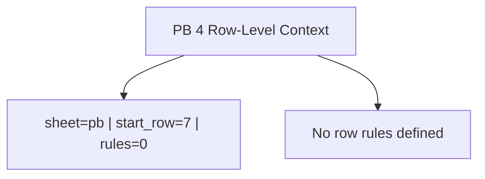
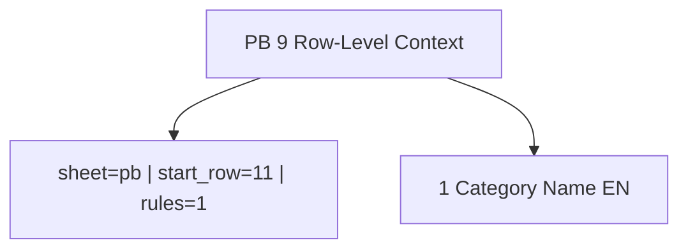
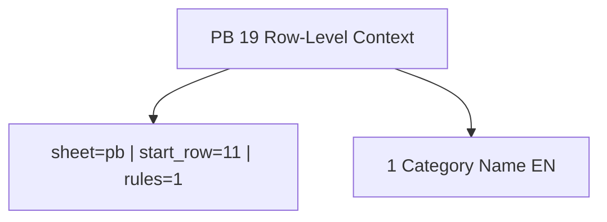

# PB Row-Level Context Diagrams

Generated from `extracted/report_configs/report_configs/pb_t*.json`.

## PB 1 — Brief analytical description of Balance of Payments of the Republic of Tajikistan (in thousand of USD)

- Config: `pb_t1_conf.json`
- Sheet: `pb`
- Data start row: `5`
- Columns: code=`A`, name=`C`, prev=`D`, current=`E`
- Rules: `102` total, `13` top-level

```mermaid
flowchart TD
  pb1_root["PB 1 Row-Level Context"]
  pb1_meta["sheet=pb | start_row=5 | rules=102"]
  pb1_root --> pb1_meta
  pb1_top_1["I. Current account"]
  pb1_root --> pb1_top_1
  pb1_top_2["1. Goods and services"]
  pb1_root --> pb1_top_2
  pb1_top_2_c_1["1.export export"]
  pb1_top_2 --> pb1_top_2_c_1
  pb1_top_2_c_2["1.import import"]
  pb1_top_2 --> pb1_top_2_c_2
  pb1_top_2_c_3["1.1. Balance of goods (+2 nested)"]
  pb1_top_2 --> pb1_top_2_c_3
  pb1_top_2_c_4["1.2. Balance of services (+11 nested)"]
  pb1_top_2 --> pb1_top_2_c_4
  pb1_top_3["2. Primary income"]
  pb1_root --> pb1_top_3
  pb1_top_3_c_1["2.credit credit"]
  pb1_top_3 --> pb1_top_3_c_1
  pb1_top_3_c_2["2.debet debet"]
  pb1_top_3 --> pb1_top_3_c_2
  pb1_top_3_c_3["2.1. Compensation of employees (+2 nested)"]
  pb1_top_3 --> pb1_top_3_c_3
  pb1_top_3_c_4["2.2. Investments income (+2 nested)"]
  pb1_top_3 --> pb1_top_3_c_4
  pb1_top_3_c_5["2.3.credit credit"]
  pb1_top_3 --> pb1_top_3_c_5
  pb1_top_3_c_6["2.3.debet debet"]
  pb1_top_3 --> pb1_top_3_c_6
  pb1_top_3_c_7["2.3. Other primary income"]
  pb1_top_3 --> pb1_top_3_c_7
  pb1_top_4["3. Secondary income"]
  pb1_root --> pb1_top_4
  pb1_top_4_c_1["3.credit credit"]
  pb1_top_4 --> pb1_top_4_c_1
  pb1_top_4_c_2["3.debet debet"]
  pb1_top_4 --> pb1_top_4_c_2
  pb1_top_4_c_3["3.1. General government (+2 nested)"]
  pb1_top_4 --> pb1_top_4_c_3
  pb1_top_4_c_4["3.2. Other sectors (+2 nested)"]
  pb1_top_4 --> pb1_top_4_c_4
  pb1_top_5["II. Capital account"]
  pb1_root --> pb1_top_5
  pb1_top_5_c_1["II.credit credit"]
  pb1_top_5 --> pb1_top_5_c_1
  pb1_top_5_c_2["II.debet debet"]
  pb1_top_5 --> pb1_top_5_c_2
  pb1_top_5_c_3["II.Net lending (+) / net borrowing (-) (balance from current and capital accounts) Net lending (+) / net borrowing (-) (..."]
  pb1_top_5 --> pb1_top_5_c_3
  pb1_top_6["III. Financial account"]
  pb1_root --> pb1_top_6
  pb1_top_6_c_1["III.Net lending (+) / net borrowing (-) (from financial account) Net lending (+) / net borrowing (-) (from financial acc..."]
  pb1_top_6 --> pb1_top_6_c_1
  pb1_top_7["4. Direct investments"]
  pb1_root --> pb1_top_7
  pb1_top_7_c_1["4.1. Net acquisition of financial assets (+4 nested)"]
  pb1_top_7 --> pb1_top_7_c_1
  pb1_top_7_c_2["4.2. Net incurrence of liabilities (+4 nested)"]
  pb1_top_7 --> pb1_top_7_c_2
  pb1_top_8["5. Portfolio investment"]
  pb1_root --> pb1_top_8
  pb1_top_8_c_1["5.1. Net acquisition of financial assets (+2 nested)"]
  pb1_top_8 --> pb1_top_8_c_1
  pb1_top_8_c_2["5.2. Net incurrence of liabilities (+2 nested)"]
  pb1_top_8 --> pb1_top_8_c_2
  pb1_top_9["6. Financial derivatives"]
  pb1_root --> pb1_top_9
  pb1_top_9_c_1["6.1. Net acquisition of financial assets"]
  pb1_top_9 --> pb1_top_9_c_1
  pb1_top_9_c_2["6.2. Net incurrence of liabilities"]
  pb1_top_9 --> pb1_top_9_c_2
  pb1_top_9_c_3["6.1. Reserve assets"]
  pb1_top_9 --> pb1_top_9_c_3
  pb1_top_9_c_4["6.2. Credit and loans with the IMF"]
  pb1_top_9 --> pb1_top_9_c_4
  pb1_top_9_c_5["6.3. The exceptional financing (+1 nested)"]
  pb1_top_9 --> pb1_top_9_c_5
  pb1_top_10["7. Other investment"]
  pb1_root --> pb1_top_10
  pb1_top_10_c_1["7.1. Net acquisition of financial assets (+13 nested)"]
  pb1_top_10 --> pb1_top_10_c_1
  pb1_top_10_c_2["7.2. Net incurrence of liabilities (+12 nested)"]
  pb1_top_10 --> pb1_top_10_c_2
  pb1_top_11["IV. Net errors and omissions"]
  pb1_root --> pb1_top_11
  pb1_top_12["V. Overal balance"]
  pb1_root --> pb1_top_12
  pb1_top_13["VI. Financing"]
  pb1_root --> pb1_top_13
```



## PB 2 — Brief standard description of Balance of Payments of the Republic of Tajikistan (in thousand of USD)

- Config: `pb_t2_conf.json`
- Sheet: `pb`
- Data start row: `5`
- Columns: code=`A`, name=`C`, prev=`D`, current=`E`
- Rules: `105` total, `14` top-level

```mermaid
flowchart TD
  pb2_root["PB 2 Row-Level Context"]
  pb2_meta["sheet=pb | start_row=5 | rules=105"]
  pb2_root --> pb2_meta
  pb2_top_1["I. Current account"]
  pb2_root --> pb2_top_1
  pb2_top_2["1. Goods and services"]
  pb2_root --> pb2_top_2
  pb2_top_2_c_1["1.export export"]
  pb2_top_2 --> pb2_top_2_c_1
  pb2_top_2_c_2["1.import import"]
  pb2_top_2 --> pb2_top_2_c_2
  pb2_top_2_c_3["1.1. Balance of goods (+2 nested)"]
  pb2_top_2 --> pb2_top_2_c_3
  pb2_top_2_c_4["1.2. Balance of services (+11 nested)"]
  pb2_top_2 --> pb2_top_2_c_4
  pb2_top_3["2. Primary income"]
  pb2_root --> pb2_top_3
  pb2_top_3_c_1["2.credit credit"]
  pb2_top_3 --> pb2_top_3_c_1
  pb2_top_3_c_2["2.debet debet"]
  pb2_top_3 --> pb2_top_3_c_2
  pb2_top_3_c_3["2.1. Compensation of employees (+2 nested)"]
  pb2_top_3 --> pb2_top_3_c_3
  pb2_top_3_c_4["2.2. Investments income (+2 nested)"]
  pb2_top_3 --> pb2_top_3_c_4
  pb2_top_3_c_5["2.3.credit credit"]
  pb2_top_3 --> pb2_top_3_c_5
  pb2_top_3_c_6["2.3.debet debet"]
  pb2_top_3 --> pb2_top_3_c_6
  pb2_top_3_c_7["2.3. Other primary income"]
  pb2_top_3 --> pb2_top_3_c_7
  pb2_top_4["3. Secondary income"]
  pb2_root --> pb2_top_4
  pb2_top_4_c_1["3.credit credit"]
  pb2_top_4 --> pb2_top_4_c_1
  pb2_top_4_c_2["3.debet debet"]
  pb2_top_4 --> pb2_top_4_c_2
  pb2_top_4_c_3["3.1. General government (+2 nested)"]
  pb2_top_4 --> pb2_top_4_c_3
  pb2_top_4_c_4["3.2. Other sectors (+2 nested)"]
  pb2_top_4 --> pb2_top_4_c_4
  pb2_top_5["II. Capital account"]
  pb2_root --> pb2_top_5
  pb2_top_5_c_1["II.credit credit"]
  pb2_top_5 --> pb2_top_5_c_1
  pb2_top_5_c_2["II.debet debet"]
  pb2_top_5 --> pb2_top_5_c_2
  pb2_top_5_c_3["II.Net lending (+) / net borrowing (-) (balance from current and capital accounts) Net lending (+) / net borrowing (-) (..."]
  pb2_top_5 --> pb2_top_5_c_3
  pb2_top_6["III. Financial account"]
  pb2_root --> pb2_top_6
  pb2_top_6_c_1["III.Net lending (+) / net borrowing (-) (from financial account) Net lending (+) / net borrowing (-) (from financial acc..."]
  pb2_top_6 --> pb2_top_6_c_1
  pb2_top_7["4. Direct investments"]
  pb2_root --> pb2_top_7
  pb2_top_7_c_1["4.1. Net acquisition of financial assets (+4 nested)"]
  pb2_top_7 --> pb2_top_7_c_1
  pb2_top_7_c_2["4.2. Net incurrence of liabilities (+4 nested)"]
  pb2_top_7 --> pb2_top_7_c_2
  pb2_top_8["5. Portfolio investment"]
  pb2_root --> pb2_top_8
  pb2_top_8_c_1["5.1. Net acquisition of financial assets (+2 nested)"]
  pb2_top_8 --> pb2_top_8_c_1
  pb2_top_8_c_2["5.2. Net incurrence of liabilities (+2 nested)"]
  pb2_top_8 --> pb2_top_8_c_2
  pb2_top_9["6. Financial derivatives"]
  pb2_root --> pb2_top_9
  pb2_top_9_c_1["6.1. Net acquisition of financial assets"]
  pb2_top_9 --> pb2_top_9_c_1
  pb2_top_9_c_2["6.2. Net incurrence of liabilities"]
  pb2_top_9 --> pb2_top_9_c_2
  pb2_top_9_c_3["6.1. Net acquisition of financial assets"]
  pb2_top_9 --> pb2_top_9_c_3
  pb2_top_9_c_4["6.2. Net incurrence of liabilities"]
  pb2_top_9 --> pb2_top_9_c_4
  pb2_top_9_c_5["6.3. The exceptional financing (+1 nested)"]
  pb2_top_9 --> pb2_top_9_c_5
  pb2_top_10["7. Other investment"]
  pb2_root --> pb2_top_10
  pb2_top_10_c_1["7.1. Net acquisition of financial assets (+13 nested)"]
  pb2_top_10 --> pb2_top_10_c_1
  pb2_top_10_c_2["7.2. Net incurrence of liabilities (+12 nested)"]
  pb2_top_10 --> pb2_top_10_c_2
  pb2_top_11["IV. Net errors and omissions"]
  pb2_root --> pb2_top_11
  pb2_top_11_c_1["IV. Net errors and omissions"]
  pb2_top_11 --> pb2_top_11_c_1
  pb2_top_12["V. Overal balance"]
  pb2_root --> pb2_top_12
  pb2_top_12_c_1["V. Overal balance"]
  pb2_top_12 --> pb2_top_12_c_1
  pb2_top_13["VI. Financing"]
  pb2_root --> pb2_top_13
  pb2_top_14["8. Reserve assets"]
  pb2_root --> pb2_top_14
```



## PB 3 — Brief standard description of Balance of Payments of the Republic of Tajikistan (in thousand of USD)

- Config: `pb_t3_conf.json`
- Sheet: `pb`
- Data start row: `7`
- Columns: code=`A`, name=`B`, prev=`D`, current=`E`
- Rules: `25` total, `6` top-level

```mermaid
flowchart TD
  pb3_root["PB 3 Row-Level Context"]
  pb3_meta["sheet=pb | start_row=7 | rules=25"]
  pb3_root --> pb3_meta
  pb3_top_1["1. Foreign Trade turnover**"]
  pb3_root --> pb3_top_1
  pb3_top_1_c_1["1.1. official data*"]
  pb3_top_1 --> pb3_top_1_c_1
  pb3_top_1_c_2["1.2. the amendment on coverage"]
  pb3_top_1 --> pb3_top_1_c_2
  pb3_top_1_c_3["1.3. adjustment up to FOB price"]
  pb3_top_1 --> pb3_top_1_c_3
  pb3_top_1_c_4["1.4. the amendment at cost"]
  pb3_top_1 --> pb3_top_1_c_4
  pb3_top_1_c_5["1.5. others"]
  pb3_top_1 --> pb3_top_1_c_5
  pb3_top_2["2. Export**"]
  pb3_root --> pb3_top_2
  pb3_top_2_c_1["2.1. official data*"]
  pb3_top_2 --> pb3_top_2_c_1
  pb3_top_2_c_2["2.2. the amendment on coverage"]
  pb3_top_2 --> pb3_top_2_c_2
  pb3_top_2_c_3["2.3. the goods for processing"]
  pb3_top_2 --> pb3_top_2_c_3
  pb3_top_2_c_4["2.4. others"]
  pb3_top_2 --> pb3_top_2_c_4
  pb3_top_3["3. Import**"]
  pb3_root --> pb3_top_3
  pb3_top_3_c_1["3.1. official data*"]
  pb3_top_3 --> pb3_top_3_c_1
  pb3_top_3_c_2["3.2. the amendment on coverage"]
  pb3_top_3 --> pb3_top_3_c_2
  pb3_top_3_c_3["3.3. adjustment up to FOB price"]
  pb3_top_3 --> pb3_top_3_c_3
  pb3_top_3_c_4["3.4. the goods for processing"]
  pb3_top_3 --> pb3_top_3_c_4
  pb3_top_3_c_5["3.5. others"]
  pb3_top_3 --> pb3_top_3_c_5
  pb3_top_4["4. Trade balance**"]
  pb3_root --> pb3_top_4
  pb3_top_4_c_1["4.1. official data*"]
  pb3_top_4 --> pb3_top_4_c_1
  pb3_top_4_c_2["4.2. the amendment on coverage"]
  pb3_top_4 --> pb3_top_4_c_2
  pb3_top_4_c_3["4.3. adjustment up to FOB price"]
  pb3_top_4 --> pb3_top_4_c_3
  pb3_top_4_c_4["4.4. the amendment at cost"]
  pb3_top_4 --> pb3_top_4_c_4
  pb3_top_4_c_5["4.5. others"]
  pb3_top_4 --> pb3_top_4_c_5
  pb3_top_5["* Маълумоти Агентии омори назди Президенти Ҷумҳурии Тоҷикистон * Data from the Statistical Agency under the President of..."]
  pb3_root --> pb3_top_5
  pb3_top_6["** Тасҳеҳоти Бонки миллии Тоҷикистон ба маълумоти Агентии омори назди Президенти Ҷумҳурии Тоҷикистон ** Adjustments by t..."]
  pb3_root --> pb3_top_6
```



## PB 4 — Table 4

- Config: `pb_t4_config.json`
- Sheet: `pb`
- Data start row: `7`
- Columns: code=`(n/a)`, name=`B`, prev=`D`, current=`E`
- Rules: `0` total, `0` top-level



## PB 5 — Table 5

- Config: `pb_t5_config.json`
- Sheet: `pb`
- Data start row: `8`
- Columns: code=`A`, name=`B`, prev=`(n/a)`, current=`(n/a)`
- Rules: `0` total, `0` top-level


## PB 6 — Table 6

- Config: `pb_t6_config.json`
- Sheet: `pb`
- Data start row: `11`
- Columns: code=`A`, name=`B`, prev=`(n/a)`, current=`(n/a)`
- Rules: `0` total, `0` top-level


## PB 7 — Table 7

- Config: `pb_t7_config.json`
- Sheet: `pb`
- Data start row: `11`
- Columns: code=`A`, name=`B`, prev=`(n/a)`, current=`(n/a)`
- Rules: `1` total, `1` top-level


## PB 8 — Table 8

- Config: `pb_t8_config.json`
- Sheet: `pb`
- Data start row: `11`
- Columns: code=`A`, name=`B`, prev=`(n/a)`, current=`(n/a)`
- Rules: `1` total, `1` top-level


## PB 9 — Table 9

- Config: `pb_t9_config.json`
- Sheet: `pb`
- Data start row: `11`
- Columns: code=`A`, name=`B`, prev=`(n/a)`, current=`(n/a)`
- Rules: `1` total, `1` top-level



## PB 10 — Table 10

- Config: `pb_t10_config.json`
- Sheet: `pb`
- Data start row: `11`
- Columns: code=`A`, name=`B`, prev=`(n/a)`, current=`(n/a)`
- Rules: `1` total, `1` top-level


## PB 11 — Table 11

- Config: `pb_t11_config.json`
- Sheet: `pb`
- Data start row: `11`
- Columns: code=`A`, name=`B`, prev=`(n/a)`, current=`(n/a)`
- Rules: `1` total, `1` top-level


## PB 12 — Table 12

- Config: `pb_t12_config.json`
- Sheet: `pb`
- Data start row: `11`
- Columns: code=`A`, name=`B`, prev=`(n/a)`, current=`(n/a)`
- Rules: `1` total, `1` top-level


## PB 13 — Table 13

- Config: `pb_t13_config.json`
- Sheet: `pb`
- Data start row: `11`
- Columns: code=`A`, name=`B`, prev=`(n/a)`, current=`(n/a)`
- Rules: `1` total, `1` top-level


## PB 14 — Table 14

- Config: `pb_t14_config.json`
- Sheet: `pb`
- Data start row: `11`
- Columns: code=`A`, name=`B`, prev=`(n/a)`, current=`(n/a)`
- Rules: `1` total, `1` top-level


## PB 15 — Table 15

- Config: `pb_t15_config.json`
- Sheet: `pb`
- Data start row: `11`
- Columns: code=`A`, name=`B`, prev=`(n/a)`, current=`(n/a)`
- Rules: `1` total, `1` top-level


## PB 16 — Table 16

- Config: `pb_t16_config.json`
- Sheet: `pb`
- Data start row: `11`
- Columns: code=`A`, name=`B`, prev=`(n/a)`, current=`(n/a)`
- Rules: `1` total, `1` top-level


## PB 17 — Table 17

- Config: `pb_t17_config.json`
- Sheet: `pb`
- Data start row: `11`
- Columns: code=`A`, name=`B`, prev=`(n/a)`, current=`(n/a)`
- Rules: `1` total, `1` top-level


## PB 18 — Table 18

- Config: `pb_t18_config.json`
- Sheet: `pb`
- Data start row: `11`
- Columns: code=`A`, name=`B`, prev=`(n/a)`, current=`(n/a)`
- Rules: `1` total, `1` top-level


## PB 19 — Table 19

- Config: `pb_t19_config.json`
- Sheet: `pb`
- Data start row: `11`
- Columns: code=`A`, name=`B`, prev=`(n/a)`, current=`(n/a)`
- Rules: `1` total, `1` top-level



## PB 20 — Table 20

- Config: `pb_t20_config.json`
- Sheet: `pb`
- Data start row: `11`
- Columns: code=`A`, name=`B`, prev=`(n/a)`, current=`(n/a)`
- Rules: `1` total, `1` top-level


## PB 21 — Table 21

- Config: `pb_t21_config.json`
- Sheet: `pb`
- Data start row: `11`
- Columns: code=`A`, name=`B`, prev=`(n/a)`, current=`(n/a)`
- Rules: `1` total, `1` top-level

```mermaid
flowchart TD
  pb21_root["PB 21 Row-Level Context"]
  pb21_meta["sheet=pb | start_row=11 | rules=1"]
  pb21_root --> pb21_meta
  pb21_top_1["1 Category Name EN"]
  pb21_root --> pb21_top_1
```

## PB 22 — Table 22

- Config: `pb_t22_config.json`
- Sheet: `pb`
- Data start row: `11`
- Columns: code=`A`, name=`B`, prev=`(n/a)`, current=`(n/a)`
- Rules: `1` total, `1` top-level

```mermaid
flowchart TD
  pb22_root["PB 22 Row-Level Context"]
  pb22_meta["sheet=pb | start_row=11 | rules=1"]
  pb22_root --> pb22_meta
  pb22_top_1["1 Category Name EN"]
  pb22_root --> pb22_top_1
```

## PB 23 — Table 23

- Config: `pb_t23_config.json`
- Sheet: `pb`
- Data start row: `10`
- Columns: code=`A`, name=`A`, prev=`D`, current=`G`
- Rules: `246` total, `15` top-level

```mermaid
flowchart TD
  pb23_root["PB 23 Row-Level Context"]
  pb23_meta["sheet=pb | start_row=10 | rules=246"]
  pb23_root --> pb23_meta
  pb23_top_1["services SERVICES"]
  pb23_root --> pb23_top_1
  pb23_top_2["credits Credits"]
  pb23_root --> pb23_top_2
  pb23_top_3["debits Debits"]
  pb23_root --> pb23_top_3
  pb23_top_4["1. Manufactoring services on physical inputs owned by others"]
  pb23_root --> pb23_top_4
  pb23_top_4_c_1["1.credits Credits"]
  pb23_top_4 --> pb23_top_4_c_1
  pb23_top_4_c_2["1.debits Debits"]
  pb23_top_4 --> pb23_top_4_c_2
  pb23_top_4_c_3["1.reference_11_goods_for_services reference: 1.1. Goods for services"]
  pb23_top_4 --> pb23_top_4_c_3
  pb23_top_4_c_4["1.goods_for_processing_in_the_republic_of_tajikistan goods for processing in the Republic of Tajikistan"]
  pb23_top_4 --> pb23_top_4_c_4
  pb23_top_4_c_5["1.goods_for_processing_abroad goods for processing abroad"]
  pb23_top_4 --> pb23_top_4_c_5
  pb23_top_5["2. 2 Maintenance and repair services n.i.e."]
  pb23_root --> pb23_top_5
  pb23_top_5_c_1["2.credits Credits"]
  pb23_top_5 --> pb23_top_5_c_1
  pb23_top_5_c_2["2.debits Debits"]
  pb23_top_5 --> pb23_top_5_c_2
  pb23_top_6["3. Transport"]
  pb23_root --> pb23_top_6
  pb23_top_6_c_1["3.credits Credits"]
  pb23_top_6 --> pb23_top_6_c_1
  pb23_top_6_c_2["3.debits Debits"]
  pb23_top_6 --> pb23_top_6_c_2
  pb23_top_6_c_3["3.1. passenger (+8 nested)"]
  pb23_top_6 --> pb23_top_6_c_3
  pb23_top_6_c_4["3.2. Motor transport (+14 nested)"]
  pb23_top_6 --> pb23_top_6_c_4
  pb23_top_6_c_5["3.3. Air transport (+14 nested)"]
  pb23_top_6 --> pb23_top_6_c_5
  pb23_top_6_c_6["3.4. Sea PNanspoNP (+20 nested)"]
  pb23_top_6 --> pb23_top_6_c_6
  pb23_top_6_c_7["3.5. Pipeline PNanspoNPaPion (+19 nested)"]
  pb23_top_6 --> pb23_top_6_c_7
  pb23_top_7["4. Travel"]
  pb23_root --> pb23_top_7
  pb23_top_7_c_1["4.credits Credits"]
  pb23_top_7 --> pb23_top_7_c_1
  pb23_top_7_c_2["4.debits Debits"]
  pb23_top_7 --> pb23_top_7_c_2
  pb23_top_7_c_3["4.1. Business (+8 nested)"]
  pb23_top_7 --> pb23_top_7_c_3
  pb23_top_7_c_4["4.2. Personal (+21 nested)"]
  pb23_top_7 --> pb23_top_7_c_4
  pb23_top_8["5. Construction"]
  pb23_root --> pb23_top_8
  pb23_top_8_c_1["5.credits Credits"]
  pb23_top_8 --> pb23_top_8_c_1
  pb23_top_8_c_2["5.debits Debits"]
  pb23_top_8 --> pb23_top_8_c_2
  pb23_top_8_c_3["5.1. Construction abroad (+2 nested)"]
  pb23_top_8 --> pb23_top_8_c_3
  pb23_top_8_c_4["5.2. Construction in the Repablic of Tajikistan (+2 nested)"]
  pb23_top_8 --> pb23_top_8_c_4
  pb23_top_9["6. Insurance and pension services"]
  pb23_root --> pb23_top_9
  pb23_top_9_c_1["6.credits Credits"]
  pb23_top_9 --> pb23_top_9_c_1
  pb23_top_9_c_2["6.debits Debits"]
  pb23_top_9 --> pb23_top_9_c_2
  pb23_top_9_c_3["6.1. Direct insurance (+2 nested)"]
  pb23_top_9 --> pb23_top_9_c_3
  pb23_top_9_c_4["6.2. Reinsurance (+2 nested)"]
  pb23_top_9 --> pb23_top_9_c_4
  pb23_top_9_c_5["6.3. Auxiliary insurance services (+2 nested)"]
  pb23_top_9 --> pb23_top_9_c_5
  pb23_top_9_c_6["6.4. Pension and standardized guarantee services (+2 nested)"]
  pb23_top_9 --> pb23_top_9_c_6
  pb23_top_9_c_7["6.5. Other (+2 nested)"]
  pb23_top_9 --> pb23_top_9_c_7
  pb23_top_10["7. Financial services"]
  pb23_root --> pb23_top_10
  pb23_top_10_c_1["7.credits Credits"]
  pb23_top_10 --> pb23_top_10_c_1
  pb23_top_10_c_2["7.debits Debits"]
  pb23_top_10 --> pb23_top_10_c_2
  pb23_top_10_c_3["7.1. Explicitly charged and other financial services (+2 nested)"]
  pb23_top_10 --> pb23_top_10_c_3
  pb23_top_10_c_4["7.2. Financial intermediation services indirectly measured (FISIM) (+2 nested)"]
  pb23_top_10 --> pb23_top_10_c_4
  pb23_top_11["8. Charges for the use of intellectual property n.i.e."]
  pb23_root --> pb23_top_11
  pb23_top_11_c_1["8.credits Credits"]
  pb23_top_11 --> pb23_top_11_c_1
  pb23_top_11_c_2["8.debits Debits"]
  pb23_top_11 --> pb23_top_11_c_2
  pb23_top_12["9. Telecommunications, computer, and information services"]
  pb23_root --> pb23_top_12
  pb23_top_12_c_1["9.credits Credits"]
  pb23_top_12 --> pb23_top_12_c_1
  pb23_top_12_c_2["9.debits Debits"]
  pb23_top_12 --> pb23_top_12_c_2
  pb23_top_12_c_3["9.1. Telecommunications services (+2 nested)"]
  pb23_top_12 --> pb23_top_12_c_3
  pb23_top_12_c_4["9.2. Computer services (+2 nested)"]
  pb23_top_12 --> pb23_top_12_c_4
  pb23_top_12_c_5["9.3. Information services (+2 nested)"]
  pb23_top_12 --> pb23_top_12_c_5
  pb23_top_13["10. Other business services"]
  pb23_root --> pb23_top_13
  pb23_top_13_c_1["10.credits Credits"]
  pb23_top_13 --> pb23_top_13_c_1
  pb23_top_13_c_2["10.debits Debits"]
  pb23_top_13 --> pb23_top_13_c_2
  pb23_top_13_c_3["10.1. Research and development services (+2 nested)"]
  pb23_top_13 --> pb23_top_13_c_3
  pb23_top_13_c_4["10.2. Professional and management consulting services (+17 nested)"]
  pb23_top_13 --> pb23_top_13_c_4
  pb23_top_13_c_5["10.3. Technical, related with trade and other services (+20 nested)"]
  pb23_top_13 --> pb23_top_13_c_5
  pb23_top_14["11. Personal, cultural, and recreational services"]
  pb23_root --> pb23_top_14
  pb23_top_14_c_1["11.credits Credits"]
  pb23_top_14 --> pb23_top_14_c_1
  pb23_top_14_c_2["11.debits Debits"]
  pb23_top_14 --> pb23_top_14_c_2
  pb23_top_14_c_3["11.1. Audiovisual and related services (+2 nested)"]
  pb23_top_14 --> pb23_top_14_c_3
  pb23_top_14_c_4["11.2. Other personal, cultural, and recreational services (+2 nested)"]
  pb23_top_14 --> pb23_top_14_c_4
  pb23_top_15["12. Government goods and services n.i.e."]
  pb23_root --> pb23_top_15
  pb23_top_15_c_1["12.credits Credits"]
  pb23_top_15 --> pb23_top_15_c_1
  pb23_top_15_c_2["12.debits Debits"]
  pb23_top_15 --> pb23_top_15_c_2
  pb23_top_15_c_3["12.1. 1Goods and services delivered or received by embasses, military bases and international organizations (+2 nested)"]
  pb23_top_15 --> pb23_top_15_c_3
  pb23_top_15_c_4["12.2. Other services delivered or received by government (+2 nested)"]
  pb23_top_15 --> pb23_top_15_c_4
  pb23_top_15_c_5["12.3. Tourism-related services in travel and passenger transport (+2 nested)"]
  pb23_top_15 --> pb23_top_15_c_5
```

## PB 24 — Table 24

- Config: `pb_t24_config.json`
- Sheet: `(not set)`
- Data start row: `10`
- Columns: code=`(n/a)`, name=`B`, prev=`(n/a)`, current=`(n/a)`
- Rules: `1` total, `1` top-level

```mermaid
flowchart TD
  pb24_root["PB 24 Row-Level Context"]
  pb24_meta["sheet=(not set) | start_row=10 | rules=1"]
  pb24_root --> pb24_meta
  pb24_top_1["1 Category Name EN"]
  pb24_root --> pb24_top_1
```

## PB 25 — Primary income

- Config: `pb_t25_config.json`
- Sheet: `pb`
- Data start row: `11`
- Columns: code=`A`, name=`A`, prev=`(n/a)`, current=`(n/a)`
- Rules: `9` total, `3` top-level

```mermaid
flowchart TD
  pb25_root["PB 25 Row-Level Context"]
  pb25_meta["sheet=pb | start_row=11 | rules=9"]
  pb25_root --> pb25_meta
  pb25_top_1["0 PRIMARY INCOME"]
  pb25_root --> pb25_top_1
  pb25_top_1_c_1["0.Credit Credit"]
  pb25_top_1 --> pb25_top_1_c_1
  pb25_top_1_c_2["0.Debet Debet"]
  pb25_top_1 --> pb25_top_1_c_2
  pb25_top_2["1. Compensation of employes"]
  pb25_root --> pb25_top_2
  pb25_top_2_c_1["1.Credit Credit"]
  pb25_top_2 --> pb25_top_2_c_1
  pb25_top_2_c_2["1.Debet Debet"]
  pb25_top_2 --> pb25_top_2_c_2
  pb25_top_3["2. Investment income"]
  pb25_root --> pb25_top_3
  pb25_top_3_c_1["2.Credit Credit"]
  pb25_top_3 --> pb25_top_3_c_1
  pb25_top_3_c_2["2.Debet Debet"]
  pb25_top_3 --> pb25_top_3_c_2
```

## PB 26 — Secondary income

- Config: `pb_t26_config.json`
- Sheet: `2023-2024`
- Data start row: `11`
- Columns: code=`A`, name=`A`, prev=`(n/a)`, current=`(n/a)`
- Rules: `0` total, `0` top-level

```mermaid
flowchart TD
  pb26_root["PB 26 Row-Level Context"]
  pb26_meta["sheet=2023-2024 | start_row=11 | rules=0"]
  pb26_root --> pb26_meta
  pb26_empty["No row rules defined"]
  pb26_root --> pb26_empty
```

## PB 27 — Table 27

- Config: `pb_t27_config.json`
- Sheet: `pb`
- Data start row: `11`
- Columns: code=`A`, name=`B`, prev=`(n/a)`, current=`(n/a)`
- Rules: `0` total, `0` top-level

```mermaid
flowchart TD
  pb27_root["PB 27 Row-Level Context"]
  pb27_meta["sheet=pb | start_row=11 | rules=0"]
  pb27_root --> pb27_meta
  pb27_empty["No row rules defined"]
  pb27_root --> pb27_empty
```

## PB 28 — Foreign Direct Investments

- Config: `pb_t28_config.json`
- Sheet: `pb`
- Data start row: `13`
- Columns: code=`A`, name=`B`, prev=`(n/a)`, current=`(n/a)`
- Rules: `11` total, `2` top-level

```mermaid
flowchart TD
  pb28_root["PB 28 Row-Level Context"]
  pb28_meta["sheet=pb | start_row=13 | rules=11"]
  pb28_root --> pb28_meta
  pb28_top_1["1 Direct investments"]
  pb28_root --> pb28_top_1
  pb28_top_2["2 in Republic of Tajikistan"]
  pb28_root --> pb28_top_2
  pb28_top_2_c_1["2.1 Proceeds"]
  pb28_top_2 --> pb28_top_2_c_1
  pb28_top_2_c_2["2.2 Outflow"]
  pb28_top_2 --> pb28_top_2_c_2
  pb28_top_2_c_3["2.3 In share capital (+2 nested)"]
  pb28_top_2 --> pb28_top_2_c_3
  pb28_top_2_c_4["2.4 Reinvested earnings (+1 nested)"]
  pb28_top_2 --> pb28_top_2_c_4
  pb28_top_2_c_5["2.5 Other investments (+1 nested)"]
  pb28_top_2 --> pb28_top_2_c_5
```

## PB 29 — Portfolio Investments

- Config: `pb_t29_config.json`
- Sheet: `pb`
- Data start row: `10`
- Columns: code=`B`, name=`C`, prev=`(n/a)`, current=`(n/a)`
- Rules: `11` total, `11` top-level

```mermaid
flowchart TD
  pb29_root["PB 29 Row-Level Context"]
  pb29_meta["sheet=pb | start_row=10 | rules=11"]
  pb29_root --> pb29_meta
  pb29_top_1["1 Manufacturing industry"]
  pb29_root --> pb29_top_1
  pb29_top_2["2 Mining and barrow excavation"]
  pb29_root --> pb29_top_2
  pb29_top_3["3 Construction activity"]
  pb29_root --> pb29_top_3
  pb29_top_4["4 Hotels and restaurants"]
  pb29_root --> pb29_top_4
  pb29_top_5["5 Trade"]
  pb29_root --> pb29_top_5
  pb29_top_6["6 Transport and communications"]
  pb29_root --> pb29_top_6
  pb29_top_7["7 Transport, warehousing and communication"]
  pb29_root --> pb29_top_7
  pb29_top_8["8 Financial intermediation"]
  pb29_root --> pb29_top_8
  pb29_top_9["9 Operations with real estate"]
  pb29_root --> pb29_top_9
  pb29_top_10["10 Education"]
  pb29_root --> pb29_top_10
  pb29_top_11["11 Other"]
  pb29_root --> pb29_top_11
```

## PB 30 — Table 30

- Config: `pb_t30_config.json`
- Sheet: `pb`
- Data start row: `9`
- Columns: code=`B`, name=`C`, prev=`(n/a)`, current=`(n/a)`
- Rules: `0` total, `0` top-level

```mermaid
flowchart TD
  pb30_root["PB 30 Row-Level Context"]
  pb30_meta["sheet=pb | start_row=9 | rules=0"]
  pb30_root --> pb30_meta
  pb30_empty["No row rules defined"]
  pb30_root --> pb30_empty
```

## PB 31 — Other Investments - Assets

- Config: `pb_t31_config.json`
- Sheet: `pb`
- Data start row: `11`
- Columns: code=`A`, name=`B`, prev=`(n/a)`, current=`(n/a)`
- Rules: `5` total, `1` top-level

```mermaid
flowchart TD
  pb31_root["PB 31 Row-Level Context"]
  pb31_meta["sheet=pb | start_row=11 | rules=5"]
  pb31_root --> pb31_meta
  pb31_top_1["1 Assets (+ decrease, - increase)"]
  pb31_root --> pb31_top_1
  pb31_top_1_c_1["1.1 Cash foreign currency and deposits (+2 nested)"]
  pb31_top_1 --> pb31_top_1_c_1
  pb31_top_1_c_2["1.2 Foreign securities"]
  pb31_top_1 --> pb31_top_1_c_2
```

## PB 32 — Other Investments - Liabilities

- Config: `pb_t32_config.json`
- Sheet: `pb`
- Data start row: `11`
- Columns: code=`A`, name=`B`, prev=`(n/a)`, current=`(n/a)`
- Rules: `5` total, `1` top-level

```mermaid
flowchart TD
  pb32_root["PB 32 Row-Level Context"]
  pb32_meta["sheet=pb | start_row=11 | rules=5"]
  pb32_root --> pb32_meta
  pb32_top_1["1 Liability (+increase;- decrease)"]
  pb32_root --> pb32_top_1
  pb32_top_1_c_1["1.1 Currency and deposits"]
  pb32_top_1 --> pb32_top_1_c_1
  pb32_top_1_c_2["1.2 Other securities"]
  pb32_top_1 --> pb32_top_1_c_2
  pb32_top_1_c_3["1.3 Loans"]
  pb32_top_1 --> pb32_top_1_c_3
  pb32_top_1_c_4["1.4 Structure"]
  pb32_top_1 --> pb32_top_1_c_4
```
