# PB Thematic Diagram and Dimensions

Generated from `report_configs/pb_t*.json`.

## Thematic Diagram

```mermaid
flowchart LR
  root["PB Reports by Theme"]
  th_1["Core Balance of Payments (3)"]
  root --> th_1
  pb_1["PB 1: Brief analytical description of Balance of Payments of the Republic of T...<br/>code=A, name=C, prev=D, cur=E<br/>sheet=pb, start_row=5, rules=102, top=13"]
  th_1 --> pb_1
  pb_2["PB 2: Brief standard description of Balance of Payments of the Republic of Taj...<br/>code=A, name=C, prev=D, cur=E<br/>sheet=pb, start_row=5, rules=105, top=14"]
  th_1 --> pb_2
  pb_3["PB 3: Brief standard description of Balance of Payments of the Republic of Taj...<br/>code=A, name=B, prev=D, cur=E<br/>sheet=pb, start_row=7, rules=25, top=6"]
  th_1 --> pb_3
  th_2["Detailed Services Breakdown (1)"]
  root --> th_2
  pb_23["PB 23: Table 23<br/>code=A, name=A, prev=D, cur=G<br/>sheet=pb, start_row=10, rules=246, top=15"]
  th_2 --> pb_23
  th_3["Income Accounts (2)"]
  root --> th_3
  pb_25["PB 25: Primary income<br/>code=A, name=A, prev=(n/a), cur=(n/a)<br/>sheet=pb, start_row=11, rules=9, top=3"]
  th_3 --> pb_25
  pb_26["PB 26: Secondary income<br/>code=A, name=A, prev=(n/a), cur=(n/a)<br/>sheet=2023-2024, start_row=11, rules=0, top=0"]
  th_3 --> pb_26
  th_4["Investment & Financial Accounts (5)"]
  root --> th_4
  pb_28["PB 28: Foreign Direct Investments<br/>code=A, name=B, prev=(n/a), cur=(n/a)<br/>sheet=pb, start_row=13, rules=11, top=2"]
  th_4 --> pb_28
  pb_29["PB 29: Portfolio Investments<br/>code=B, name=C, prev=(n/a), cur=(n/a)<br/>sheet=pb, start_row=10, rules=11, top=11"]
  th_4 --> pb_29
  pb_30["PB 30: Table 30<br/>code=B, name=C, prev=(n/a), cur=(n/a)<br/>sheet=pb, start_row=9, rules=0, top=0"]
  th_4 --> pb_30
  pb_31["PB 31: Other Investments - Assets<br/>code=A, name=B, prev=(n/a), cur=(n/a)<br/>sheet=pb, start_row=11, rules=5, top=1"]
  th_4 --> pb_31
  pb_32["PB 32: Other Investments - Liabilities<br/>code=A, name=B, prev=(n/a), cur=(n/a)<br/>sheet=pb, start_row=11, rules=5, top=1"]
  th_4 --> pb_32
  th_5["Reference / Minimal Templates (21)"]
  root --> th_5
  pb_4["PB 4: Table 4<br/>code=(n/a), name=B, prev=D, cur=E<br/>sheet=pb, start_row=7, rules=0, top=0"]
  th_5 --> pb_4
  pb_5["PB 5: Table 5<br/>code=A, name=B, prev=(n/a), cur=(n/a)<br/>sheet=pb, start_row=8, rules=0, top=0"]
  th_5 --> pb_5
  pb_6["PB 6: Table 6<br/>code=A, name=B, prev=(n/a), cur=(n/a)<br/>sheet=pb, start_row=11, rules=0, top=0"]
  th_5 --> pb_6
  pb_7["PB 7: Table 7<br/>code=A, name=B, prev=(n/a), cur=(n/a)<br/>sheet=pb, start_row=11, rules=1, top=1"]
  th_5 --> pb_7
  pb_8["PB 8: Table 8<br/>code=A, name=B, prev=(n/a), cur=(n/a)<br/>sheet=pb, start_row=11, rules=1, top=1"]
  th_5 --> pb_8
  pb_9["PB 9: Table 9<br/>code=A, name=B, prev=(n/a), cur=(n/a)<br/>sheet=pb, start_row=11, rules=1, top=1"]
  th_5 --> pb_9
  pb_10["PB 10: Table 10<br/>code=A, name=B, prev=(n/a), cur=(n/a)<br/>sheet=pb, start_row=11, rules=1, top=1"]
  th_5 --> pb_10
  pb_11["PB 11: Table 11<br/>code=A, name=B, prev=(n/a), cur=(n/a)<br/>sheet=pb, start_row=11, rules=1, top=1"]
  th_5 --> pb_11
  pb_12["PB 12: Table 12<br/>code=A, name=B, prev=(n/a), cur=(n/a)<br/>sheet=pb, start_row=11, rules=1, top=1"]
  th_5 --> pb_12
  pb_13["PB 13: Table 13<br/>code=A, name=B, prev=(n/a), cur=(n/a)<br/>sheet=pb, start_row=11, rules=1, top=1"]
  th_5 --> pb_13
  pb_14["PB 14: Table 14<br/>code=A, name=B, prev=(n/a), cur=(n/a)<br/>sheet=pb, start_row=11, rules=1, top=1"]
  th_5 --> pb_14
  pb_15["PB 15: Table 15<br/>code=A, name=B, prev=(n/a), cur=(n/a)<br/>sheet=pb, start_row=11, rules=1, top=1"]
  th_5 --> pb_15
  pb_16["PB 16: Table 16<br/>code=A, name=B, prev=(n/a), cur=(n/a)<br/>sheet=pb, start_row=11, rules=1, top=1"]
  th_5 --> pb_16
  pb_17["PB 17: Table 17<br/>code=A, name=B, prev=(n/a), cur=(n/a)<br/>sheet=pb, start_row=11, rules=1, top=1"]
  th_5 --> pb_17
  pb_18["PB 18: Table 18<br/>code=A, name=B, prev=(n/a), cur=(n/a)<br/>sheet=pb, start_row=11, rules=1, top=1"]
  th_5 --> pb_18
  pb_19["PB 19: Table 19<br/>code=A, name=B, prev=(n/a), cur=(n/a)<br/>sheet=pb, start_row=11, rules=1, top=1"]
  th_5 --> pb_19
  pb_20["PB 20: Table 20<br/>code=A, name=B, prev=(n/a), cur=(n/a)<br/>sheet=pb, start_row=11, rules=1, top=1"]
  th_5 --> pb_20
  pb_21["PB 21: Table 21<br/>code=A, name=B, prev=(n/a), cur=(n/a)<br/>sheet=pb, start_row=11, rules=1, top=1"]
  th_5 --> pb_21
  pb_22["PB 22: Table 22<br/>code=A, name=B, prev=(n/a), cur=(n/a)<br/>sheet=pb, start_row=11, rules=1, top=1"]
  th_5 --> pb_22
  pb_24["PB 24: Table 24<br/>code=(n/a), name=B, prev=(n/a), cur=(n/a)<br/>sheet=(not set), start_row=10, rules=1, top=1"]
  th_5 --> pb_24
  pb_27["PB 27: Table 27<br/>code=A, name=B, prev=(n/a), cur=(n/a)<br/>sheet=pb, start_row=11, rules=0, top=0"]
  th_5 --> pb_27
```

## Dimensions by Theme

### Core Balance of Payments

| PB | Title | Sheet | Start row | Code col | Name col | Prev col | Current col | Rules | Top-level |
|---:|---|---|---:|---|---|---|---|---:|---:|
| 1 | Brief analytical description of Balance of Payments of the Republic of Tajikistan (in thousand of USD) | pb | 5 | A | C | D | E | 102 | 13 |
| 2 | Brief standard description of Balance of Payments of the Republic of Tajikistan (in thousand of USD) | pb | 5 | A | C | D | E | 105 | 14 |
| 3 | Brief standard description of Balance of Payments of the Republic of Tajikistan (in thousand of USD) | pb | 7 | A | B | D | E | 25 | 6 |

### Detailed Services Breakdown

| PB | Title | Sheet | Start row | Code col | Name col | Prev col | Current col | Rules | Top-level |
|---:|---|---|---:|---|---|---|---|---:|---:|
| 23 | Table 23 | pb | 10 | A | A | D | G | 246 | 15 |

### Income Accounts

| PB | Title | Sheet | Start row | Code col | Name col | Prev col | Current col | Rules | Top-level |
|---:|---|---|---:|---|---|---|---|---:|---:|
| 25 | Primary income | pb | 11 | A | A | (n/a) | (n/a) | 9 | 3 |
| 26 | Secondary income | 2023-2024 | 11 | A | A | (n/a) | (n/a) | 0 | 0 |

### Investment & Financial Accounts

| PB | Title | Sheet | Start row | Code col | Name col | Prev col | Current col | Rules | Top-level |
|---:|---|---|---:|---|---|---|---|---:|---:|
| 28 | Foreign Direct Investments | pb | 13 | A | B | (n/a) | (n/a) | 11 | 2 |
| 29 | Portfolio Investments | pb | 10 | B | C | (n/a) | (n/a) | 11 | 11 |
| 30 | Table 30 | pb | 9 | B | C | (n/a) | (n/a) | 0 | 0 |
| 31 | Other Investments - Assets | pb | 11 | A | B | (n/a) | (n/a) | 5 | 1 |
| 32 | Other Investments - Liabilities | pb | 11 | A | B | (n/a) | (n/a) | 5 | 1 |

### Reference / Minimal Templates

| PB | Title | Sheet | Start row | Code col | Name col | Prev col | Current col | Rules | Top-level |
|---:|---|---|---:|---|---|---|---|---:|---:|
| 4 | Table 4 | pb | 7 | (n/a) | B | D | E | 0 | 0 |
| 5 | Table 5 | pb | 8 | A | B | (n/a) | (n/a) | 0 | 0 |
| 6 | Table 6 | pb | 11 | A | B | (n/a) | (n/a) | 0 | 0 |
| 7 | Table 7 | pb | 11 | A | B | (n/a) | (n/a) | 1 | 1 |
| 8 | Table 8 | pb | 11 | A | B | (n/a) | (n/a) | 1 | 1 |
| 9 | Table 9 | pb | 11 | A | B | (n/a) | (n/a) | 1 | 1 |
| 10 | Table 10 | pb | 11 | A | B | (n/a) | (n/a) | 1 | 1 |
| 11 | Table 11 | pb | 11 | A | B | (n/a) | (n/a) | 1 | 1 |
| 12 | Table 12 | pb | 11 | A | B | (n/a) | (n/a) | 1 | 1 |
| 13 | Table 13 | pb | 11 | A | B | (n/a) | (n/a) | 1 | 1 |
| 14 | Table 14 | pb | 11 | A | B | (n/a) | (n/a) | 1 | 1 |
| 15 | Table 15 | pb | 11 | A | B | (n/a) | (n/a) | 1 | 1 |
| 16 | Table 16 | pb | 11 | A | B | (n/a) | (n/a) | 1 | 1 |
| 17 | Table 17 | pb | 11 | A | B | (n/a) | (n/a) | 1 | 1 |
| 18 | Table 18 | pb | 11 | A | B | (n/a) | (n/a) | 1 | 1 |
| 19 | Table 19 | pb | 11 | A | B | (n/a) | (n/a) | 1 | 1 |
| 20 | Table 20 | pb | 11 | A | B | (n/a) | (n/a) | 1 | 1 |
| 21 | Table 21 | pb | 11 | A | B | (n/a) | (n/a) | 1 | 1 |
| 22 | Table 22 | pb | 11 | A | B | (n/a) | (n/a) | 1 | 1 |
| 24 | Table 24 | (not set) | 10 | (n/a) | B | (n/a) | (n/a) | 1 | 1 |
| 27 | Table 27 | pb | 11 | A | B | (n/a) | (n/a) | 0 | 0 |
